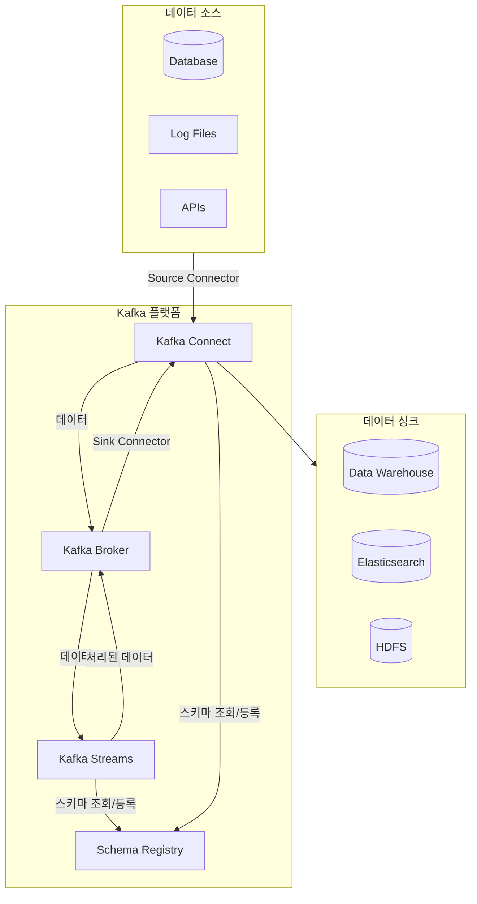
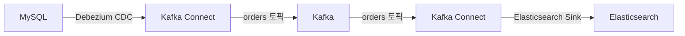
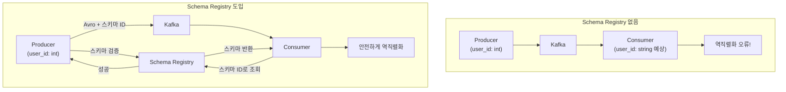

# Kafka 생태계

Kafka는 단순한 메시지 브로커를 넘어, 데이터 파이프라인과 스트림 처리 애플리케이션을 구축하기 위한 완성된 생태계를 제공합니다. 여기서는 핵심 컴포넌트인 **Kafka Connect**, **Schema Registry**, **Kafka Streams**를 소개합니다.



---

## 1. Kafka Connect

**Kafka Connect**는 Kafka와 다른 시스템 간에 데이터를 안정적으로 스트리밍하기 위한 프레임워크입니다. 코딩 없이 설정만으로 데이터 파이프라인을 구축할 수 있습니다.

### 핵심 개념

| 컴포넌트 | 역할 | 예시 |
|---|---|---|
| **Source Connector** | 외부 시스템 → Kafka | DB 변경 사항을 Kafka 토픽으로 |
| **Sink Connector** | Kafka → 외부 시스템 | Kafka 토픽을 Elasticsearch로 |
| **Converter** | 데이터 형식 변환 | JSON, Avro, Protobuf |
| **Transform** | 간단한 메시지 변환 | 필드 추가/제거, 라우팅 |

### 사용 예시: 데이터베이스 변경 사항을 Elasticsearch로

1.  **Debezium Source Connector**가 MySQL의 변경 로그(Binlog)를 읽어 `orders` 토픽으로 스트리밍합니다.
2.  **Elasticsearch Sink Connector**가 `orders` 토픽의 메시지를 읽어 Elasticsearch에 인덱싱합니다.



### 장점
- **코드 불필요**: 설정 파일(JSON)만으로 파이프라인 구성
- **확장성 및 안정성**: 분산 환경에서 실행, 장애 자동 복구
- **풍부한 생태계**: JDBC, S3, HDFS, Elasticsearch 등 수많은 기성 커넥터 존재

---

## 2. Schema Registry

**Schema Registry**는 메시지의 스키마(구조)를 중앙에서 관리하고 검증하는 서비스입니다. 데이터의 일관성과 호환성을 보장하는 데 필수적입니다.

### 왜 필요한가?

스키마가 없다면 Consumer는 메시지 구조를 추측해야 하며, Producer가 구조를 변경하면 Consumer가 깨질 수 있습니다.



### 핵심 기능

- **스키마 버전 관리**: 스키마 변경 이력을 관리합니다.
- **호환성 검증**: Producer가 스키마를 변경할 때 기존 Consumer와의 호환성(전방/후방/완전)을 강제합니다.
- **직렬화/역직렬화 지원**: Avro, Protobuf, JSON Schema와 통합되어 효율적인 직렬화를 지원합니다.

### 장점
- **데이터 품질 보장**: 정해진 스키마를 따르는 데이터만 Kafka에 저장
- **느슨한 결합**: Producer와 Consumer가 스키마를 통해 소통하므로 직접적인 의존성 감소
- **효율적인 저장**: Avro와 함께 사용 시 메시지 크기 감소

---

## 3. Kafka Streams

**Kafka Streams**는 Kafka 토픽의 데이터를 실시간으로 처리하고 분석하는 자바/스칼라 라이브러리입니다. 별도의 처리 클러스터 없이 Kafka만으로 스트림 처리 애플리케이션을 만들 수 있습니다.

### 핵심 개념

| 개념 | 설명 |
|---|---|
| **KStream** | 레코드의 스트림. 변경 불가능한 데이터 (ex: 이벤트 로그) |
| **KTable** | 변경 가능한 데이터 스트림. Key별 최신 값만 유지 (ex: 사용자 프로필) |
| **Topology** | 데이터 처리 흐름을 정의한 DAG(Directed Acyclic Graph) |

### 사용 예시: 실시간 주문 집계

```java
// Kafka Streams DSL 예시
StreamsBuilder builder = new StreamsBuilder();

KStream<String, Order> orders = builder.stream("orders");

KTable<String, Double> userTotalAmount = orders
    .groupBy((key, value) -> value.getCustomerId()) // 고객 ID로 그룹화
    .aggregate(
        () -> 0.0, // 초기값
        (aggKey, newValue, aggValue) -> aggValue + newValue.getAmount(), // 집계
        Materialized.as("user-order-totals")
    );

// 결과를 'user-totals' 토픽으로 전송
userTotalAmount.toStream().to("user-totals");
```

```mermaid
graph TD
    A[orders 토픽] --> B{고객 ID로 GroupBy}
    B --> C{주문 금액 합산 (Aggregate)}
    C --> D[user-totals 토픽]
```

### 장점
- **단순함**: 별도의 클러스터(Spark, Flink 등) 없이 라이브러리 형태로 애플리케이션에 포함
- **상태 저장 처리**: 로컬 상태 저장소(RocksDB)를 사용하여 상태 기반 처리(집계, 조인 등) 지원
- **탄력성**: 애플리케이션 인스턴스를 추가/제거하여 쉽게 확장/축소 가능

## 정리

| 컴포넌트 | 한 줄 요약 | 주요 사용 사례 |
|---|---|---|
| **Kafka Connect** | 데이터 파이프라인 구축 프레임워크 | DB ↔ Kafka, S3 ↔ Kafka |
| **Schema Registry** | 스키마 중앙 관리 및 검증 | 데이터 거버넌스, Avro/Protobuf 연동 |
| **Kafka Streams** | 실시간 스트림 처리 라이브러리 | 실시간 집계, 이벤트 기반 마이크로서비스 |

```