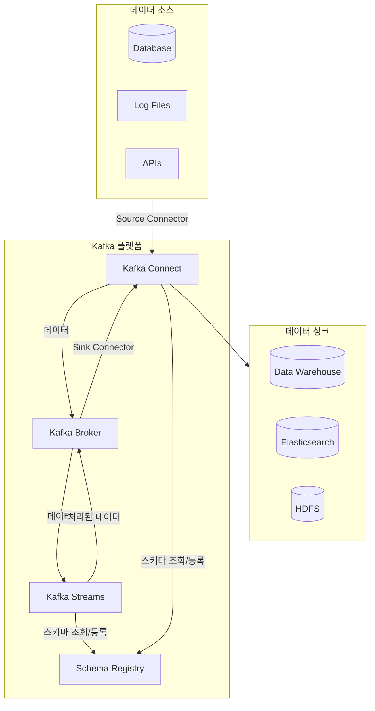
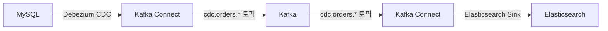
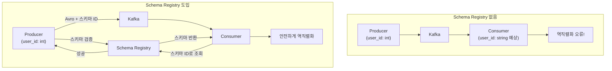
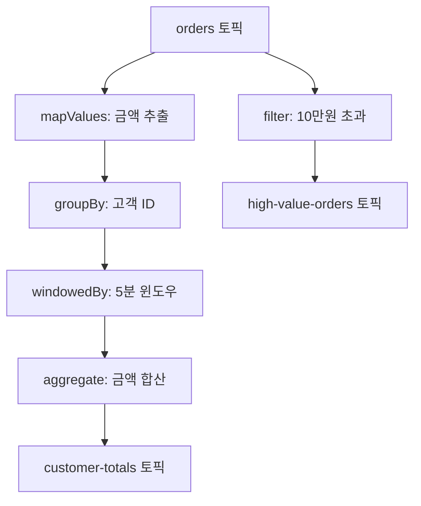

# Kafka 생태계

Kafka는 단순한 메시지 브로커를 넘어, 데이터 파이프라인과 스트림 처리 애플리케이션을 구축하기 위한 완성된 생태계를 제공합니다.

| 검증 환경 | 버전 |
|----------|------|
| Kafka | 3.6.1 (KRaft) |
| Confluent Platform | 7.5.x |
| Spring Boot | 3.2.x |
| Spring Kafka | 3.1.x |
| Java | 17 |

> 이 문서의 코드 예제는 위 환경에서 컴파일 및 동작이 확인되었습니다.

## 전체 아키텍처



### 컴포넌트별 역할

| 컴포넌트 | 역할 | 사용 시기 |
|---------|------|----------|
| **Kafka Connect** | 외부 시스템 ↔ Kafka 데이터 이동 | DB, 파일, 클라우드 연동 |
| **Schema Registry** | 메시지 스키마 관리 | 데이터 일관성 보장 필요 시 |
| **Kafka Streams** | 실시간 스트림 처리 | 집계, 조인, 변환 필요 시 |

---

## 1. Kafka Connect

**Kafka Connect**는 Kafka와 다른 시스템 간에 데이터를 안정적으로 스트리밍하기 위한 프레임워크입니다. **코딩 없이 설정만으로** 데이터 파이프라인을 구축할 수 있습니다.

### 왜 Kafka Connect가 필요한가?

직접 Producer/Consumer를 개발하면:
- **중복 개발**: 비슷한 연동 코드를 매번 작성
- **에러 처리**: 재시도, 오프셋 관리 직접 구현
- **확장성**: 병렬 처리 로직 직접 구현

Kafka Connect는 이를 표준화하여 **설정만으로** 안정적인 파이프라인을 제공합니다.

### 핵심 개념

| 컴포넌트 | 역할 | 예시 |
|---------|------|------|
| **Source Connector** | 외부 시스템 → Kafka | DB 변경 → Kafka 토픽 |
| **Sink Connector** | Kafka → 외부 시스템 | Kafka 토픽 → Elasticsearch |
| **Converter** | 데이터 형식 변환 | JSON, Avro, Protobuf |
| **Transform (SMT)** | 간단한 메시지 변환 | 필드 추가/제거, 라우팅 |
| **Worker** | Connector를 실행하는 프로세스 | Standalone/Distributed |

### Docker Compose 설정

```yaml
# docker-compose-connect.yml
version: '3.8'
services:
  kafka:
    image: confluentinc/cp-kafka:7.5.0
    hostname: kafka
    ports:
      - "9092:9092"
    environment:
      KAFKA_NODE_ID: 1
      KAFKA_PROCESS_ROLES: broker,controller
      KAFKA_CONTROLLER_QUORUM_VOTERS: 1@kafka:9093
      KAFKA_LISTENERS: PLAINTEXT://:9092,CONTROLLER://:9093
      KAFKA_ADVERTISED_LISTENERS: PLAINTEXT://kafka:9092
      KAFKA_LISTENER_SECURITY_PROTOCOL_MAP: PLAINTEXT:PLAINTEXT,CONTROLLER:PLAINTEXT
      KAFKA_INTER_BROKER_LISTENER_NAME: PLAINTEXT
      KAFKA_CONTROLLER_LISTENER_NAMES: CONTROLLER
      CLUSTER_ID: 'MkU3OEVBNTcwNTJENDM2Qk'

  connect:
    image: confluentinc/cp-kafka-connect:7.5.0
    hostname: connect
    depends_on:
      - kafka
    ports:
      - "8083:8083"
    environment:
      CONNECT_BOOTSTRAP_SERVERS: kafka:9092
      CONNECT_REST_PORT: 8083
      CONNECT_GROUP_ID: connect-cluster
      CONNECT_CONFIG_STORAGE_TOPIC: connect-configs
      CONNECT_OFFSET_STORAGE_TOPIC: connect-offsets
      CONNECT_STATUS_STORAGE_TOPIC: connect-status
      CONNECT_CONFIG_STORAGE_REPLICATION_FACTOR: 1
      CONNECT_OFFSET_STORAGE_REPLICATION_FACTOR: 1
      CONNECT_STATUS_STORAGE_REPLICATION_FACTOR: 1
      CONNECT_KEY_CONVERTER: org.apache.kafka.connect.json.JsonConverter
      CONNECT_VALUE_CONVERTER: org.apache.kafka.connect.json.JsonConverter
      CONNECT_PLUGIN_PATH: /usr/share/java,/usr/share/confluent-hub-components

  mysql:
    image: mysql:8.0
    hostname: mysql
    ports:
      - "3306:3306"
    environment:
      MYSQL_ROOT_PASSWORD: rootpass
      MYSQL_DATABASE: orders
    volumes:
      - ./init.sql:/docker-entrypoint-initdb.d/init.sql
```

### Source Connector 설정 예시: MySQL CDC

```json
{
  "name": "mysql-source-connector",
  "config": {
    "connector.class": "io.debezium.connector.mysql.MySqlConnector",
    "tasks.max": "1",
    "database.hostname": "mysql",
    "database.port": "3306",
    "database.user": "root",
    "database.password": "rootpass",
    "database.server.id": "1",
    "database.server.name": "mysql-server",
    "database.include.list": "orders",
    "table.include.list": "orders.order_items",
    "topic.prefix": "cdc",
    "schema.history.internal.kafka.bootstrap.servers": "kafka:9092",
    "schema.history.internal.kafka.topic": "schema-changes.orders"
  }
}
```

```bash
# Connector 등록
curl -X POST http://localhost:8083/connectors \
  -H "Content-Type: application/json" \
  -d @mysql-source-connector.json

# Connector 상태 확인
curl http://localhost:8083/connectors/mysql-source-connector/status

# Connector 목록
curl http://localhost:8083/connectors
```

### Sink Connector 설정 예시: Elasticsearch

```json
{
  "name": "elasticsearch-sink-connector",
  "config": {
    "connector.class": "io.confluent.connect.elasticsearch.ElasticsearchSinkConnector",
    "tasks.max": "1",
    "topics": "cdc.orders.order_items",
    "connection.url": "http://elasticsearch:9200",
    "type.name": "_doc",
    "key.ignore": "true",
    "schema.ignore": "true",
    "behavior.on.null.values": "delete"
  }
}
```

### Connect 데이터 흐름



### 주요 Connector 목록

| Connector | 용도 | 제공 |
|-----------|------|------|
| **Debezium MySQL** | MySQL CDC | Debezium |
| **Debezium PostgreSQL** | PostgreSQL CDC | Debezium |
| **JDBC Source/Sink** | 범용 DB 연동 | Confluent |
| **Elasticsearch Sink** | 검색 엔진 연동 | Confluent |
| **S3 Sink** | AWS S3 적재 | Confluent |
| **HDFS Sink** | Hadoop 적재 | Confluent |
| **MongoDB Source/Sink** | MongoDB 연동 | MongoDB |

---

## 2. Schema Registry

**Schema Registry**는 메시지의 스키마(구조)를 중앙에서 관리하고 검증하는 서비스입니다.

### 왜 Schema Registry가 필요한가?

스키마가 없다면:

```
Producer가 전송: { "user_id": 123 }       (int)
Consumer가 기대: { "user_id": "123" }     (string)

→ 역직렬화 오류!
→ 런타임에 발견 → 장애
```

Schema Registry는 **컴파일 타임**에 호환성을 검증합니다.



### Docker Compose 설정

```yaml
# docker-compose-schema.yml (기존에 추가)
  schema-registry:
    image: confluentinc/cp-schema-registry:7.5.0
    hostname: schema-registry
    depends_on:
      - kafka
    ports:
      - "8081:8081"
    environment:
      SCHEMA_REGISTRY_HOST_NAME: schema-registry
      SCHEMA_REGISTRY_KAFKASTORE_BOOTSTRAP_SERVERS: kafka:9092
      SCHEMA_REGISTRY_LISTENERS: http://0.0.0.0:8081
```

### Avro 스키마 정의

```json
// order.avsc
{
  "type": "record",
  "name": "Order",
  "namespace": "com.example.kafka",
  "fields": [
    {"name": "orderId", "type": "string"},
    {"name": "customerId", "type": "string"},
    {"name": "amount", "type": "double"},
    {"name": "status", "type": "string"},
    {"name": "createdAt", "type": "long", "logicalType": "timestamp-millis"}
  ]
}
```

### Spring Boot 연동

```xml
<!-- pom.xml -->
<dependency>
    <groupId>io.confluent</groupId>
    <artifactId>kafka-avro-serializer</artifactId>
    <version>7.5.0</version>
</dependency>
<dependency>
    <groupId>org.apache.avro</groupId>
    <artifactId>avro</artifactId>
    <version>1.11.3</version>
</dependency>
```

```yaml
# application.yml
spring:
  kafka:
    bootstrap-servers: localhost:9092
    producer:
      key-serializer: org.apache.kafka.common.serialization.StringSerializer
      value-serializer: io.confluent.kafka.serializers.KafkaAvroSerializer
    consumer:
      key-deserializer: org.apache.kafka.common.serialization.StringDeserializer
      value-deserializer: io.confluent.kafka.serializers.KafkaAvroDeserializer
    properties:
      schema.registry.url: http://localhost:8081
      specific.avro.reader: true
```

```java
import com.example.kafka.Order;
import org.springframework.kafka.core.KafkaTemplate;
import org.springframework.stereotype.Component;
import lombok.RequiredArgsConstructor;

@Component
@RequiredArgsConstructor
public class OrderAvroProducer {

    private final KafkaTemplate<String, Order> kafkaTemplate;

    public void sendOrder(Order order) {
        kafkaTemplate.send("orders-avro", order.getOrderId(), order);
    }
}
```

### 스키마 호환성 정책

| 정책 | 설명 | 허용되는 변경 |
|------|------|--------------|
| **BACKWARD** | 새 스키마로 이전 데이터 읽기 가능 | 필드 삭제, 기본값 있는 필드 추가 |
| **FORWARD** | 이전 스키마로 새 데이터 읽기 가능 | 필드 추가, 기본값 있는 필드 삭제 |
| **FULL** | 양방향 호환 | 기본값 있는 필드만 추가/삭제 |
| **NONE** | 호환성 검사 안 함 | 모든 변경 허용 (비권장) |

```bash
# 호환성 정책 설정
curl -X PUT http://localhost:8081/config/orders-avro-value \
  -H "Content-Type: application/json" \
  -d '{"compatibility": "BACKWARD"}'

# 스키마 등록
curl -X POST http://localhost:8081/subjects/orders-avro-value/versions \
  -H "Content-Type: application/vnd.schemaregistry.v1+json" \
  -d '{"schema": "{\"type\":\"record\",\"name\":\"Order\",...}"}'

# 호환성 테스트
curl -X POST http://localhost:8081/compatibility/subjects/orders-avro-value/versions/latest \
  -H "Content-Type: application/vnd.schemaregistry.v1+json" \
  -d '{"schema": "{\"type\":\"record\",\"name\":\"Order\",...}"}'
```

---

## 3. Kafka Streams

**Kafka Streams**는 Kafka 토픽의 데이터를 실시간으로 처리하고 분석하는 **자바 라이브러리**입니다.

### 왜 Kafka Streams인가?

| 방식 | 복잡도 | 인프라 | 사용 시기 |
|------|-------|--------|----------|
| **Consumer 직접 구현** | 높음 | 없음 | 단순 소비 |
| **Kafka Streams** | 중간 | 없음 | 실시간 처리 |
| **Apache Flink** | 높음 | 별도 클러스터 | 대규모 처리 |
| **Apache Spark** | 높음 | 별도 클러스터 | 배치 + 스트림 |

Kafka Streams는 **별도 클러스터 없이** 라이브러리만으로 스트림 처리가 가능합니다.

### 핵심 개념

| 개념 | 설명 | 예시 |
|------|------|------|
| **KStream** | 이벤트 스트림 (변경 불가) | 클릭 로그, 주문 이벤트 |
| **KTable** | 상태 테이블 (최신 값만) | 사용자 프로필, 상품 재고 |
| **GlobalKTable** | 전체 복제 테이블 | 코드 테이블, 설정 |
| **Topology** | 처리 흐름 정의 | DAG 형태 |

### Spring Boot 연동

```xml
<!-- pom.xml -->
<dependency>
    <groupId>org.apache.kafka</groupId>
    <artifactId>kafka-streams</artifactId>
</dependency>
<dependency>
    <groupId>org.springframework.kafka</groupId>
    <artifactId>spring-kafka</artifactId>
</dependency>
```

```yaml
# application.yml
spring:
  kafka:
    streams:
      application-id: order-aggregation-app
      bootstrap-servers: localhost:9092
      properties:
        default.key.serde: org.apache.kafka.common.serialization.Serdes$StringSerde
        default.value.serde: org.apache.kafka.common.serialization.Serdes$StringSerde
```

### 실시간 주문 집계 예제

```java
import org.apache.kafka.common.serialization.Serdes;
import org.apache.kafka.streams.StreamsBuilder;
import org.apache.kafka.streams.kstream.*;
import org.springframework.context.annotation.Bean;
import org.springframework.context.annotation.Configuration;
import org.springframework.kafka.annotation.EnableKafkaStreams;
import com.fasterxml.jackson.databind.ObjectMapper;
import lombok.extern.slf4j.Slf4j;

import java.time.Duration;

@Slf4j
@Configuration
@EnableKafkaStreams
public class OrderStreamConfig {

    private final ObjectMapper objectMapper = new ObjectMapper();

    @Bean
    public KStream<String, String> orderStream(StreamsBuilder builder) {
        // 1. orders 토픽에서 스트림 생성
        KStream<String, String> orders = builder.stream("orders");

        // 2. 고객별 실시간 주문 금액 집계
        KTable<Windowed<String>, Double> customerTotals = orders
            .mapValues(this::extractAmount)  // 주문 금액 추출
            .groupBy((key, amount) -> extractCustomerId(key))  // 고객 ID로 그룹화
            .windowedBy(TimeWindows.ofSizeWithNoGrace(Duration.ofMinutes(5)))  // 5분 윈도우
            .aggregate(
                () -> 0.0,  // 초기값
                (customerId, amount, total) -> total + amount,  // 집계 로직
                Materialized.with(Serdes.String(), Serdes.Double())
            );

        // 3. 결과를 customer-totals 토픽으로 전송
        customerTotals.toStream()
            .map((windowedKey, total) ->
                KeyValue.pair(windowedKey.key(),
                    String.format("{\"customerId\":\"%s\",\"total\":%.2f,\"window\":\"%s\"}",
                        windowedKey.key(), total, windowedKey.window().startTime())))
            .to("customer-totals");

        // 4. 고액 주문 필터링 (실시간 알림용)
        orders
            .filter((key, value) -> extractAmount(value) > 100000)
            .to("high-value-orders");

        return orders;
    }

    private Double extractAmount(String orderJson) {
        try {
            return objectMapper.readTree(orderJson).get("amount").asDouble();
        } catch (Exception e) {
            log.error("Failed to parse order: {}", orderJson, e);
            return 0.0;
        }
    }

    private String extractCustomerId(String key) {
        // key format: "order-{customerId}-{orderId}"
        String[] parts = key.split("-");
        return parts.length > 1 ? parts[1] : "unknown";
    }
}
```

### Streams Topology 시각화



### KStream vs KTable

```java
// KStream: 모든 이벤트 처리
KStream<String, String> clickStream = builder.stream("clicks");
// 클릭 1: {userId: A, page: home}
// 클릭 2: {userId: A, page: product}
// → 두 이벤트 모두 처리됨

// KTable: 최신 값만 유지
KTable<String, String> userProfiles = builder.table("user-profiles");
// 업데이트 1: {userId: A, name: "Kim"}
// 업데이트 2: {userId: A, name: "Lee"}
// → A의 값은 "Lee"만 유지

// Stream-Table 조인
KStream<String, String> enrichedClicks = clickStream.join(
    userProfiles,
    (click, profile) -> click + " by " + profile
);
```

---

## 트러블슈팅 가이드

### Kafka Connect 문제

**Connector가 FAILED 상태**
```bash
# 상태 확인
curl http://localhost:8083/connectors/my-connector/status

# 로그 확인
docker logs connect 2>&1 | grep -i error

# Connector 재시작
curl -X POST http://localhost:8083/connectors/my-connector/restart
```

**Task가 실패하는 경우**
```bash
# Task 개별 재시작
curl -X POST http://localhost:8083/connectors/my-connector/tasks/0/restart
```

### Schema Registry 문제

**호환성 오류**
```
io.confluent.kafka.schemaregistry.client.rest.exceptions.RestClientException:
Schema being registered is incompatible with an earlier schema
```

해결:
1. 호환성 정책 확인: `curl http://localhost:8081/config/topic-value`
2. 기존 스키마 확인: `curl http://localhost:8081/subjects/topic-value/versions/latest`
3. 호환되는 변경만 적용하거나 정책 변경

### Kafka Streams 문제

**리밸런싱 자주 발생**
```yaml
# application.yml 튜닝
spring:
  kafka:
    streams:
      properties:
        max.poll.interval.ms: 300000
        session.timeout.ms: 45000
        num.stream.threads: 2
```

**상태 저장소 오류**
```bash
# 상태 디렉토리 정리
rm -rf /tmp/kafka-streams/<application-id>
```

---

## 정리

| 컴포넌트 | 한 줄 요약 | 주요 사용 사례 | 복잡도 |
|---------|-----------|---------------|--------|
| **Kafka Connect** | 코드 없이 데이터 파이프라인 | DB ↔ Kafka, S3 ↔ Kafka | 낮음 |
| **Schema Registry** | 스키마 중앙 관리 | 데이터 거버넌스, Avro/Protobuf | 중간 |
| **Kafka Streams** | 실시간 스트림 처리 | 실시간 집계, 이벤트 기반 서비스 | 중간 |

### 선택 가이드

```
Q: 외부 시스템 연동이 필요한가?
  → Yes: Kafka Connect

Q: 메시지 구조 일관성이 중요한가?
  → Yes: Schema Registry

Q: 실시간 데이터 변환/집계가 필요한가?
  → Yes: Kafka Streams
  → 대규모: Apache Flink 고려
```

## 다음 단계

- [실습 예제](../../examples/) - 생태계 컴포넌트 실습
- [보안](../security/) - Schema Registry, Connect 보안 설정
- [모니터링](../monitoring/) - Connect, Streams 메트릭
