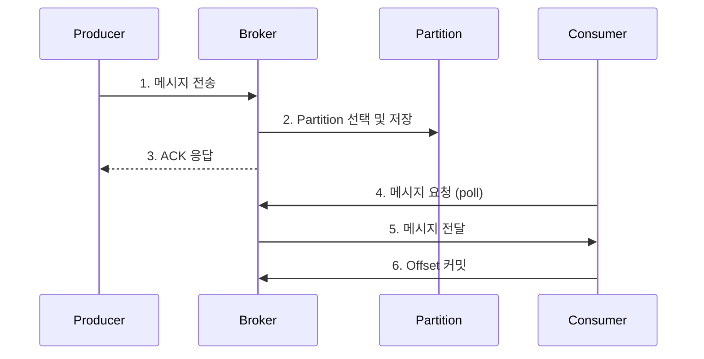
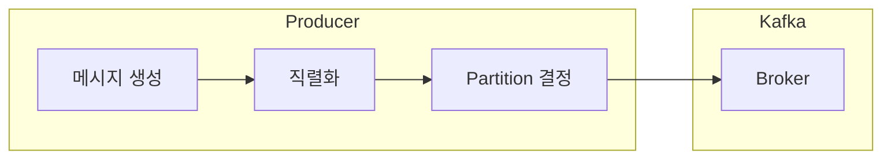
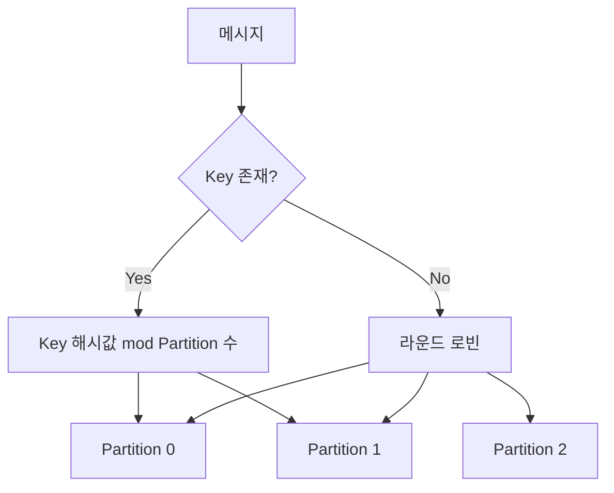
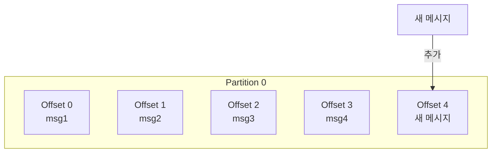
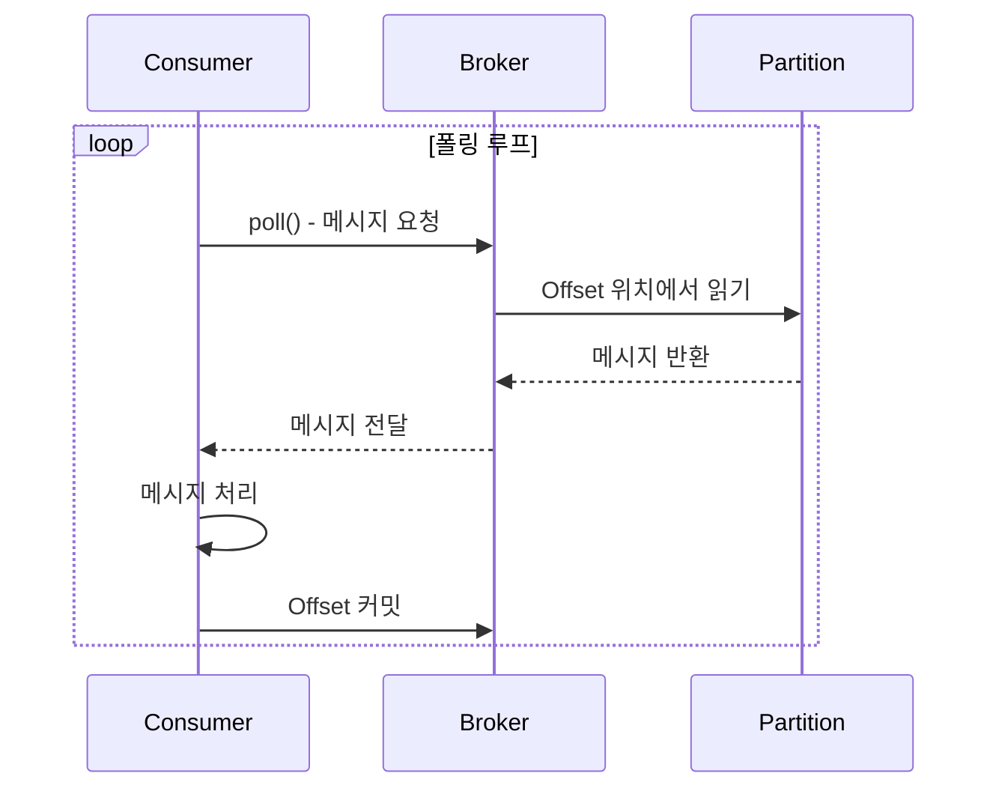
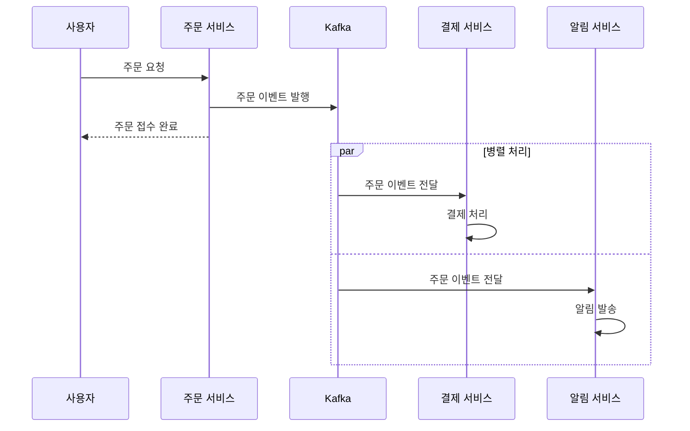
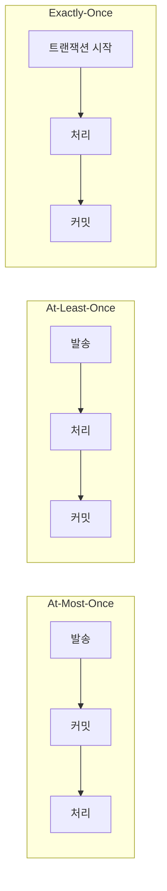

# 메시지 흐름

Kafka에서 메시지가 발행되고 소비되는 전체 과정을 이해합니다.

## 왜 메시지 흐름을 이해해야 하는가?

Kafka를 "그냥 메시지 큐"로만 생각하면 운영 중 예상치 못한 문제를 겪게 됩니다. 메시지 흐름을 깊이 이해하면 다음 질문에 답할 수 있습니다:

- **"왜 메시지 순서가 뒤바뀌었지?"** → Partition과 Key의 관계를 모르면 발생
- **"왜 같은 메시지가 두 번 처리되었지?"** → Offset 커밋 시점을 이해하지 못하면 발생
- **"왜 Consumer가 메시지를 못 받지?"** → Pull 방식의 특성을 모르면 원인 파악 어려움
- **"왜 처리량이 기대보다 낮지?"** → Partition 분배 원리를 모르면 병목 해결 불가

이 문서에서는 단순히 "어떻게 동작하는가"를 넘어 **"왜 이렇게 설계되었고, 실무에서 어떤 영향을 미치는가"**를 함께 다룹니다.

## 전체 흐름 개요



## 1단계: 메시지 발행 (Produce)

Producer가 메시지를 Kafka에 전송합니다.



### 발행 과정

1. **메시지 생성**: Key-Value 쌍으로 메시지 구성
2. **직렬화**: 객체를 바이트 배열로 변환
3. **Partition 결정**: Key 해시 또는 라운드 로빈
4. **전송**: 네트워크를 통해 Broker로 전송

```java
// Producer 코드 예시
kafkaTemplate.send("orders", orderId, orderJson);
//                  Topic    Key      Value
```

### Partition 결정 방식



- **Key 있음**: 동일 Key는 항상 동일 Partition으로
- **Key 없음**: 라운드 로빈으로 균등 분배

### Key 설계가 중요한 이유

Key는 단순한 식별자가 아니라 **메시지의 운명을 결정**합니다.

**순서 보장의 핵심:**
Kafka는 **Partition 내에서만 순서를 보장**합니다. 같은 Key를 가진 메시지는 같은 Partition으로 가므로 순서가 보장되지만, 다른 Key의 메시지끼리는 순서를 보장하지 않습니다.

```
예시: 주문 상태 변경 이벤트

Key = "order-123"인 메시지들:
  1. OrderCreated (Partition 2)
  2. OrderPaid (Partition 2)
  3. OrderShipped (Partition 2)
→ 순서 보장됨: Created → Paid → Shipped

Key 없이 보낸 경우:
  1. OrderCreated (Partition 0)
  2. OrderPaid (Partition 2)
  3. OrderShipped (Partition 1)
→ Consumer에서 Shipped가 Created보다 먼저 처리될 수 있음!
```

**Key 설계 가이드:**

| 상황 | 권장 Key | 이유 |
|------|----------|------|
| 주문 이벤트 | `orderId` | 같은 주문의 상태 변경은 순서대로 처리되어야 함 |
| 사용자 활동 로그 | `userId` | 같은 사용자의 행동은 시간 순서가 중요 |
| 센서 데이터 | `sensorId` | 같은 센서의 데이터는 시계열로 처리 |
| 범용 로그 | Key 없음 | 순서가 중요하지 않으면 균등 분배가 유리 |

**주의: Hot Partition 문제**

특정 Key에 메시지가 집중되면 해당 Partition만 과부하됩니다:

```
나쁜 예시: 대형 고객사의 모든 주문이 "customer-대기업" Key 사용
→ 해당 Partition만 처리량 폭주, 다른 Partition은 유휴 상태

해결책:
1. Key를 더 세분화: "customer-대기업-order-123"
2. 또는 순서가 필수가 아니면 Key 없이 전송
```

## 2단계: 메시지 저장 (Store)

Broker가 메시지를 Partition에 저장합니다.



### 저장 특성

| 특성 | 설명 |
|------|------|
| **순차 저장** | 메시지는 Partition 끝에 추가 (Append-only) |
| **불변성** | 저장된 메시지는 수정 불가 |
| **Offset 할당** | 각 메시지에 고유 순번 부여 |
| **영속성** | 디스크에 저장되어 재시작해도 유지 |

### Offset이란?

```
Partition 0: [0] [1] [2] [3] [4] [5] [6] [7]
                              ↑
                         현재 Consumer 위치
```

- 각 메시지의 고유 식별자 (순차 번호)
- Consumer는 Offset을 기준으로 읽은 위치 추적
- 0부터 시작하여 무한히 증가

## 3단계: 메시지 소비 (Consume)

Consumer가 Broker로부터 메시지를 가져옵니다.



### 소비 과정

1. **Poll**: Consumer가 Broker에 메시지 요청
2. **Fetch**: Broker가 Partition에서 메시지 읽기
3. **처리**: Consumer가 비즈니스 로직 실행
4. **커밋**: 처리 완료된 Offset 저장

```java
// Consumer 코드 예시
@KafkaListener(topics = "orders", groupId = "order-service")
public void consume(ConsumerRecord<String, String> record) {
    String key = record.key();
    String value = record.value();
    long offset = record.offset();

    // 비즈니스 로직 처리
    processOrder(value);

    // Offset은 자동으로 커밋됨 (기본 설정)
}
```

### Pull vs Push: 왜 Kafka는 Pull 방식인가?

Kafka는 **Pull 방식**을 사용합니다. 이 설계 결정에는 분명한 이유가 있습니다.

| 방식 | 설명 | 장점 | 단점 |
|------|------|------|------|
| **Pull** | Consumer가 필요할 때 가져감 | Consumer 처리 속도에 맞춤 | 폴링 오버헤드, 지연 발생 가능 |
| Push | Broker가 Consumer에게 밀어냄 | 즉시 전달 가능 | Consumer 과부하, 백프레셔 복잡 |

**Pull 방식의 실질적 장점:**

1. **Consumer 자율성**: 느린 Consumer도 자기 속도로 처리 가능. Push면 메시지가 쌓여서 OOM 발생
2. **배치 처리 효율**: Consumer가 한 번에 여러 메시지를 가져와 처리 가능 (`max.poll.records`)
3. **리밸런싱 유연성**: Consumer 추가/제거 시 Broker 부담 없음

**Pull 방식의 주의점:**

```java
// poll() 호출 간격이 너무 길면 Consumer가 죽은 것으로 간주됨
// max.poll.interval.ms (기본 5분) 내에 다음 poll()을 호출해야 함

@KafkaListener(topics = "orders")
public void consume(String message) {
    // ❌ 위험: 처리 시간이 5분 이상 걸리면 리밸런싱 발생
    verySlowProcess(message);

    // ✅ 해결: 처리 시간이 긴 작업은 별도 스레드로 위임
    executorService.submit(() -> verySlowProcess(message));
}
```

**실시간성이 필요하다면?**

Pull 방식이라도 `fetch.min.bytes=1`과 짧은 폴링 간격으로 거의 실시간에 가깝게 처리할 수 있습니다. 다만, 진정한 실시간이 필요하면 Kafka Streams나 다른 스트리밍 솔루션을 고려하세요.

## 전체 흐름 예시

주문 시스템에서의 메시지 흐름:



## 메시지 보장 수준



| 수준 | 설명 | 사용 사례 |
|------|------|----------|
| **At-Most-Once** | 최대 1번 (유실 가능) | 로그, 메트릭 |
| **At-Least-Once** | 최소 1번 (중복 가능) | 일반적인 이벤트 |
| **Exactly-Once** | 정확히 1번 | 금융 트랜잭션 |

**어떤 수준을 선택해야 하는가?**

대부분의 경우 **At-Least-Once + 멱등성 처리**가 정답입니다:

- At-Most-Once: 데이터 유실을 감수할 수 있는 경우만 (실제로 드묾)
- Exactly-Once: Kafka 트랜잭션 오버헤드가 있어 꼭 필요한 경우만
- At-Least-Once: 가장 일반적. Consumer에서 멱등성을 보장하면 중복 걱정 없음

```java
// 멱등성 처리 예시: 이미 처리한 이벤트는 무시
@KafkaListener(topics = "orders")
public void consume(ConsumerRecord<String, OrderEvent> record) {
    String eventId = record.value().getEventId();

    // 이미 처리한 이벤트인지 확인
    if (processedEventRepository.exists(eventId)) {
        log.info("이미 처리된 이벤트, 건너뜀: {}", eventId);
        return;
    }

    // 비즈니스 로직 처리
    processOrder(record.value());

    // 처리 완료 기록
    processedEventRepository.save(eventId);
}
```

---

## 실무에서 흔한 실수

### 실수 1: Key 없이 순서 의존 로직 구현

```java
// ❌ 잘못된 코드: 주문 상태 변경인데 Key가 없음
kafkaTemplate.send("order-events", orderEvent);  // Key 없음!

// Consumer에서 상태 머신 오류 발생 가능
// "Shipped 상태에서 Created 이벤트를 받았습니다" 같은 에러
```

**해결:** 순서가 중요한 이벤트는 반드시 Key를 지정하세요.

```java
// ✅ 올바른 코드
kafkaTemplate.send("order-events", orderId, orderEvent);
```

### 실수 2: 자동 커밋에 의존하면서 긴 처리 시간

```java
// ❌ 위험: 자동 커밋(5초마다)인데 처리가 10초 걸림
@KafkaListener(topics = "orders")
public void consume(String message) {
    longRunningProcess(message);  // 10초 소요
    // 처리 중에 자동 커밋됨 → 실패하면 메시지 유실!
}
```

**해결:** 긴 처리가 필요하면 수동 커밋 사용

```java
// ✅ 올바른 코드
@KafkaListener(topics = "orders")
public void consume(String message, Acknowledgment ack) {
    longRunningProcess(message);
    ack.acknowledge();  // 처리 완료 후 커밋
}
```

### 실수 3: Consumer 처리 속도 < Producer 전송 속도

**증상:** Consumer lag이 계속 증가, 결국 처리 불가능한 수준까지 쌓임

**원인 파악:**
```bash
# Consumer lag 확인
kafka-consumer-groups.sh --describe --group order-service \
  --bootstrap-server localhost:9092
```

**해결책:**
1. **Consumer 인스턴스 추가** (Partition 수만큼)
2. **처리 로직 최적화** (DB 배치 처리, 비동기화)
3. **Partition 수 증가** (Consumer 확장 여지 확보)

### 실수 4: Partition 수보다 많은 Consumer

```
Topic: orders (Partition 3개)
Consumer Group: order-service (Consumer 5개)

결과:
- Consumer 1 → Partition 0
- Consumer 2 → Partition 1
- Consumer 3 → Partition 2
- Consumer 4 → 유휴 (처리할 Partition 없음)
- Consumer 5 → 유휴 (처리할 Partition 없음)
```

**해결:** Consumer 수 ≤ Partition 수를 유지하세요. 확장이 필요하면 먼저 Partition을 늘리세요.

---

## 핵심 정리

| 개념 | 핵심 포인트 |
|------|-------------|
| **Key** | 순서 보장이 필요하면 반드시 지정. Hot Partition 주의 |
| **Partition** | 병렬 처리의 단위. Consumer 수는 Partition 수 이하로 |
| **Offset** | Consumer의 읽기 위치. 커밋 시점이 메시지 보장 수준 결정 |
| **Pull 방식** | Consumer가 주도권. 처리 시간이 길면 poll 간격 주의 |

## 다음 단계

- [Consumer Group & Offset](../consumer-group-offset/) - 병렬 처리와 상태 관리
