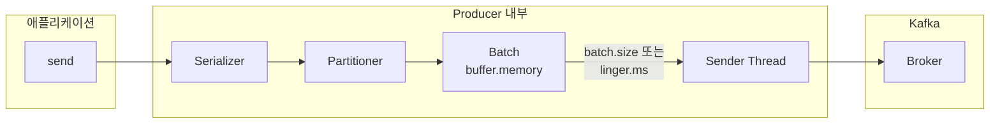
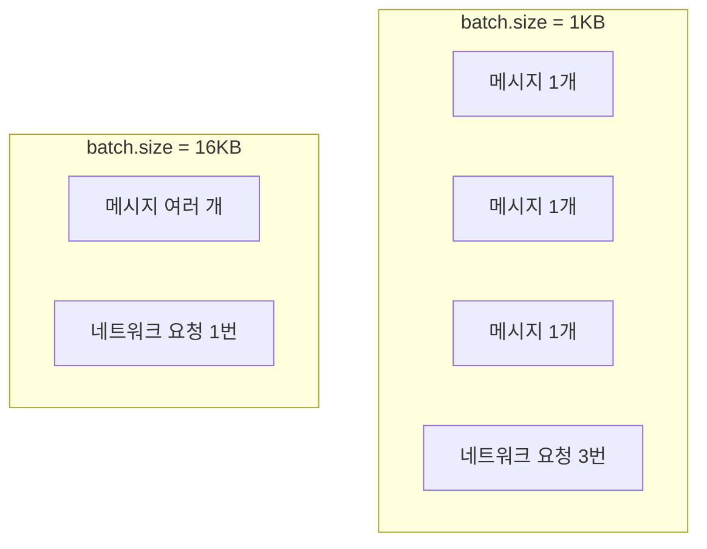
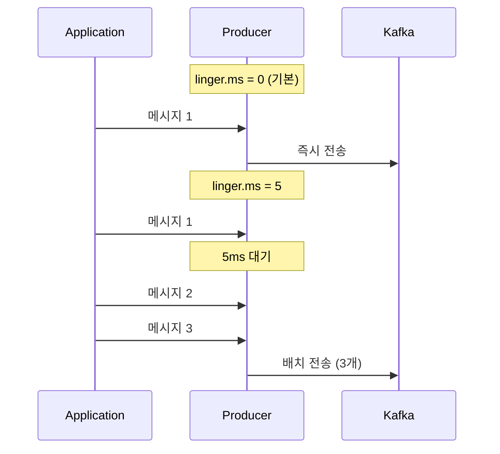
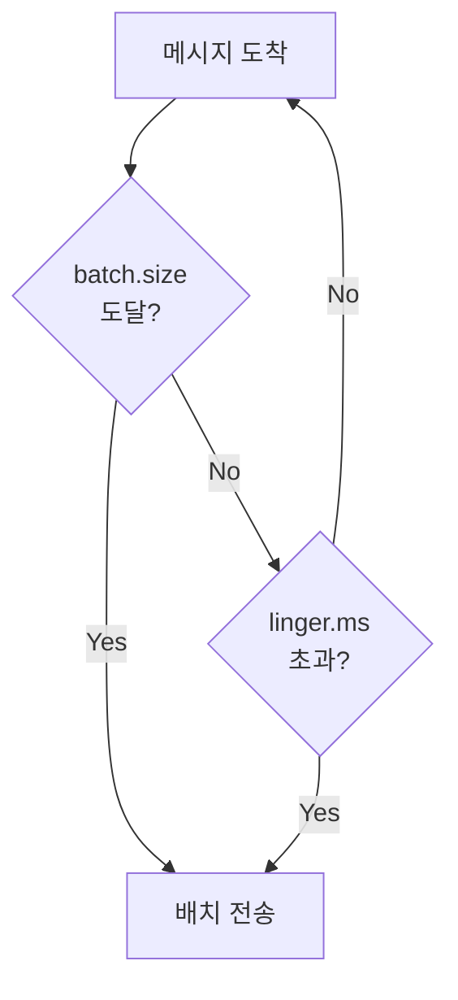
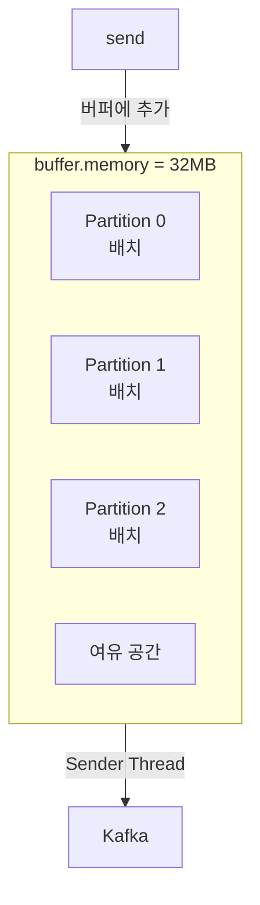
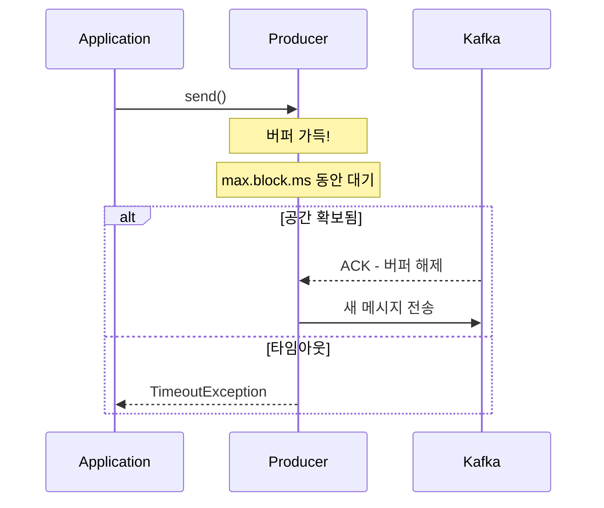
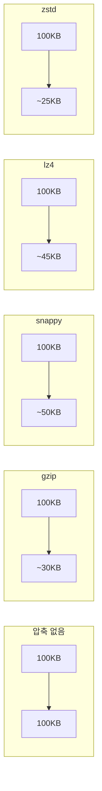
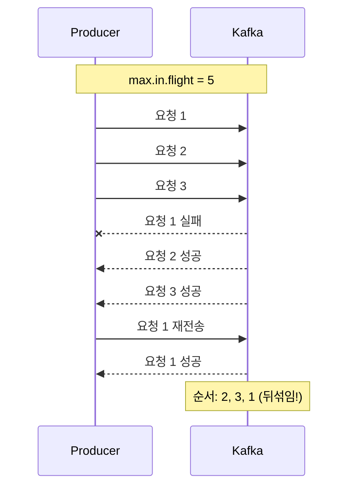
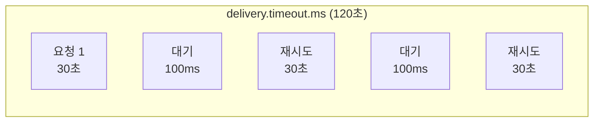
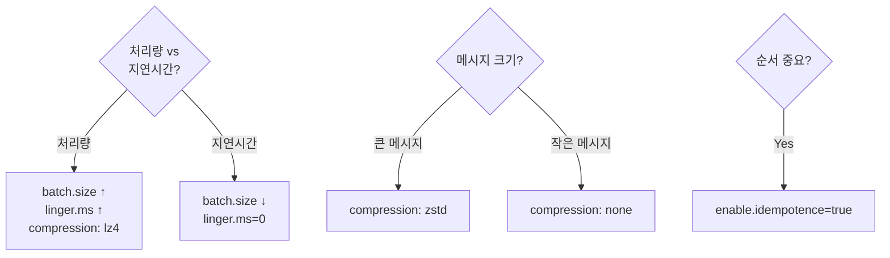

# Producer 튜닝

Producer 성능을 최적화하는 핵심 설정들을 이해합니다.

> **Kafka 버전**: 이 문서는 **Kafka 3.6.x** 기준으로 작성되었습니다.

## 선행 지식

- [심화 개념](../advanced-concepts/) - acks, Message Key, Idempotent Producer
- [메시지 흐름](../message-flow/) - Topic, Partition, Broker 개념

## Producer 내부 구조



## 핵심 설정 개요

| 설정 | 기본값 | 영향 |
|------|--------|------|
| `batch.size` | 16KB | 배치 크기 |
| `linger.ms` | 0ms | 배치 대기 시간 |
| `buffer.memory` | 32MB | 전체 버퍼 크기 |
| `compression.type` | none | 압축 방식 |
| `max.in.flight.requests.per.connection` | 5 | 동시 요청 수 |

## batch.size

한 번에 전송할 메시지 배치의 최대 크기입니다.

### 동작 원리



### 설정 가이드

```yaml
spring:
  kafka:
    producer:
      batch-size: 16384  # 16KB (기본값)
      # batch-size: 65536  # 64KB (처리량 중시)
      # batch-size: 1024   # 1KB (지연 시간 중시)
```

| 값 | 효과 | 적합한 경우 |
|----|------|------------|
| **작은 값** | 낮은 지연, 낮은 처리량 | 실시간 요구사항 |
| **큰 값** | 높은 처리량, 높은 지연 | 배치 처리 |

## linger.ms

배치가 가득 차지 않아도 전송하기까지 대기하는 시간입니다.

### 동작 원리



### 설정 가이드

```yaml
spring:
  kafka:
    producer:
      properties:
        linger.ms: 5  # 5ms 대기
```

| 값 | 효과 | 적합한 경우 |
|----|------|------------|
| **0 (기본)** | 즉시 전송 | 지연 시간 최소화 |
| **5-10ms** | 적당한 배칭 | 일반적 권장 |
| **100ms+** | 최대 배칭 | 대용량 배치 처리 |

### batch.size + linger.ms 조합



둘 중 하나의 조건이 만족되면 전송됩니다.

## buffer.memory

Producer가 사용할 수 있는 전체 버퍼 메모리입니다.

### 동작 원리



### 버퍼 부족 시



### 설정 가이드

```yaml
spring:
  kafka:
    producer:
      buffer-memory: 33554432  # 32MB (기본값)
      properties:
        max.block.ms: 60000  # 버퍼 대기 최대 시간
```

**권장:** `buffer.memory` > `batch.size` × Partition 수

## compression.type

메시지 압축 방식을 설정합니다.

### 압축 방식 비교



| 방식 | 압축률 | CPU 사용 | 속도 | 권장 |
|------|--------|---------|------|------|
| **none** | 0% | 최저 | 최고 | 작은 메시지 |
| **gzip** | 최고 | 최고 | 최저 | 저장 공간 중시 |
| **snappy** | 중간 | 낮음 | 높음 | **일반 권장** |
| **lz4** | 중간 | 낮음 | 최고 | 고성능 요구 |
| **zstd** | 높음 | 중간 | 높음 | Kafka 2.1+ |

### 설정

```yaml
spring:
  kafka:
    producer:
      compression-type: snappy  # 일반 권장
      # compression-type: lz4   # 고성능
      # compression-type: zstd  # 고압축
```

### 압축의 이점

```
원본 데이터: 100MB
├── 네트워크 전송: 100MB
├── 브로커 저장: 100MB
└── 복제 전송: 200MB (RF=3)

snappy 압축: 50MB
├── 네트워크 전송: 50MB (-50%)
├── 브로커 저장: 50MB (-50%)
└── 복제 전송: 100MB (-50%)
```

## max.in.flight.requests.per.connection

하나의 연결에서 ACK 대기 중인 최대 요청 수입니다.

### 순서 보장 문제



### 해결책

```yaml
# 방법 1: Idempotent Producer (권장)
spring:
  kafka:
    producer:
      properties:
        enable.idempotence: true  # Kafka 3.0+ 기본값
        max.in.flight.requests.per.connection: 5  # 5까지 안전

# 방법 2: in-flight를 1로 제한 (성능 저하)
spring:
  kafka:
    producer:
      properties:
        max.in.flight.requests.per.connection: 1
```

Idempotent Producer는 시퀀스 번호로 순서를 보장합니다.

## 재시도 설정

### 핵심 설정

```yaml
spring:
  kafka:
    producer:
      retries: 2147483647  # Integer.MAX_VALUE (기본값)
      properties:
        delivery.timeout.ms: 120000  # 전체 타임아웃
        retry.backoff.ms: 100  # 재시도 간격
        request.timeout.ms: 30000  # 단일 요청 타임아웃
```

### 타임아웃 관계



**규칙:** `delivery.timeout.ms` >= `request.timeout.ms` + `linger.ms`

## 프로필별 설정 예시

### 처리량 최적화 (Throughput)

```yaml
spring:
  kafka:
    producer:
      acks: all
      batch-size: 65536  # 64KB
      compression-type: lz4
      properties:
        linger.ms: 50
        buffer.memory: 67108864  # 64MB
```

### 지연 시간 최적화 (Latency)

```yaml
spring:
  kafka:
    producer:
      acks: 1  # 또는 all
      batch-size: 1024  # 1KB
      compression-type: none
      properties:
        linger.ms: 0
```

### 균형잡힌 설정 (Balanced)

```yaml
spring:
  kafka:
    producer:
      acks: all
      batch-size: 16384  # 16KB
      compression-type: snappy
      properties:
        linger.ms: 5
        enable.idempotence: true
```

## 설정 튜닝 가이드



## 성능 특성 참고 데이터

아래 수치는 **참고용**입니다. 실제 성능은 환경(하드웨어, 네트워크, 메시지 크기, 직렬화 방식)에 따라 크게 달라집니다.

> **측정 환경 예시**: 3-node Kafka 클러스터, 각 노드 8 vCPU, 32GB RAM, NVMe SSD, 1Gbps 네트워크

**직접 측정을 권장합니다:**
```bash
# Kafka 내장 성능 테스트 도구
kafka-producer-perf-test.sh --topic test-topic \
    --num-records 1000000 \
    --record-size 1024 \
    --throughput -1 \
    --producer-props bootstrap.servers=localhost:9092 \
        linger.ms=5 batch.size=16384
```

### linger.ms 영향 측정

| linger.ms | 메시지 크기 | 초당 메시지 | 레이턴시 (p99) | 네트워크 요청/초 |
|-----------|-------------|-------------|---------------|-----------------|
| 0 | 1KB | 45,000 | 2ms | 45,000 |
| 5 | 1KB | 120,000 | 8ms | 8,000 |
| 20 | 1KB | 180,000 | 25ms | 3,000 |
| 50 | 1KB | 210,000 | 55ms | 1,500 |

> **인사이트:** linger.ms=5만으로도 처리량이 **2.7배** 증가합니다. 대부분의 경우 5~20ms가 최적입니다.

### batch.size 영향 측정

| batch.size | linger.ms | 초당 메시지 | 메모리 사용량 |
|------------|-----------|-------------|--------------|
| 16KB | 5 | 120,000 | 낮음 |
| 64KB | 5 | 165,000 | 중간 |
| 128KB | 5 | 175,000 | 높음 |
| 256KB | 5 | 178,000 | 매우 높음 |

> **인사이트:** 64KB 이상에서는 처리량 증가가 미미합니다. 메모리 대비 효율은 **64KB**가 최적입니다.

### 압축 방식 비교 (10KB 메시지)

| 압축 방식 | 압축률 | 처리량 (msg/s) | CPU 사용률 | 권장 여부 |
|----------|--------|---------------|-----------|----------|
| none | 0% | 180,000 | 15% | 작은 메시지 |
| snappy | 55% | 165,000 | 25% | **일반 권장** |
| lz4 | 52% | 175,000 | 22% | **고성능 권장** |
| gzip | 72% | 95,000 | 45% | 저장 공간 중시 |
| zstd | 68% | 140,000 | 30% | Kafka 2.1+ |

## 프로덕션 트러블슈팅

### 1. BufferExhaustedException

```
org.apache.kafka.clients.producer.BufferExhaustedException:
Failed to allocate memory within the configured max blocking time
```

**원인:** buffer.memory가 가득 차서 max.block.ms 시간 내에 공간 확보 실패

```yaml
# 해결책
spring:
  kafka:
    producer:
      buffer-memory: 67108864  # 32MB → 64MB 증가
      properties:
        max.block.ms: 120000   # 60초 → 120초 증가
        linger.ms: 5           # 배치 전송 촉진
```

**근본 원인 파악:**
```bash
# Broker 응답 시간 확인
kafka-producer-perf-test.sh --topic test \
    --num-records 100000 \
    --record-size 1000 \
    --throughput -1 \
    --producer-props bootstrap.servers=localhost:9092

# 느린 Broker가 있으면 해당 노드 점검
```

### 2. RecordTooLargeException

```
org.apache.kafka.common.errors.RecordTooLargeException:
The message is 2097152 bytes when serialized which is larger than 1048576
```

**해결책:**

```yaml
# Producer 설정
spring:
  kafka:
    producer:
      properties:
        max.request.size: 10485760  # 10MB

# Broker 설정 (server.properties)
message.max.bytes: 10485760

# Topic 설정
max.message.bytes: 10485760
```

> **권장:** 메시지가 1MB를 초과하면 **참조 패턴** 사용을 고려하세요. 실제 데이터는 S3/MinIO에 저장하고 Kafka에는 URL만 전송합니다.

### 3. TimeoutException (Delivery Timeout)

```
org.apache.kafka.common.errors.TimeoutException:
Expiring 16 record(s) for topic-0:120000 ms has passed since batch creation
```

**원인 분석 체크리스트:**

```bash
# 1. Broker 상태 확인
kafka-metadata.sh --snapshot /path/to/kafka-logs/__cluster_metadata-0/00000000000000000000.log --status

# 2. 네트워크 레이턴시 확인
ping kafka-broker1

# 3. Broker 로그 확인 (느린 디스크 I/O?)
grep -i "slow" /var/log/kafka/server.log

# 4. ISR 상태 확인 (min.insync.replicas 충족?)
kafka-topics.sh --describe --topic orders \
    --bootstrap-server localhost:9092
```

**해결 설정:**

```yaml
spring:
  kafka:
    producer:
      retries: 2147483647
      properties:
        delivery.timeout.ms: 180000  # 3분
        request.timeout.ms: 60000    # 1분
        retry.backoff.ms: 500
```

## 메모리 최적화 가이드

### Producer 메모리 계산

```
총 메모리 = buffer.memory + (batch.size × Partition 수) + 오버헤드

예시:
├── buffer.memory: 32MB
├── batch.size: 64KB × 30 Partitions = 1.9MB
├── Serialization 버퍼: ~10MB
└── 총 예상: ~45MB per Producer
```

### JVM 튜닝 권장사항

```bash
# Producer 애플리케이션 JVM 옵션 (Java 17+ 기준)
JAVA_OPTS="-Xms512m -Xmx2g \
  -XX:+UseG1GC \
  -XX:MaxGCPauseMillis=20 \
  -XX:+ParallelRefProcEnabled"

# 대용량 처리 시 ZGC 고려 (Java 17+)
# JAVA_OPTS="-Xms2g -Xmx4g -XX:+UseZGC"
```

**G1GC 선택 이유:**
- Kafka Producer는 중간 크기 힙(1~4GB)에서 주로 운영
- G1GC는 이 범위에서 레이턴시/처리량 균형 우수
- MaxGCPauseMillis=20은 Kafka 기본 request.timeout.ms(30초) 대비 충분히 작음

| 메시지 볼륨 | Heap 크기 | buffer.memory |
|------------|----------|---------------|
| 낮음 (~1K/s) | 512MB | 32MB |
| 중간 (~10K/s) | 1GB | 64MB |
| 높음 (~100K/s) | 2GB+ | 128MB+ |

## 정리

| 설정 | 처리량 ↑ | 지연시간 ↓ |
|------|----------|-----------|
| `batch.size` | ↑ 크게 | ↓ 작게 |
| `linger.ms` | ↑ 크게 | = 0 |
| `compression.type` | lz4/snappy | none |
| `buffer.memory` | ↑ 크게 | 영향 없음 |

## FAQ

**Q: linger.ms를 늘리면 메시지 유실 위험이 있나요?**
> A: 아니요. linger.ms는 버퍼에서 대기하는 시간이며, 이 시간 동안 Producer가 죽으면 버퍼 내 메시지는 유실됩니다. 하지만 이는 acks 설정과 무관합니다. 중요 데이터는 `acks=all`과 함께 사용하세요.

**Q: batch.size와 linger.ms 중 뭘 먼저 튜닝해야 하나요?**
> A: `linger.ms`를 먼저 튜닝하세요. 기본값 0에서 5~20ms로만 바꿔도 처리량이 크게 향상됩니다. batch.size는 그 다음에 조정합니다.

**Q: 압축을 사용하면 Producer CPU가 병목이 될 수 있나요?**
> A: 네. gzip은 CPU 사용량이 높습니다. CPU 병목이 우려되면 lz4나 snappy를 사용하세요. 압축률은 낮지만 속도가 빠릅니다.

**Q: buffer.memory가 부족하면 어떻게 되나요?**
> A: `max.block.ms` 시간 동안 대기 후 `BufferExhaustedException` 발생. buffer.memory를 늘리거나 Broker 응답 속도를 확인하세요.

**Q: Idempotent Producer를 쓰면 성능이 떨어지나요?**
> A: Kafka 3.0+에서는 기본 활성화이며, 성능 영향은 미미합니다 (1~2% 이내). 순서 보장과 중복 방지 이점이 더 큽니다.

## 참고 자료

- [Kafka Producer Configs - Apache Documentation](https://kafka.apache.org/documentation/#producerconfigs)
- [Kafka Performance Tuning - Confluent Blog](https://www.confluent.io/blog/configure-kafka-to-minimize-latency/)
- [Producer Compression - Confluent Documentation](https://docs.confluent.io/platform/current/installation/configuration/producer-configs.html#compression-type)
- [kafka-producer-perf-test - Kafka Tools](https://kafka.apache.org/documentation/#basic_ops_producer_perf)

## 다음 단계

- [Consumer 심화 운영](../consumer-advanced/) - Consumer 성능 최적화
- [트랜잭션](../transactions/) - Exactly-Once 처리
