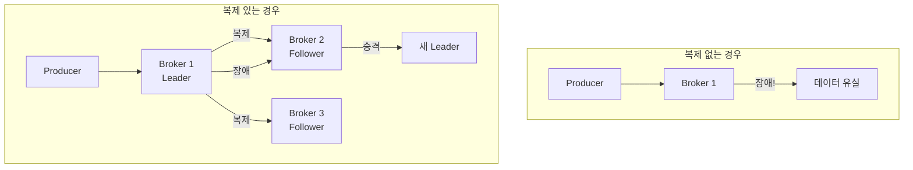
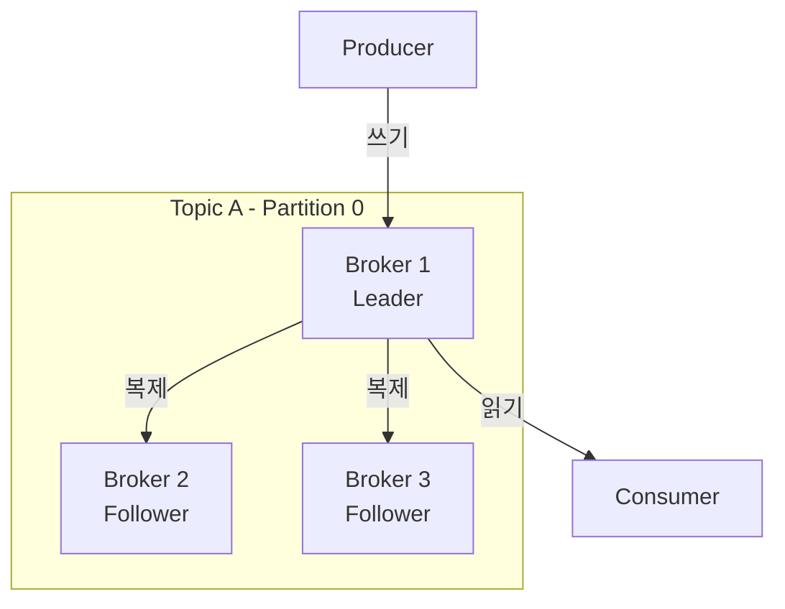
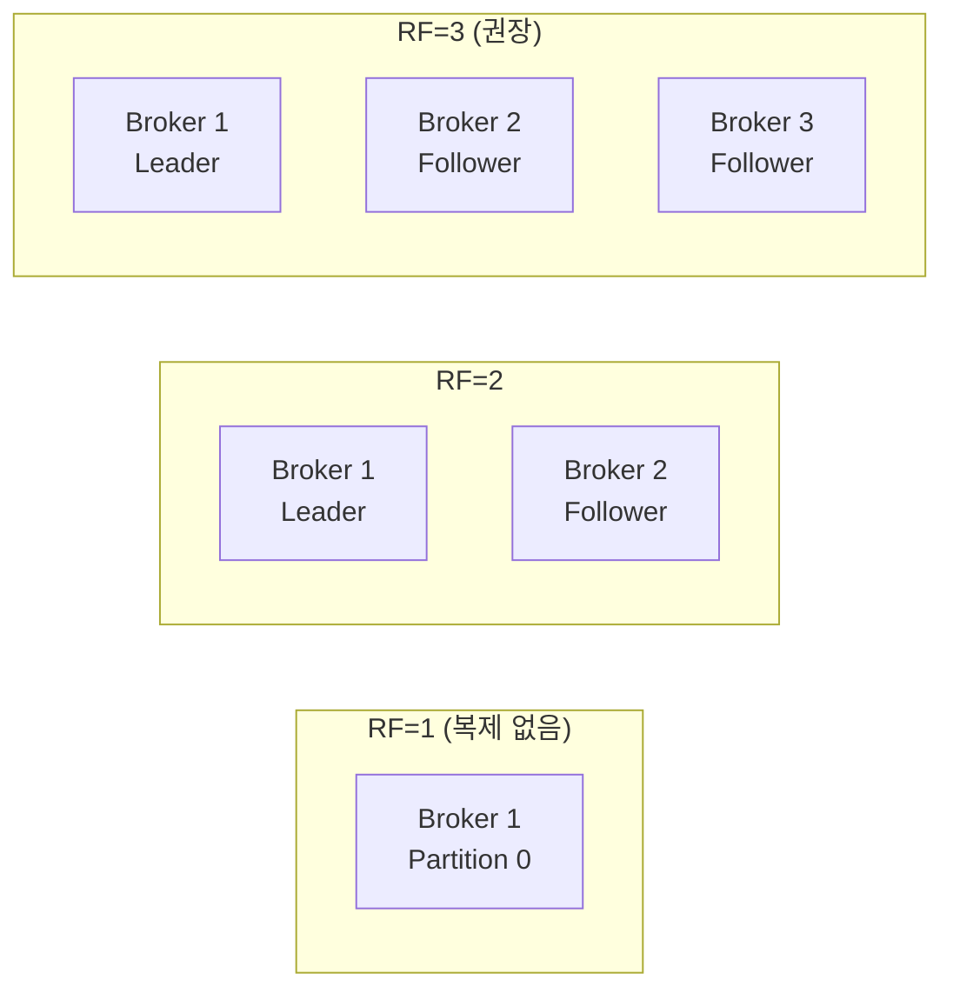
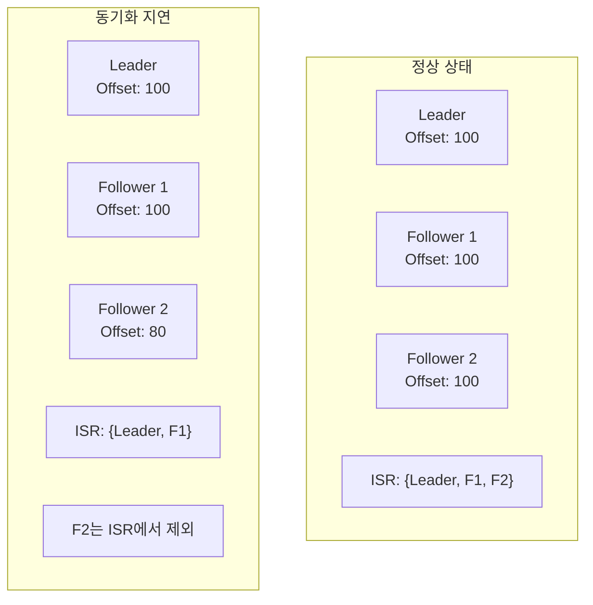
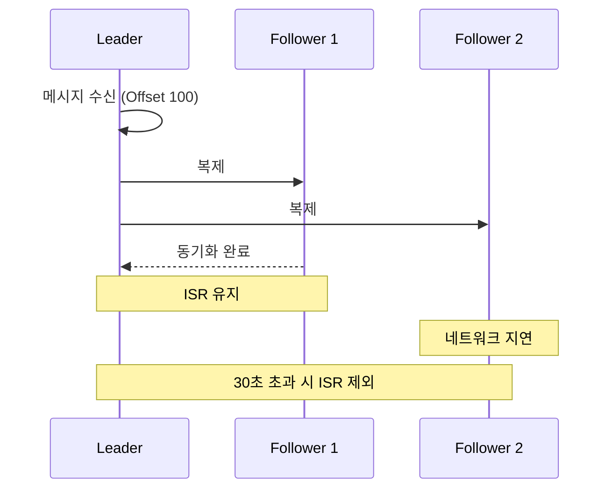
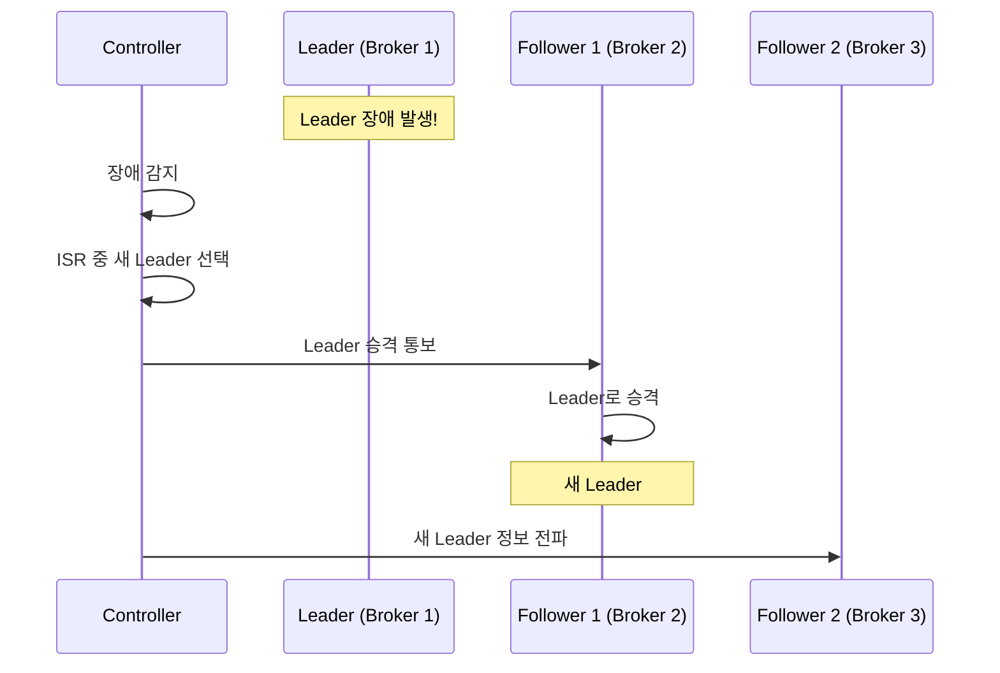
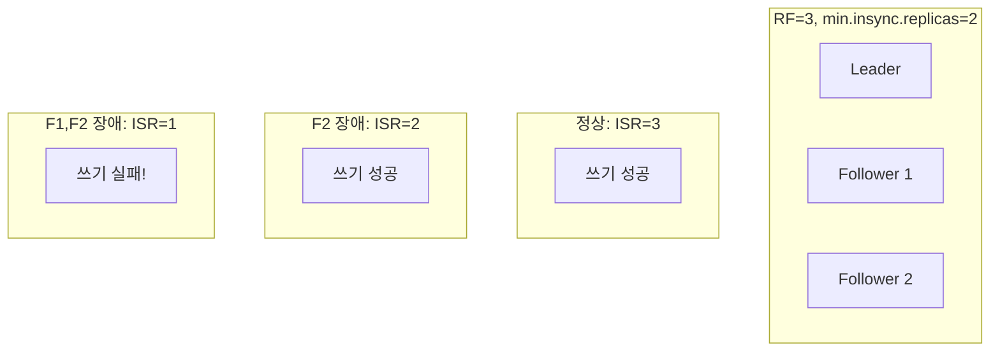
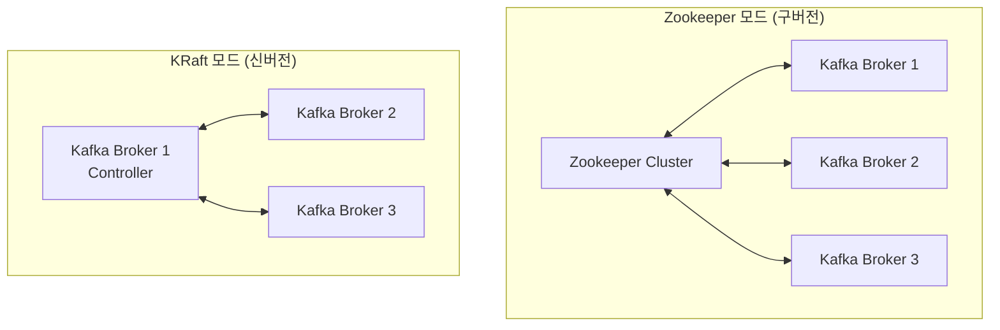
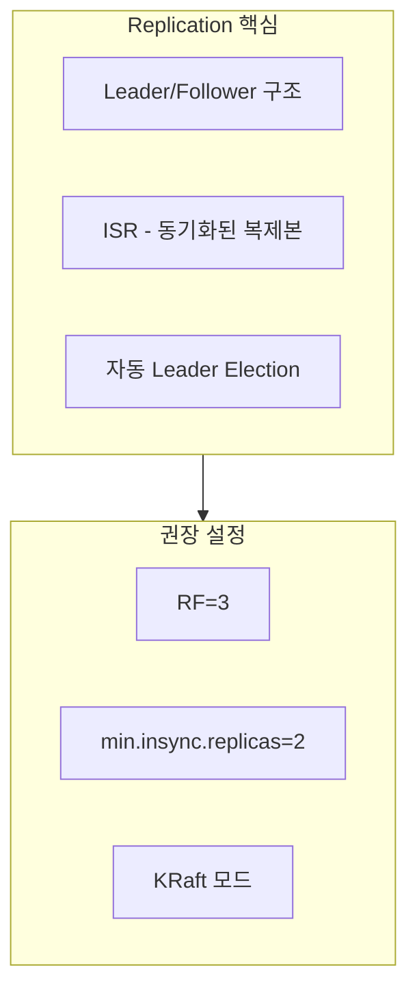

# Replication

데이터 복제와 고가용성 메커니즘을 이해합니다.

| 검증 환경 | 버전 |
|----------|------|
| Kafka | 3.6.1 (KRaft) |
| Spring Boot | 3.2.x |
| Spring Kafka | 3.1.x |
| Java | 17 |

> 이 문서의 코드 예제는 위 환경에서 컴파일 및 동작이 확인되었습니다.

## 왜 Replication이 필요한가?

단일 Broker에 데이터를 저장하면 장애 시 데이터 유실이 발생합니다.

**실제로 어떤 일이 생기는가?**

복제 없이 운영하다가 Broker가 다운되면:
- 해당 Broker의 모든 Partition 데이터 **영구 유실**
- Producer는 메시지 전송 실패
- Consumer는 해당 Partition 소비 불가
- **복구 방법 없음** - 백업이 없으면 데이터를 되살릴 수 없음

복제가 있으면:
- Leader 장애 시 Follower가 **수 초 내에 자동 승격**
- Producer/Consumer는 잠시 끊겼다가 새 Leader로 자동 연결
- 데이터 유실 없음 (ISR 설정에 따라)



## Leader와 Follower

각 Partition은 하나의 **Leader**와 여러 **Follower**로 구성됩니다.



### 역할 분담

| 역할 | 책임 |
|------|------|
| **Leader** | 모든 읽기/쓰기 처리, Follower에 데이터 복제 |
| **Follower** | Leader 데이터 복제, Leader 장애 시 승격 대기 |

> **중요:** Producer와 Consumer는 **Leader에만** 연결됩니다.

## Replication Factor

**Replication Factor**는 각 Partition의 복제본 수입니다.



### RF별 특성

| RF | 내결함성 | 저장 비용 | 권장 사용 |
|----|---------|----------|----------|
| 1 | 없음 | 1x | 개발/테스트 |
| 2 | 1 Broker 장애 허용 | 2x | 일반 |
| 3 | 2 Broker 장애 허용 | 3x | **프로덕션 권장** |

### 왜 RF=3이 프로덕션 권장인가?

**RF=2의 함정:**

언뜻 보면 "1대 장애 허용"이면 충분해 보입니다. 하지만 실제 운영 상황을 고려하면:

```
상황: RF=2, Broker A(Leader), Broker B(Follower)

1. Broker A 정기 점검으로 내림
   → Broker B가 Leader로 승격
   → 현재 복제본 1개만 존재 (위험!)

2. 점검 중 Broker B 장애 발생
   → 데이터 유실! 복구 불가능
```

**RF=3의 안전성:**

```
상황: RF=3, Broker A(Leader), B(Follower), C(Follower)

1. Broker A 정기 점검으로 내림
   → Broker B가 Leader로 승격
   → 여전히 복제본 2개 유지 (안전)

2. 점검 중 Broker B 장애 발생
   → Broker C가 Leader로 승격
   → 여전히 복제본 1개 유지 (서비스 지속)

3. Broker A 점검 완료 후 복귀
   → 정상 복귀, 다시 복제본 3개
```

**비용 대비 효과:**

| 항목 | RF=2 | RF=3 | 비고 |
|------|------|------|------|
| 저장 비용 | 2x | 3x | 50% 증가 |
| 점검 중 장애 허용 | 0대 | 1대 | **RF=3만 가능** |
| 데이터 유실 위험 | 중간 | 매우 낮음 | - |

결론: 저장 비용 50% 증가로 **운영 안정성이 크게 향상**됩니다. 프로덕션에서는 RF=3을 사용하세요.

## ISR (In-Sync Replicas)

**ISR**은 Leader와 동기화된 복제본 집합입니다.



### 복제 내부 동작: LEO와 High Watermark

복제가 **어떻게** 동작하는지 이해하면 문제 진단이 쉬워집니다.

```
Leader Partition:
+----+----+----+----+----+----+----+----+
| 0  | 1  | 2  | 3  | 4  | 5  | 6  | 7  |  ← 메시지들
+----+----+----+----+----+----+----+----+
                              ↑         ↑
                              HW        LEO
                         (High Watermark)  (Log End Offset)
```

| 용어 | 의미 | 중요성 |
|------|------|--------|
| **LEO (Log End Offset)** | 가장 마지막 메시지의 다음 Offset | Replica마다 다를 수 있음 |
| **High Watermark (HW)** | 모든 ISR에 복제 완료된 Offset | Consumer는 여기까지만 읽을 수 있음 |

**왜 이 구분이 중요한가:**

```
상황: Leader LEO=100, Follower LEO=95, HW=95

- Producer가 보낸 메시지 96-100은 Leader에만 존재
- Consumer는 95까지만 읽을 수 있음 (HW 기준)
- 이 상태에서 Leader가 죽으면?
  → Follower가 Leader로 승격
  → 메시지 96-100은 유실됨 (ISR 설정에 따라 다름)
```

**복제 지연 확인 방법:**

```bash
# 각 Replica의 LEO 확인
kafka-replica-verification.sh --broker-list localhost:9092 \
  --topic-white-list "orders"

# 출력에서 LEO 차이가 크면 복제 지연 중
```

### ISR 조건

Follower가 ISR에 포함되려면:
- `replica.lag.time.max.ms` 이내에 Leader와 동기화
- 기본값: 30초

### ISR 설정이 운영에 미치는 영향

`replica.lag.time.max.ms`는 "얼마나 느린 Follower까지 동기화된 것으로 인정할 것인가"를 결정합니다.

**값이 너무 짧으면 (예: 5초):**
```
문제: 네트워크 일시 지연만으로도 ISR에서 제외됨

상황:
1. 네트워크 순간 지연 (3-5초)
2. Follower가 ISR에서 제외
3. 곧바로 복구되어 다시 ISR에 포함
4. 반복되면서 불필요한 리밸런싱 발생

결과: 클러스터 불안정, 불필요한 알림 폭주
```

**값이 너무 길면 (예: 5분):**
```
문제: 실제 장애 감지가 느려짐

상황:
1. Follower가 실제로 멈춤 (디스크 장애 등)
2. 5분이 지나야 ISR에서 제외
3. 그 사이 Leader 장애 발생 시 오래된 데이터의 Follower가 승격될 수 있음

결과: 데이터 정합성 위험
```

**권장 설정:**

| 환경 | replica.lag.time.max.ms | 이유 |
|------|------------------------|------|
| 안정적인 네트워크 | 10000 (10초) | 빠른 장애 감지 |
| 불안정한 네트워크 | 30000 (30초, 기본값) | 순간 지연 허용 |
| 지역 간 복제 | 60000+ (1분+) | 높은 레이턴시 고려 |

**모니터링 필수 지표:**
```bash
# ISR 축소 확인 - 자주 발생하면 설정 검토 필요
kafka-topics.sh --describe --topic orders --bootstrap-server localhost:9092

# Under-replicated partitions - 0이 아니면 즉시 확인
kafka-topics.sh --describe --under-replicated-partitions \
  --bootstrap-server localhost:9092
```



## Leader Election

Leader 장애 시 새로운 Leader를 선출하는 과정입니다.



### 선출 규칙

1. **ISR 우선**: ISR 내의 Follower 중에서 선출
2. **Unclean Leader Election**: ISR이 비어있을 때 비동기 Follower 선출 (데이터 유실 가능)

```yaml
# Topic 설정
unclean.leader.election.enable: false  # 권장: 데이터 유실 방지
```

## min.insync.replicas

메시지 쓰기 시 필요한 최소 ISR 수입니다.



### 권장 설정

| 환경 | RF | min.insync.replicas |
|------|----|--------------------|
| 개발 | 1 | 1 |
| 프로덕션 | 3 | 2 |

## Zookeeper vs KRaft

Kafka의 메타데이터 관리 방식 비교:



### 비교

| 항목 | Zookeeper | KRaft |
|------|-----------|-------|
| **외부 의존성** | 필요 | 불필요 |
| **운영 복잡도** | 높음 | 낮음 |
| **Partition 확장성** | 제한적 | 향상 |
| **복구 시간** | 느림 | 빠름 |
| **Kafka 버전** | 2.x 이하 | 3.3+ 권장 |

> **권장:** 신규 프로젝트는 **KRaft 모드**를 사용하세요.

### KRaft 설정 예시

```yaml
# docker-compose.yml
environment:
  KAFKA_PROCESS_ROLES: broker,controller
  KAFKA_CONTROLLER_QUORUM_VOTERS: 1@kafka:9093
```

## 정리



| 개념 | 역할 |
|------|------|
| **Replication Factor** | 데이터 복사본 수 |
| **ISR** | 동기화된 복제본 집합 |
| **Leader Election** | 자동 장애 복구 |
| **KRaft** | 단순화된 클러스터 관리 |

---

## 장애 시나리오와 대응

### 시나리오 1: 단일 Broker 장애

**상황:** 3대 클러스터에서 1대 다운 (RF=3, min.insync.replicas=2)

```
영향:
- 해당 Broker가 Leader인 Partition들 → 자동으로 새 Leader 선출
- 해당 Broker의 Follower Partition들 → ISR에서 제외
- 서비스 중단 시간: 수 초 (Leader Election 시간)

대응:
1. 자동 복구 확인: kafka-topics.sh --describe로 Leader 확인
2. 장애 Broker 원인 분석 및 복구
3. 복구 후 Follower가 ISR에 다시 포함되는지 확인
```

### 시나리오 2: 과반수 Broker 장애

**상황:** 3대 클러스터에서 2대 다운

```
영향:
- ISR이 1개 이하가 되어 min.insync.replicas=2 조건 불충족
- Producer는 acks=all 설정 시 쓰기 실패
- Consumer는 읽기 가능 (Leader가 살아있다면)

대응:
1. 긴급 복구: 최소 1대라도 빨리 복구
2. 일시적으로 min.insync.replicas=1로 변경 (데이터 유실 위험 감수)
3. 근본 원인 분석 (동시 장애는 보통 공통 원인 있음)
```

### 시나리오 3: 전체 클러스터 재시작

**상황:** 계획된 유지보수로 전체 클러스터 재시작

```
권장 절차:
1. Rolling Restart 사용 (한 대씩 순차적으로)
2. 각 Broker 재시작 후 ISR 복구 확인 후 다음 진행
3. controlled.shutdown.enable=true 확인 (깨끗한 종료)

주의:
- 한꺼번에 재시작하면 Leader Election 폭주
- 데이터 정합성 문제 발생 가능
```

---

## 실무 팁

### 1. acks 설정과 Replication의 관계

| acks | 동작 | 데이터 안전성 | 성능 |
|------|------|-------------|------|
| 0 | 전송만 (응답 안 기다림) | 낮음 | 최고 |
| 1 | Leader 저장 확인 | 중간 | 높음 |
| all | 모든 ISR 저장 확인 | **높음** | 중간 |

**권장:** 프로덕션에서는 `acks=all` + `min.insync.replicas=2` 조합

```yaml
# application.yml
spring:
  kafka:
    producer:
      acks: all  # 모든 ISR에 저장 확인
```

### 2. Unclean Leader Election 주의

```yaml
# 절대 프로덕션에서 true로 설정하지 마세요
unclean.leader.election.enable: false  # 기본값이 false
```

**true로 설정하면:**
- ISR이 비어있을 때 동기화 안 된 Follower가 Leader로 승격
- 그 사이 Producer가 보낸 메시지 유실 가능
- **데이터 정합성보다 가용성이 중요한 경우에만** 고려

### 3. Broker 추가 시 주의사항

새 Broker를 추가해도 **기존 Partition은 자동으로 재배치되지 않습니다**.

```bash
# 수동으로 Partition 재배치 필요
kafka-reassign-partitions.sh --reassignment-json-file plan.json \
  --bootstrap-server localhost:9092 --execute
```

또는 Cruise Control 같은 자동화 도구 사용을 권장합니다.

### 4. 권장 클러스터 구성

| 환경 | Broker 수 | RF | min.insync.replicas |
|------|----------|----|--------------------|
| 개발 | 1 | 1 | 1 |
| 스테이징 | 3 | 2 | 1 |
| **프로덕션** | **3+** | **3** | **2** |
| 대규모 | 5+ | 3 | 2 |

---

## 프로덕션 운영 체크리스트

### 배포 전 점검

```
□ Replication Factor가 3 이상인가?
□ min.insync.replicas가 2 이상인가?
□ unclean.leader.election.enable이 false인가?
□ 모든 Broker가 다른 랙/가용영역에 분산되어 있는가?
□ 모니터링/알림이 설정되어 있는가?
```

### 일일 모니터링 점검

```bash
# 1. Under-replicated partition 확인 (0이어야 정상)
kafka-topics.sh --describe --under-replicated-partitions \
  --bootstrap-server localhost:9092

# 2. Offline partition 확인 (0이어야 정상)
kafka-topics.sh --describe --unavailable-partitions \
  --bootstrap-server localhost:9092

# 3. ISR 축소/확장 이벤트 확인 (로그)
grep -E "ISR|shrunk|expanded" /var/log/kafka/server.log
```

### 핵심 알림 규칙

```yaml
# Prometheus alerting rules
groups:
  - name: kafka-replication-alerts
    rules:
      # Under-replicated partitions > 0 이면 경고
      - alert: UnderReplicatedPartitions
        expr: kafka_server_replicamanager_underreplicatedpartitions > 0
        for: 5m
        labels:
          severity: warning
        annotations:
          summary: "{{ $value }}개의 partition이 복제 부족 상태"

      # ISR 축소가 빈번하면 경고
      - alert: FrequentISRShrink
        expr: rate(kafka_server_replicamanager_isrshrinks_total[5m]) > 0.1
        for: 10m
        labels:
          severity: warning
        annotations:
          summary: "ISR 축소가 빈번함 - 네트워크/디스크 점검 필요"

      # Offline partition은 즉시 알림
      - alert: OfflinePartitions
        expr: kafka_controller_kafkacontroller_offlinepartitionscount > 0
        for: 1m
        labels:
          severity: critical
        annotations:
          summary: "{{ $value }}개의 partition이 오프라인 상태!"
```

---

## 장애 복구 플레이북

### 상황 1: Under-replicated Partition 발생

```bash
# 1. 어떤 partition이 문제인지 확인
kafka-topics.sh --describe --under-replicated-partitions \
  --bootstrap-server localhost:9092

# 2. 해당 Broker의 상태 확인
# - Broker가 살아있는가?
# - CPU/메모리/디스크는 정상인가?
# - 네트워크 연결은 정상인가?

# 3. Broker 로그 확인
tail -f /var/log/kafka/server.log | grep -E "ERROR|WARN"

# 4. 복제 상태 확인
kafka-replica-verification.sh --broker-list localhost:9092 \
  --topic-white-list ".*"
```

### 상황 2: Broker 완전 장애

```bash
# 1. 영향받는 partition 확인
kafka-topics.sh --describe --bootstrap-server localhost:9092 \
  | grep "Isr:" | grep -v "broker-id-of-failed-broker"

# 2. Leader 재선출 상태 확인
kafka-leader-election.sh --bootstrap-server localhost:9092 \
  --election-type preferred --all-topic-partitions

# 3. Broker 복구 후 확인
# - 복구된 Broker가 ISR에 다시 포함되는지 확인
# - Under-replicated partition이 0이 되는지 확인
```

### 상황 3: 긴급 - 데이터 유실 방지

```bash
# 일시적으로 쓰기 허용 조건 완화 (주의: 데이터 유실 위험 증가)
# 정상화 후 반드시 원복해야 함!

# Topic 레벨에서 min.insync.replicas 변경
kafka-configs.sh --alter --entity-type topics --entity-name orders \
  --add-config min.insync.replicas=1 \
  --bootstrap-server localhost:9092

# 정상화 후 원복
kafka-configs.sh --alter --entity-type topics --entity-name orders \
  --add-config min.insync.replicas=2 \
  --bootstrap-server localhost:9092
```

---

## 복제 성능 영향

복제는 안전성을 높이지만 성능에 영향을 줍니다. 트레이드오프를 이해하세요.

### 쓰기 지연시간 (Latency)

| 설정 | 대략적 지연시간 | 안전성 |
|------|---------------|--------|
| acks=0 | < 1ms | 낮음 |
| acks=1 | 1-5ms | 중간 |
| acks=all, RF=3 | 5-15ms | 높음 |
| acks=all, RF=3, 원격 DC | 50-200ms | 매우 높음 |

> ⚠️ 위 수치는 참고용입니다. 실제 환경에서 반드시 측정하세요.

### 네트워크 대역폭 계산

복제는 네트워크 대역폭을 RF배 사용합니다:

```
예시: 100MB/sec 쓰기 처리량, RF=3

- Producer → Leader: 100MB/sec
- Leader → Follower1: 100MB/sec
- Leader → Follower2: 100MB/sec
- 총 네트워크 사용: 300MB/sec + Consumer 읽기

권장: Broker간 네트워크는 10Gbps 이상
```

## 다음 단계

- [심화 개념](../advanced-concepts/) - acks, Message Key, Retention
