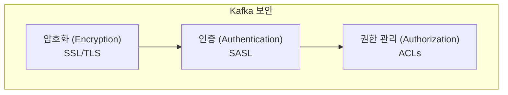
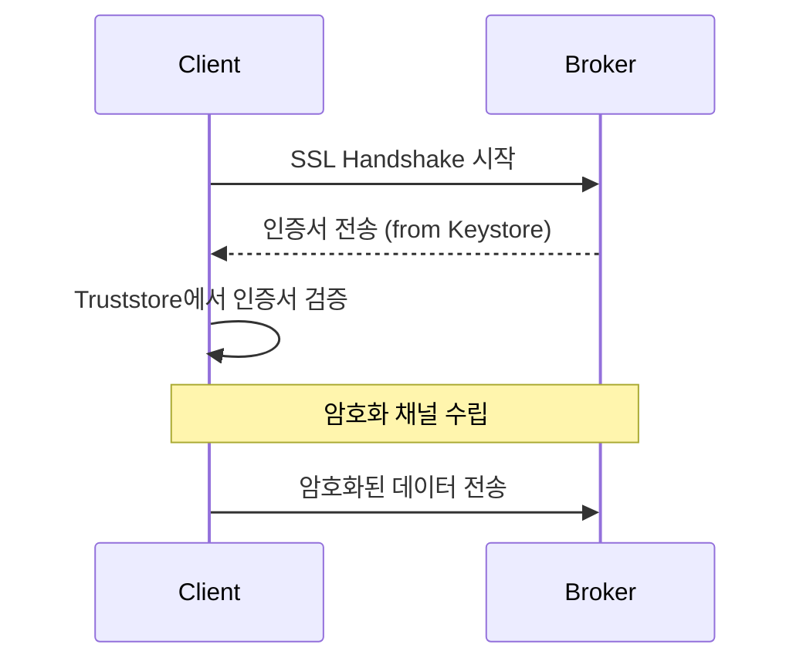
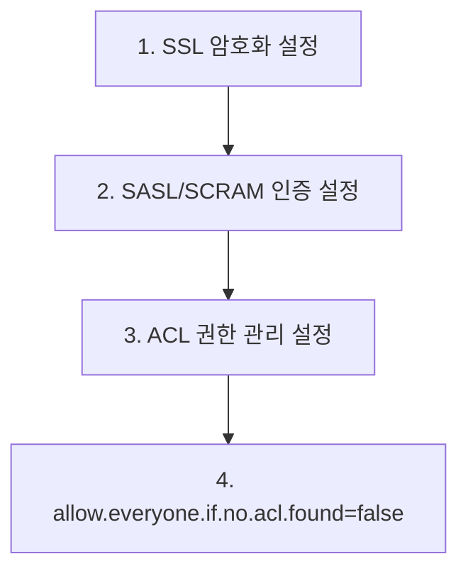

# Kafka 보안 기초

프로덕션 환경에서 Kafka를 안전하게 운영하기 위한 핵심 보안 요소인 암호화, 인증, 권한 관리를 이해합니다.

## Kafka 보안의 세 가지 축



| 요소 | 역할 | 해결하는 문제 |
|---|---|---|
| **암호화** | 데이터 탈취 방지 | "누가 내 데이터를 엿듣는가?" |
| **인증** | 신원 확인 | "당신은 누구인가?" |
| **권한 관리** | 접근 제어 | "당신이 이 작업을 해도 되는가?" |

---

## 1. 암호화 (Encryption): SSL/TLS

네트워크를 통해 전송되는 데이터(Producer ↔ Broker, Broker ↔ Consumer, Broker ↔ Broker)를 암호화합니다.

### 동작 원리

Java의 SSL/TLS 기능을 사용하여 통신 채널을 암호화합니다. 이를 위해 **Java Keystore**와 **Truststore**가 필요합니다.

- **Keystore**: 서버의 개인 키와 인증서를 저장합니다.
- **Truststore**: 클라이언트가 신뢰하는 서버의 인증서 또는 CA(Certificate Authority)를 저장합니다.



### 설정 예시 (Broker)

```properties
# server.properties
listeners=SSL://:9093
advertised.listeners=SSL://<hostname>:9093

ssl.keystore.location=/var/private/kafka/server.keystore.jks
ssl.keystore.password=test1234
ssl.key.password=test1234
ssl.truststore.location=/var/private/kafka/server.truststore.jks
ssl.truststore.password=test1234
```

### 설정 예시 (Client)

```yaml
# application.yml (Spring Boot)
spring:
  kafka:
    properties:
      security.protocol: SSL
    ssl:
      trust-store-location: file:/path/to/client.truststore.jks
      trust-store-password: password
      key-store-location: file:/path/to/client.keystore.jks
      key-store-password: password
```

---

## 2. 인증 (Authentication): SASL

클라이언트(Producer/Consumer)가 Broker에 연결할 때 신원을 확인하는 메커니즘입니다.

### SASL 메커니즘

| 메커니즘 | 설명 | 사용 사례 |
|---|---|---|
| **PLAIN** | 사용자명/비밀번호 기반. SSL과 함께 사용 필수. | 가장 간단한 인증 |
| **SCRAM** | Challenge-Response 방식. 비밀번호 유출 방지. | **권장**. PLAIN보다 안전 |
| **GSSAPI** | Kerberos 기반 인증. | 엔터프라이즈 환경 |

### 설정 예시 (Broker - SASL/SCRAM)

```properties
# server.properties
listeners=SASL_SSL://:9093
sasl.mechanism.inter.broker.protocol=SCRAM-SHA-256
sasl.enabled.mechanisms=SCRAM-SHA-256

# JAAS 설정 파일 (kafka_server_jaas.conf)
KafkaServer {
    org.apache.kafka.common.security.scram.ScramLoginModule required
    username="admin"
    password="admin-secret"
    ...
};
```

### 설정 예시 (Client - SASL/SCRAM)

```yaml
# application.yml
spring:
  kafka:
    properties:
      security.protocol: SASL_SSL
      sasl.mechanism: SCRAM-SHA-256
      sasl.jaas.config: 'org.apache.kafka.common.security.scram.ScramLoginModule required username="user" password="user-secret";'
```

---

## 3. 권한 관리 (Authorization): ACLs

인증된 사용자가 특정 리소스(Topic, Group 등)에 대해 수행할 수 있는 작업을 제어합니다.

### ACL (Access Control List) 구조

`Principal P is [Allowed/Denied] Operation O From Host H On Resource R`

- **Principal**: 사용자 또는 그룹 (예: `User:benji`)
- **Operation**: 작업 (예: `Read`, `Write`, `Create`)
- **Host**: 클라이언트 IP 주소 (예: `192.168.1.100`)
- **Resource**: 대상 (예: `Topic:orders`)

### ACL 명령어 예시

```bash
# 'benji' 사용자에게 'orders' 토픽에 대한 쓰기 권한 부여
kafka-acls.sh --bootstrap-server localhost:9093 \
  --add --allow-principal User:benji \
  --producer --topic orders

# 'data-team' 그룹에게 'logs' 토픽에 대한 읽기 권한 부여
kafka-acls.sh --bootstrap-server localhost:9093 \
  --add --allow-principal Group:data-team \
  --consumer --group analytics-group --topic logs
```

### 설정 예시 (Broker)

```properties
# server.properties
authorizer.class.name=kafka.security.authorizer.AclAuthorizer
allow.everyone.if.no.acl.found=false # 권장: ACL 없으면 모두 거부
```

## 권장 보안 구성



1.  **SSL/TLS**로 모든 통신을 암호화합니다.
2.  **SASL/SCRAM**으로 안전하게 사용자를 인증합니다.
3.  **ACLs**를 사용하여 최소 권한 원칙(Principle of Least Privilege)에 따라 접근을 제어합니다.

이 세 가지를 함께 구성해야 안전한 Kafka 환경을 구축할 수 있습니다.
