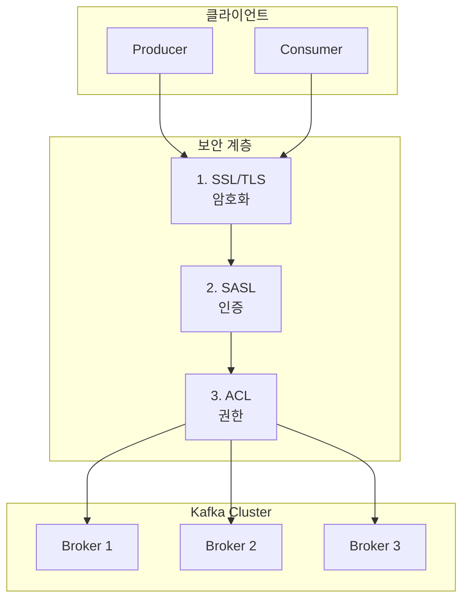

프로덕션 환경에서 Kafka를 안전하게 운영하기 위한 암호화, 인증, 권한 관리를 이해합니다.

#### 왜 Kafka 보안이 중요한가?

보안 없이 Kafka를 운영하면 심각한 문제가 발생할 수 있습니다. 먼저 데이터 유출 위험이 있습니다. 네트워크 스니핑을 통해 결제 정보나 개인정보가 탈취될 수 있으며, 평문 전송 시 중간자 공격(MITM)에 취약해집니다. 다음으로 무단 접근 문제가 있습니다. 인증이 없으면 누구나 Topic에 메시지를 발행할 수 있어 악의적인 데이터 주입으로 시스템이 오작동할 수 있습니다. 마지막으로 권한 남용이 발생할 수 있습니다. 권한 관리가 없으면 개발자가 실수로 프로덕션 Topic을 삭제하거나 민감 데이터에 무제한으로 접근하는 상황이 생깁니다.

보안의 3요소 관점에서 Kafka 보안을 살펴보면, 기밀성(Confidentiality)은 SSL/TLS 암호화로 데이터 탈취를 방지합니다. 무결성(Integrity)은 SSL/TLS와 메시지 서명으로 데이터 변조를 방지합니다. 가용성(Availability)은 ACL과 인증을 통해 무단 접근으로 인한 장애를 방지합니다.

#### Kafka 보안 아키텍처

Kafka 보안은 세 가지 계층으로 구성됩니다. 첫 번째 계층인 SSL/TLS는 클라이언트와 Broker 간의 모든 통신을 암호화합니다. 두 번째 계층인 SASL은 클라이언트의 신원을 확인하는 인증을 담당합니다. 세 번째 계층인 ACL은 인증된 클라이언트가 어떤 작업을 수행할 수 있는지 권한을 관리합니다. 클라이언트 요청은 이 세 계층을 모두 통과해야 Broker에 도달할 수 있습니다.



#### 암호화 (Encryption): SSL/TLS

SSL/TLS는 네트워크 통신을 암호화하여 데이터가 전송 중에 노출되는 것을 방지합니다. Kafka에서 SSL을 구성하려면 인증서를 생성하고 Broker와 Client에 각각 설정해야 합니다.

**인증서 생성 과정**

먼저 CA(Certificate Authority)를 생성합니다. CA는 다른 인증서에 서명하는 신뢰할 수 있는 기관 역할을 합니다.

```bash
# CA 개인키 생성
openssl genrsa -out ca-key.pem 2048

# CA 인증서 생성 (10년 유효)
openssl req -new -x509 -key ca-key.pem -out ca-cert.pem -days 3650 \
    -subj "/CN=KafkaCA/O=MyCompany/C=KR"
```

다음으로 Broker 인증서를 생성합니다. Broker는 자체 Keystore에 개인키와 인증서를 보관하며, 이 인증서는 CA에 의해 서명되어야 합니다.

```bash
# Broker Keystore 생성
keytool -genkeypair -alias kafka-broker \
    -keyalg RSA -keysize 2048 \
    -keystore kafka.broker.keystore.jks \
    -validity 365 \
    -storepass broker-secret \
    -keypass broker-secret \
    -dname "CN=kafka-broker,O=MyCompany,C=KR"

# CSR(Certificate Signing Request) 생성
keytool -certreq -alias kafka-broker \
    -keystore kafka.broker.keystore.jks \
    -file broker.csr \
    -storepass broker-secret

# CA로 서명
openssl x509 -req -in broker.csr \
    -CA ca-cert.pem -CAkey ca-key.pem -CAcreateserial \
    -out broker-signed.pem -days 365

# CA 인증서를 Keystore에 추가
keytool -importcert -alias ca-root \
    -file ca-cert.pem \
    -keystore kafka.broker.keystore.jks \
    -storepass broker-secret -noprompt

# 서명된 인증서를 Keystore에 추가
keytool -importcert -alias kafka-broker \
    -file broker-signed.pem \
    -keystore kafka.broker.keystore.jks \
    -storepass broker-secret -noprompt
```

마지막으로 Truststore를 생성합니다. Truststore는 신뢰하는 CA 인증서를 보관하며, 상대방의 인증서가 이 CA에 의해 서명되었는지 확인하는 데 사용됩니다.

```bash
# Broker Truststore (CA 인증서 포함)
keytool -importcert -alias ca-root \
    -file ca-cert.pem \
    -keystore kafka.broker.truststore.jks \
    -storepass truststore-secret -noprompt

# Client Truststore
keytool -importcert -alias ca-root \
    -file ca-cert.pem \
    -keystore kafka.client.truststore.jks \
    -storepass client-secret -noprompt
```

**Broker SSL 설정**

인증서를 생성한 후에는 Broker에 SSL 설정을 적용합니다. listeners는 SSL 프로토콜을 사용하는 포트를 지정하고, ssl.client.auth=required는 양방향 TLS를 활성화하여 클라이언트 인증서도 검증합니다.

```properties
# server.properties
listeners=SSL://:9093
advertised.listeners=SSL://kafka-broker:9093
security.inter.broker.protocol=SSL

# SSL 설정
ssl.keystore.location=/etc/kafka/secrets/kafka.broker.keystore.jks
ssl.keystore.password=broker-secret
ssl.key.password=broker-secret
ssl.truststore.location=/etc/kafka/secrets/kafka.broker.truststore.jks
ssl.truststore.password=truststore-secret

# 클라이언트 인증 (양방향 TLS)
ssl.client.auth=required  # none, requested, required
```

**Spring Boot 클라이언트 설정**

Spring Boot 애플리케이션에서 SSL을 사용하려면 security.protocol을 SSL로 설정하고 Truststore와 Keystore 위치를 지정합니다.

```yaml
# application.yml
spring:
  kafka:
    bootstrap-servers: kafka-broker:9093
    properties:
      security.protocol: SSL
    ssl:
      trust-store-location: classpath:kafka.client.truststore.jks
      trust-store-password: client-secret
      key-store-location: classpath:kafka.client.keystore.jks
      key-store-password: client-secret
      key-password: client-secret
```

프로그래밍 방식으로 SSL을 구성하면 더 세밀한 제어가 가능합니다.

```java
@Configuration
public class KafkaSslConfig {

    @Bean
    public ProducerFactory<String, String> producerFactory() {
        Map<String, Object> props = new HashMap<>();
        props.put(ProducerConfig.BOOTSTRAP_SERVERS_CONFIG, "kafka-broker:9093");
        props.put(ProducerConfig.KEY_SERIALIZER_CLASS_CONFIG, StringSerializer.class);
        props.put(ProducerConfig.VALUE_SERIALIZER_CLASS_CONFIG, StringSerializer.class);

        // SSL 설정
        props.put("security.protocol", "SSL");
        props.put(SslConfigs.SSL_TRUSTSTORE_LOCATION_CONFIG, "/path/to/truststore.jks");
        props.put(SslConfigs.SSL_TRUSTSTORE_PASSWORD_CONFIG, "truststore-secret");
        props.put(SslConfigs.SSL_KEYSTORE_LOCATION_CONFIG, "/path/to/keystore.jks");
        props.put(SslConfigs.SSL_KEYSTORE_PASSWORD_CONFIG, "client-secret");
        props.put(SslConfigs.SSL_KEY_PASSWORD_CONFIG, "client-secret");

        return new DefaultKafkaProducerFactory<>(props);
    }

    @Bean
    public KafkaTemplate<String, String> kafkaTemplate() {
        return new KafkaTemplate<>(producerFactory());
    }
}
```

#### 인증 (Authentication): SASL

SASL(Simple Authentication and Security Layer)은 클라이언트의 신원을 확인하는 인증 프레임워크입니다. Kafka는 여러 SASL 메커니즘을 지원하며, 각각 보안 수준과 설정 복잡도가 다릅니다.

PLAIN은 사용자명과 비밀번호를 평문으로 전송하므로 보안 수준이 낮고 반드시 SSL과 함께 사용해야 합니다. SCRAM-SHA-256은 Challenge-Response 방식으로 비밀번호를 안전하게 검증하며 프로덕션에서 권장됩니다. SCRAM-SHA-512는 더 강력한 해시를 사용하여 고보안 환경에 적합합니다. GSSAPI는 Kerberos 기반 인증으로 기존 Kerberos 인프라가 있는 조직에서 사용합니다. OAUTHBEARER는 OAuth 2.0 토큰 기반 인증으로 최신 인증 시스템과 통합할 때 사용합니다.

**SCRAM 사용자 생성**

SCRAM을 사용하려면 먼저 Broker에 사용자를 등록해야 합니다. KRaft 모드에서는 kafka-configs.sh 명령어로 사용자를 생성합니다.

```bash
# SCRAM-SHA-256 사용자 생성 (KRaft 모드)
kafka-configs.sh --bootstrap-server localhost:9092 \
    --alter --add-config 'SCRAM-SHA-256=[iterations=8192,password=user-secret]' \
    --entity-type users --entity-name order-service

# 사용자 확인
kafka-configs.sh --bootstrap-server localhost:9092 \
    --describe --entity-type users --entity-name order-service
```

**Broker SASL 설정**

Broker에서 SASL을 활성화하려면 리스너 프로토콜을 SASL_SSL로 변경하고 사용할 메커니즘을 지정합니다.

```properties
# server.properties
listeners=SASL_SSL://:9093
advertised.listeners=SASL_SSL://kafka-broker:9093
security.inter.broker.protocol=SASL_SSL

# SASL 설정
sasl.mechanism.inter.broker.protocol=SCRAM-SHA-256
sasl.enabled.mechanisms=SCRAM-SHA-256

# SSL 설정 (이전 섹션 참조)
ssl.keystore.location=...
```

JAAS(Java Authentication and Authorization Service) 설정 파일은 Broker가 인증에 사용할 자격 증명을 정의합니다.

```
KafkaServer {
    org.apache.kafka.common.security.scram.ScramLoginModule required
    username="admin"
    password="admin-secret";
};
```

Broker 시작 시 JAAS 설정 파일을 지정합니다.

```bash
KAFKA_OPTS="-Djava.security.auth.login.config=/path/to/kafka_server_jaas.conf" \
    ./bin/kafka-server-start.sh config/server.properties
```

**Spring Boot SASL 클라이언트**

Spring Boot 클라이언트에서는 application.yml에 SASL 설정을 추가합니다. sasl.jaas.config에 사용자명과 비밀번호를 직접 지정할 수 있습니다.

```yaml
# application.yml
spring:
  kafka:
    bootstrap-servers: kafka-broker:9093
    properties:
      security.protocol: SASL_SSL
      sasl.mechanism: SCRAM-SHA-256
      sasl.jaas.config: >
        org.apache.kafka.common.security.scram.ScramLoginModule required
        username="order-service"
        password="user-secret";
    ssl:
      trust-store-location: classpath:kafka.client.truststore.jks
      trust-store-password: client-secret
```

#### 권한 관리 (Authorization): ACLs

ACL(Access Control List)은 인증된 사용자가 어떤 리소스에 어떤 작업을 수행할 수 있는지 정의합니다. ACL 규칙의 형식은 "Principal P is [Allowed/Denied] Operation O From Host H On Resource R"입니다. 예를 들어 "User:order-service is Allowed Write From * On Topic:orders"는 order-service 사용자가 모든 호스트에서 orders Topic에 쓰기가 가능함을 의미합니다.

Kafka의 주요 리소스는 네 가지입니다. Topic은 Read, Write, Create, Delete, Describe 작업을 지원합니다. Group은 Consumer Group에 대한 Read, Describe, Delete 작업을 지원합니다. Cluster는 클러스터 관리를 위한 Create, Alter, Describe 작업을 지원합니다. TransactionalId는 트랜잭션을 위한 Write, Describe 작업을 지원합니다.

**ACL 설정 예시**

Producer에게 특정 Topic에 쓰기 권한을 부여하려면 --producer 옵션을 사용합니다.

```bash
# Producer 권한: orders 토픽에 쓰기
kafka-acls.sh --bootstrap-server localhost:9093 \
    --command-config admin.properties \
    --add --allow-principal User:order-service \
    --producer --topic orders

# Consumer 권한: orders 토픽 읽기 + Consumer Group
kafka-acls.sh --bootstrap-server localhost:9093 \
    --command-config admin.properties \
    --add --allow-principal User:payment-service \
    --consumer --topic orders --group payment-group

# 특정 IP에서만 접근 허용
kafka-acls.sh --bootstrap-server localhost:9093 \
    --command-config admin.properties \
    --add --allow-principal User:analytics-service \
    --allow-host 10.0.0.0/24 \
    --operation Read --topic orders

# ACL 목록 조회
kafka-acls.sh --bootstrap-server localhost:9093 \
    --command-config admin.properties \
    --list --topic orders

# ACL 삭제
kafka-acls.sh --bootstrap-server localhost:9093 \
    --command-config admin.properties \
    --remove --allow-principal User:old-service \
    --producer --topic orders
```

admin.properties 파일은 관리 명령을 실행하는 데 필요한 인증 정보를 포함합니다.

```properties
security.protocol=SASL_SSL
sasl.mechanism=SCRAM-SHA-256
sasl.jaas.config=org.apache.kafka.common.security.scram.ScramLoginModule required \
    username="admin" password="admin-secret";
ssl.truststore.location=/path/to/truststore.jks
ssl.truststore.password=truststore-secret
```

**Broker ACL 설정**

Broker에서 ACL을 활성화하려면 authorizer.class.name을 설정합니다. KRaft 모드에서는 StandardAuthorizer를 사용합니다. super.users는 모든 권한을 가진 관리자를 지정하고, allow.everyone.if.no.acl.found=false는 ACL이 없으면 기본적으로 접근을 거부하도록 합니다. 이 설정은 보안상 권장됩니다.

```properties
# server.properties
authorizer.class.name=org.apache.kafka.metadata.authorizer.StandardAuthorizer

# KRaft 모드에서 슈퍼 유저
super.users=User:admin

# ACL 없으면 거부 (보안 권장)
allow.everyone.if.no.acl.found=false
```

#### Docker Compose 보안 클러스터 예시

보안이 적용된 Kafka 클러스터를 Docker Compose로 구성할 수 있습니다. 이 예시에는 SASL_SSL 리스너, SCRAM 인증, ACL이 모두 포함되어 있습니다.

```yaml
# docker-compose-secure.yml
version: '3.8'
services:
  kafka:
    image: confluentinc/cp-kafka:7.5.0
    hostname: kafka
    ports:
      - "9093:9093"
    environment:
      KAFKA_NODE_ID: 1
      KAFKA_PROCESS_ROLES: broker,controller
      KAFKA_CONTROLLER_QUORUM_VOTERS: 1@kafka:9094

      # 리스너 설정
      KAFKA_LISTENERS: SASL_SSL://:9093,CONTROLLER://:9094
      KAFKA_ADVERTISED_LISTENERS: SASL_SSL://localhost:9093
      KAFKA_LISTENER_SECURITY_PROTOCOL_MAP: SASL_SSL:SASL_SSL,CONTROLLER:PLAINTEXT
      KAFKA_INTER_BROKER_LISTENER_NAME: SASL_SSL
      KAFKA_CONTROLLER_LISTENER_NAMES: CONTROLLER

      # SASL 설정
      KAFKA_SASL_ENABLED_MECHANISMS: SCRAM-SHA-256
      KAFKA_SASL_MECHANISM_INTER_BROKER_PROTOCOL: SCRAM-SHA-256

      # SSL 설정
      KAFKA_SSL_KEYSTORE_FILENAME: kafka.broker.keystore.jks
      KAFKA_SSL_KEYSTORE_CREDENTIALS: keystore_creds
      KAFKA_SSL_KEY_CREDENTIALS: key_creds
      KAFKA_SSL_TRUSTSTORE_FILENAME: kafka.broker.truststore.jks
      KAFKA_SSL_TRUSTSTORE_CREDENTIALS: truststore_creds
      KAFKA_SSL_CLIENT_AUTH: required

      # ACL 설정
      KAFKA_AUTHORIZER_CLASS_NAME: org.apache.kafka.metadata.authorizer.StandardAuthorizer
      KAFKA_SUPER_USERS: User:admin
      KAFKA_ALLOW_EVERYONE_IF_NO_ACL_FOUND: "false"

      # JAAS
      KAFKA_OPTS: "-Djava.security.auth.login.config=/etc/kafka/secrets/kafka_server_jaas.conf"
    volumes:
      - ./secrets:/etc/kafka/secrets
```

#### 트러블슈팅 가이드

**SSL Handshake 실패**

`org.apache.kafka.common.errors.SslAuthenticationException: SSL handshake failed` 에러가 발생하면 여러 원인이 있을 수 있습니다.

인증서가 만료되었을 수 있으므로 `keytool -list -v -keystore keystore.jks` 명령으로 유효기간을 확인합니다. CA가 일치하지 않을 수 있으므로 Client Truststore에 올바른 CA 인증서가 포함되어 있는지 확인합니다. 인증서의 CN(Common Name)과 Bootstrap 서버 호스트명이 일치하지 않을 수 있습니다. TLS 프로토콜 버전 불일치 시 `ssl.enabled.protocols=TLSv1.2,TLSv1.3`을 확인합니다.

```bash
# 인증서 확인
openssl s_client -connect kafka-broker:9093 -showcerts

# 인증서 상세 정보
keytool -list -v -keystore kafka.broker.keystore.jks -storepass broker-secret
```

**SASL 인증 실패**

`org.apache.kafka.common.errors.SaslAuthenticationException: Authentication failed: credentials invalid` 에러는 자격 증명 문제를 나타냅니다.

먼저 사용자가 존재하는지 확인합니다. 비밀번호가 잘못되었다면 재설정합니다. JAAS 설정에서 사용자명이나 비밀번호에 특수문자가 있으면 따옴표로 감싸야 합니다.

```bash
# 1. 사용자 존재 확인
kafka-configs.sh --bootstrap-server localhost:9092 \
    --describe --entity-type users --entity-name order-service

# 2. 비밀번호 재설정
kafka-configs.sh --bootstrap-server localhost:9092 \
    --alter --add-config 'SCRAM-SHA-256=[password=new-password]' \
    --entity-type users --entity-name order-service
```

**ACL 권한 부족**

`org.apache.kafka.common.errors.TopicAuthorizationException: Not authorized to access topics: [orders]` 에러는 필요한 권한이 없음을 의미합니다. 현재 ACL을 확인하고 필요한 권한을 추가합니다.

```bash
# 1. 현재 ACL 확인
kafka-acls.sh --bootstrap-server localhost:9093 \
    --command-config admin.properties \
    --list --topic orders

# 2. 필요한 권한 추가
kafka-acls.sh --bootstrap-server localhost:9093 \
    --command-config admin.properties \
    --add --allow-principal User:order-service \
    --operation Write --topic orders
```

**디버깅 로깅 활성화**

문제 진단을 위해 Kafka 보안 관련 로깅을 DEBUG 레벨로 활성화할 수 있습니다.

```yaml
# application.yml
logging:
  level:
    org.apache.kafka.common.security: DEBUG
    org.apache.kafka.clients: DEBUG
```

#### 프로덕션 보안 체크리스트

프로덕션 배포 전에 다음 항목을 확인해야 합니다.

암호화 관련으로 모든 통신에 SSL/TLS를 적용했는지(security.protocol=SASL_SSL), 인증서 유효기간이 충분한지(최소 1년), 강력한 암호화 스위트를 사용하는지(TLS 1.2+), 양방향 TLS가 활성화되어 있는지(ssl.client.auth=required) 확인합니다.

인증 관련으로 SCRAM-SHA-256 또는 SCRAM-SHA-512를 사용하는지, 기본 비밀번호를 변경했는지, 서비스별 별도 사용자를 생성했는지, 비밀번호가 충분히 복잡한지(16자 이상 권장) 확인합니다.

권한 관련으로 allow.everyone.if.no.acl.found=false가 설정되어 있는지, 최소 권한 원칙이 적용되어 있는지, super.users가 최소화되어 있는지, 정기적 ACL 감사 계획이 있는지 확인합니다.

모니터링 관련으로 인증 실패 알림이 설정되어 있는지, ACL 거부 로깅이 활성화되어 있는지, 인증서 만료 30일 전 알림이 설정되어 있는지 확인합니다.

**인증서 갱신 자동화**

인증서 만료는 심각한 장애를 유발할 수 있으므로 자동 갱신 또는 사전 알림 시스템을 구축해야 합니다.

```bash
#!/bin/bash
# cert-renewal.sh

CERT_DIR="/etc/kafka/secrets"
DAYS_BEFORE_EXPIRY=30

# 만료 확인
EXPIRY=$(keytool -list -v -keystore $CERT_DIR/kafka.broker.keystore.jks \
    -storepass broker-secret | grep "Valid from" | head -1)

# 알림 또는 자동 갱신 로직
if [ $(days_until_expiry "$EXPIRY") -lt $DAYS_BEFORE_EXPIRY ]; then
    echo "Certificate expires soon. Renewal needed."
    # 갱신 스크립트 호출
fi
```

#### 자주 묻는 질문

**SSL과 SASL 중 하나만 써도 되나요?**

둘 다 사용해야 완전한 보안이 구현됩니다. SSL은 통신 암호화를 담당하고 SASL은 사용자 인증을 담당합니다. SASL_PLAINTEXT를 사용하면 비밀번호가 평문으로 전송되어 매우 위험합니다. 항상 SASL_SSL을 사용하세요.

**SCRAM과 Kerberos 중 무엇을 선택하나요?**

기존에 Kerberos 인프라가 구축되어 있다면 GSSAPI(Kerberos)를 사용하는 것이 좋습니다. 그렇지 않다면 SCRAM-SHA-256을 권장합니다. SCRAM은 설정이 더 간단하고 별도의 인프라가 필요하지 않습니다.

**ACL을 Topic 단위로만 설정해야 하나요?**

아닙니다. 접두사(prefix) 기반 권한도 설정할 수 있습니다. `--resource-pattern-type=prefixed` 옵션을 사용하면 특정 접두사로 시작하는 모든 Topic에 권한을 부여할 수 있습니다. 예를 들어 order-로 시작하는 모든 Topic에 쓰기 권한을 부여할 수 있습니다.

```bash
kafka-acls.sh --add --allow-principal User:order-service \
    --operation Write --topic order- --resource-pattern-type prefixed
```

**인증서가 만료되면 어떻게 되나요?**

새로운 연결이 실패합니다. 기존에 맺어진 연결은 유지되지만, 재시작하면 연결할 수 없게 됩니다. 인증서 만료 전에 자동으로 갱신되도록 시스템을 구성하는 것이 필수입니다.

**개발 환경에서도 보안을 적용해야 하나요?**

프로덕션과 동일한 보안 설정을 권장합니다. 개발 환경에서 보안 설정을 적용하면 프로덕션 배포 전에 보안 관련 문제를 미리 발견할 수 있습니다. 또한 개발자가 보안 설정에 익숙해지는 장점도 있습니다.

#### 다음 단계

- [모니터링](../monitoring/) - 보안 이벤트 모니터링
- [생태계](../ecosystem/) - Schema Registry 보안 설정
