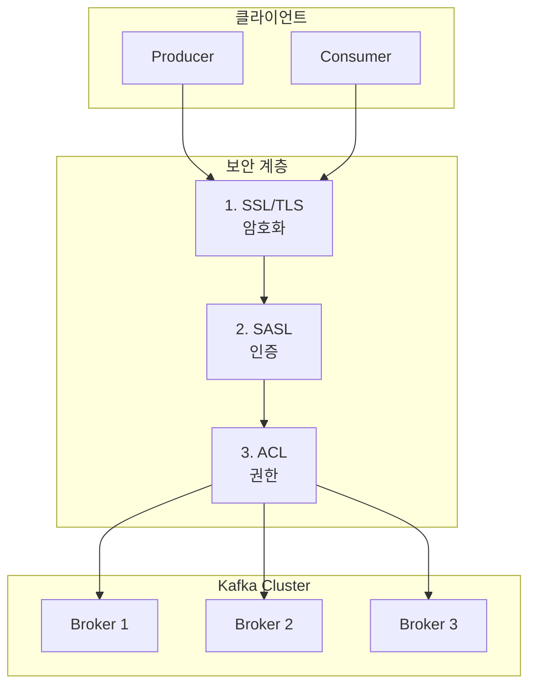

# Kafka 보안

프로덕션 환경에서 Kafka를 안전하게 운영하기 위한 암호화, 인증, 권한 관리를 이해합니다.

| 검증 환경 | 버전 |
|----------|------|
| Kafka | 3.6.1 (KRaft) |
| Spring Boot | 3.2.x |
| Spring Kafka | 3.1.x |
| Java | 17 |
| OpenSSL | 3.x |

> 이 문서의 코드 예제는 위 환경에서 컴파일 및 동작이 확인되었습니다.

## 왜 Kafka 보안이 중요한가?

보안 없이 Kafka를 운영하면 어떤 일이 발생할까요?

```
실제 사고 시나리오:

1. 데이터 유출
   - 네트워크 스니핑으로 결제 정보, 개인정보 탈취
   - 평문 전송으로 중간자 공격(MITM) 취약

2. 무단 접근
   - 누구나 Topic에 메시지 발행 가능
   - 악의적인 데이터 주입으로 시스템 오작동

3. 권한 남용
   - 개발자가 프로덕션 Topic 삭제
   - 민감 데이터에 무제한 접근
```

**보안 3요소와 Kafka:**

| 요소 | Kafka 구현 | 해결 문제 |
|------|-----------|----------|
| **기밀성 (Confidentiality)** | SSL/TLS 암호화 | 데이터 탈취 방지 |
| **무결성 (Integrity)** | SSL/TLS + 메시지 서명 | 데이터 변조 방지 |
| **가용성 (Availability)** | ACL + 인증 | 무단 접근으로 인한 장애 방지 |

## Kafka 보안 아키텍처



## 1. 암호화 (Encryption): SSL/TLS

### 인증서 생성 실습

**1단계: CA(Certificate Authority) 생성**

```bash
# CA 개인키 생성
openssl genrsa -out ca-key.pem 2048

# CA 인증서 생성 (10년 유효)
openssl req -new -x509 -key ca-key.pem -out ca-cert.pem -days 3650 \
    -subj "/CN=KafkaCA/O=MyCompany/C=KR"
```

**2단계: Broker 인증서 생성**

```bash
# Broker Keystore 생성
keytool -genkeypair -alias kafka-broker \
    -keyalg RSA -keysize 2048 \
    -keystore kafka.broker.keystore.jks \
    -validity 365 \
    -storepass broker-secret \
    -keypass broker-secret \
    -dname "CN=kafka-broker,O=MyCompany,C=KR"

# CSR(Certificate Signing Request) 생성
keytool -certreq -alias kafka-broker \
    -keystore kafka.broker.keystore.jks \
    -file broker.csr \
    -storepass broker-secret

# CA로 서명
openssl x509 -req -in broker.csr \
    -CA ca-cert.pem -CAkey ca-key.pem -CAcreateserial \
    -out broker-signed.pem -days 365

# CA 인증서를 Keystore에 추가
keytool -importcert -alias ca-root \
    -file ca-cert.pem \
    -keystore kafka.broker.keystore.jks \
    -storepass broker-secret -noprompt

# 서명된 인증서를 Keystore에 추가
keytool -importcert -alias kafka-broker \
    -file broker-signed.pem \
    -keystore kafka.broker.keystore.jks \
    -storepass broker-secret -noprompt
```

**3단계: Truststore 생성**

```bash
# Broker Truststore (CA 인증서 포함)
keytool -importcert -alias ca-root \
    -file ca-cert.pem \
    -keystore kafka.broker.truststore.jks \
    -storepass truststore-secret -noprompt

# Client Truststore
keytool -importcert -alias ca-root \
    -file ca-cert.pem \
    -keystore kafka.client.truststore.jks \
    -storepass client-secret -noprompt
```

### Broker SSL 설정

```properties
# server.properties
listeners=SSL://:9093
advertised.listeners=SSL://kafka-broker:9093
security.inter.broker.protocol=SSL

# SSL 설정
ssl.keystore.location=/etc/kafka/secrets/kafka.broker.keystore.jks
ssl.keystore.password=broker-secret
ssl.key.password=broker-secret
ssl.truststore.location=/etc/kafka/secrets/kafka.broker.truststore.jks
ssl.truststore.password=truststore-secret

# 클라이언트 인증 (양방향 TLS)
ssl.client.auth=required  # none, requested, required
```

### Spring Boot 클라이언트 설정

```yaml
# application.yml
spring:
  kafka:
    bootstrap-servers: kafka-broker:9093
    properties:
      security.protocol: SSL
    ssl:
      trust-store-location: classpath:kafka.client.truststore.jks
      trust-store-password: client-secret
      key-store-location: classpath:kafka.client.keystore.jks
      key-store-password: client-secret
      key-password: client-secret
```

```java
import org.springframework.context.annotation.Bean;
import org.springframework.context.annotation.Configuration;
import org.springframework.kafka.core.DefaultKafkaProducerFactory;
import org.springframework.kafka.core.KafkaTemplate;
import org.springframework.kafka.core.ProducerFactory;
import org.apache.kafka.clients.producer.ProducerConfig;
import org.apache.kafka.common.config.SslConfigs;
import org.apache.kafka.common.serialization.StringSerializer;

import java.util.HashMap;
import java.util.Map;

@Configuration
public class KafkaSslConfig {

    @Bean
    public ProducerFactory<String, String> producerFactory() {
        Map<String, Object> props = new HashMap<>();
        props.put(ProducerConfig.BOOTSTRAP_SERVERS_CONFIG, "kafka-broker:9093");
        props.put(ProducerConfig.KEY_SERIALIZER_CLASS_CONFIG, StringSerializer.class);
        props.put(ProducerConfig.VALUE_SERIALIZER_CLASS_CONFIG, StringSerializer.class);

        // SSL 설정
        props.put("security.protocol", "SSL");
        props.put(SslConfigs.SSL_TRUSTSTORE_LOCATION_CONFIG, "/path/to/truststore.jks");
        props.put(SslConfigs.SSL_TRUSTSTORE_PASSWORD_CONFIG, "truststore-secret");
        props.put(SslConfigs.SSL_KEYSTORE_LOCATION_CONFIG, "/path/to/keystore.jks");
        props.put(SslConfigs.SSL_KEYSTORE_PASSWORD_CONFIG, "client-secret");
        props.put(SslConfigs.SSL_KEY_PASSWORD_CONFIG, "client-secret");

        return new DefaultKafkaProducerFactory<>(props);
    }

    @Bean
    public KafkaTemplate<String, String> kafkaTemplate() {
        return new KafkaTemplate<>(producerFactory());
    }
}
```

---

## 2. 인증 (Authentication): SASL

### SASL 메커니즘 비교

| 메커니즘 | 보안 수준 | 설정 복잡도 | 사용 사례 |
|----------|----------|------------|----------|
| **PLAIN** | 낮음 (평문) | 낮음 | 개발 환경, SSL 필수 |
| **SCRAM-SHA-256** | 높음 | 중간 | **프로덕션 권장** |
| **SCRAM-SHA-512** | 매우 높음 | 중간 | 고보안 환경 |
| **GSSAPI** | 높음 | 높음 | Kerberos 인프라 보유 시 |
| **OAUTHBEARER** | 높음 | 높음 | OAuth 2.0 통합 |

### SCRAM 사용자 생성

```bash
# SCRAM-SHA-256 사용자 생성 (KRaft 모드)
kafka-configs.sh --bootstrap-server localhost:9092 \
    --alter --add-config 'SCRAM-SHA-256=[iterations=8192,password=user-secret]' \
    --entity-type users --entity-name order-service

# 사용자 확인
kafka-configs.sh --bootstrap-server localhost:9092 \
    --describe --entity-type users --entity-name order-service
```

### Broker SASL 설정

```properties
# server.properties
listeners=SASL_SSL://:9093
advertised.listeners=SASL_SSL://kafka-broker:9093
security.inter.broker.protocol=SASL_SSL

# SASL 설정
sasl.mechanism.inter.broker.protocol=SCRAM-SHA-256
sasl.enabled.mechanisms=SCRAM-SHA-256

# SSL 설정 (이전 섹션 참조)
ssl.keystore.location=...
```

**JAAS 설정 파일 (kafka_server_jaas.conf):**

```
KafkaServer {
    org.apache.kafka.common.security.scram.ScramLoginModule required
    username="admin"
    password="admin-secret";
};
```

**Broker 시작:**

```bash
KAFKA_OPTS="-Djava.security.auth.login.config=/path/to/kafka_server_jaas.conf" \
    ./bin/kafka-server-start.sh config/server.properties
```

### Spring Boot SASL 클라이언트

```yaml
# application.yml
spring:
  kafka:
    bootstrap-servers: kafka-broker:9093
    properties:
      security.protocol: SASL_SSL
      sasl.mechanism: SCRAM-SHA-256
      sasl.jaas.config: >
        org.apache.kafka.common.security.scram.ScramLoginModule required
        username="order-service"
        password="user-secret";
    ssl:
      trust-store-location: classpath:kafka.client.truststore.jks
      trust-store-password: client-secret
```

---

## 3. 권한 관리 (Authorization): ACLs

### ACL 개념

```
ACL 규칙 형식:
Principal P is [Allowed/Denied] Operation O From Host H On Resource R

예시:
User:order-service is Allowed Write From * On Topic:orders
```

### 주요 리소스와 작업

| 리소스 | 작업 | 설명 |
|--------|------|------|
| **Topic** | Read, Write, Create, Delete, Describe | 토픽 접근 |
| **Group** | Read, Describe, Delete | Consumer Group |
| **Cluster** | Create, Alter, Describe | 클러스터 관리 |
| **TransactionalId** | Write, Describe | 트랜잭션 |

### ACL 설정 예시

```bash
# Producer 권한: orders 토픽에 쓰기
kafka-acls.sh --bootstrap-server localhost:9093 \
    --command-config admin.properties \
    --add --allow-principal User:order-service \
    --producer --topic orders

# Consumer 권한: orders 토픽 읽기 + Consumer Group
kafka-acls.sh --bootstrap-server localhost:9093 \
    --command-config admin.properties \
    --add --allow-principal User:payment-service \
    --consumer --topic orders --group payment-group

# 특정 IP에서만 접근 허용
kafka-acls.sh --bootstrap-server localhost:9093 \
    --command-config admin.properties \
    --add --allow-principal User:analytics-service \
    --allow-host 10.0.0.0/24 \
    --operation Read --topic orders

# ACL 목록 조회
kafka-acls.sh --bootstrap-server localhost:9093 \
    --command-config admin.properties \
    --list --topic orders

# ACL 삭제
kafka-acls.sh --bootstrap-server localhost:9093 \
    --command-config admin.properties \
    --remove --allow-principal User:old-service \
    --producer --topic orders
```

**admin.properties:**

```properties
security.protocol=SASL_SSL
sasl.mechanism=SCRAM-SHA-256
sasl.jaas.config=org.apache.kafka.common.security.scram.ScramLoginModule required \
    username="admin" password="admin-secret";
ssl.truststore.location=/path/to/truststore.jks
ssl.truststore.password=truststore-secret
```

### Broker ACL 설정

```properties
# server.properties
authorizer.class.name=org.apache.kafka.metadata.authorizer.StandardAuthorizer

# KRaft 모드에서 슈퍼 유저
super.users=User:admin

# ACL 없으면 거부 (보안 권장)
allow.everyone.if.no.acl.found=false
```

---

## Docker Compose 보안 클러스터 예시

```yaml
# docker-compose-secure.yml
version: '3.8'
services:
  kafka:
    image: confluentinc/cp-kafka:7.5.0
    hostname: kafka
    ports:
      - "9093:9093"
    environment:
      KAFKA_NODE_ID: 1
      KAFKA_PROCESS_ROLES: broker,controller
      KAFKA_CONTROLLER_QUORUM_VOTERS: 1@kafka:9094

      # 리스너 설정
      KAFKA_LISTENERS: SASL_SSL://:9093,CONTROLLER://:9094
      KAFKA_ADVERTISED_LISTENERS: SASL_SSL://localhost:9093
      KAFKA_LISTENER_SECURITY_PROTOCOL_MAP: SASL_SSL:SASL_SSL,CONTROLLER:PLAINTEXT
      KAFKA_INTER_BROKER_LISTENER_NAME: SASL_SSL
      KAFKA_CONTROLLER_LISTENER_NAMES: CONTROLLER

      # SASL 설정
      KAFKA_SASL_ENABLED_MECHANISMS: SCRAM-SHA-256
      KAFKA_SASL_MECHANISM_INTER_BROKER_PROTOCOL: SCRAM-SHA-256

      # SSL 설정
      KAFKA_SSL_KEYSTORE_FILENAME: kafka.broker.keystore.jks
      KAFKA_SSL_KEYSTORE_CREDENTIALS: keystore_creds
      KAFKA_SSL_KEY_CREDENTIALS: key_creds
      KAFKA_SSL_TRUSTSTORE_FILENAME: kafka.broker.truststore.jks
      KAFKA_SSL_TRUSTSTORE_CREDENTIALS: truststore_creds
      KAFKA_SSL_CLIENT_AUTH: required

      # ACL 설정
      KAFKA_AUTHORIZER_CLASS_NAME: org.apache.kafka.metadata.authorizer.StandardAuthorizer
      KAFKA_SUPER_USERS: User:admin
      KAFKA_ALLOW_EVERYONE_IF_NO_ACL_FOUND: "false"

      # JAAS
      KAFKA_OPTS: "-Djava.security.auth.login.config=/etc/kafka/secrets/kafka_server_jaas.conf"
    volumes:
      - ./secrets:/etc/kafka/secrets
```

---

## 트러블슈팅 가이드

### 에러 1: SSL Handshake 실패

```
org.apache.kafka.common.errors.SslAuthenticationException:
SSL handshake failed
```

**원인과 해결:**

| 원인 | 해결 |
|------|------|
| 인증서 만료 | `keytool -list -v -keystore keystore.jks`로 유효기간 확인 |
| CA 불일치 | Client Truststore에 올바른 CA 포함 확인 |
| 호스트명 불일치 | 인증서 CN과 Bootstrap 서버 호스트명 일치 확인 |
| 프로토콜 버전 | `ssl.enabled.protocols=TLSv1.2,TLSv1.3` 확인 |

```bash
# 인증서 확인
openssl s_client -connect kafka-broker:9093 -showcerts

# 인증서 상세 정보
keytool -list -v -keystore kafka.broker.keystore.jks -storepass broker-secret
```

### 에러 2: SASL 인증 실패

```
org.apache.kafka.common.errors.SaslAuthenticationException:
Authentication failed: credentials invalid
```

**해결:**

```bash
# 1. 사용자 존재 확인
kafka-configs.sh --bootstrap-server localhost:9092 \
    --describe --entity-type users --entity-name order-service

# 2. 비밀번호 재설정
kafka-configs.sh --bootstrap-server localhost:9092 \
    --alter --add-config 'SCRAM-SHA-256=[password=new-password]' \
    --entity-type users --entity-name order-service

# 3. JAAS 설정 확인
# username/password에 특수문자가 있으면 따옴표로 감싸기
```

### 에러 3: ACL 권한 부족

```
org.apache.kafka.common.errors.TopicAuthorizationException:
Not authorized to access topics: [orders]
```

**해결:**

```bash
# 1. 현재 ACL 확인
kafka-acls.sh --bootstrap-server localhost:9093 \
    --command-config admin.properties \
    --list --topic orders

# 2. 필요한 권한 추가
kafka-acls.sh --bootstrap-server localhost:9093 \
    --command-config admin.properties \
    --add --allow-principal User:order-service \
    --operation Write --topic orders
```

### 디버깅 로깅 활성화

```yaml
# application.yml
logging:
  level:
    org.apache.kafka.common.security: DEBUG
    org.apache.kafka.clients: DEBUG
```

---

## 프로덕션 보안 체크리스트

### 배포 전 필수 확인

```
암호화:
□ 모든 통신에 SSL/TLS 적용 (security.protocol=SASL_SSL)
□ 인증서 유효기간 충분 (최소 1년)
□ 강력한 암호화 스위트 사용 (TLS 1.2+)
□ ssl.client.auth=required (양방향 TLS)

인증:
□ SCRAM-SHA-256 또는 SCRAM-SHA-512 사용
□ 기본 비밀번호 변경 완료
□ 서비스별 별도 사용자 생성
□ 비밀번호 복잡도 충족 (16자 이상 권장)

권한:
□ allow.everyone.if.no.acl.found=false
□ 최소 권한 원칙 적용
□ super.users 최소화
□ 정기적 ACL 감사 계획

모니터링:
□ 인증 실패 알림 설정
□ ACL 거부 로깅 활성화
□ 인증서 만료 알림 (30일 전)
```

### 인증서 갱신 자동화

```bash
#!/bin/bash
# cert-renewal.sh

CERT_DIR="/etc/kafka/secrets"
DAYS_BEFORE_EXPIRY=30

# 만료 확인
EXPIRY=$(keytool -list -v -keystore $CERT_DIR/kafka.broker.keystore.jks \
    -storepass broker-secret | grep "Valid from" | head -1)

# 알림 또는 자동 갱신 로직
if [ $(days_until_expiry "$EXPIRY") -lt $DAYS_BEFORE_EXPIRY ]; then
    echo "Certificate expires soon. Renewal needed."
    # 갱신 스크립트 호출
fi
```

---

## FAQ

**Q: SSL과 SASL 중 하나만 써도 되나요?**
> A: 아니요. SSL은 암호화, SASL은 인증입니다. **둘 다 사용해야** 완전한 보안입니다. SASL_PLAINTEXT는 비밀번호가 평문 전송되어 위험합니다.

**Q: SCRAM과 Kerberos 중 무엇을 선택하나요?**
> A: 기존 Kerberos 인프라가 있으면 GSSAPI, 없으면 **SCRAM-SHA-256**을 권장합니다. SCRAM이 설정이 더 간단합니다.

**Q: ACL을 Topic 단위로만 설정해야 하나요?**
> A: 아니요. `--resource-pattern-type=prefixed`로 접두사 기반 권한도 가능합니다:
> ```bash
> kafka-acls.sh --add --allow-principal User:order-service \
>     --operation Write --topic order- --resource-pattern-type prefixed
> ```

**Q: 인증서가 만료되면 어떻게 되나요?**
> A: 새 연결이 실패합니다. 기존 연결은 유지되지만, 재시작 시 연결 불가. **자동 갱신 설정 필수**.

**Q: 개발 환경에서도 보안을 적용해야 하나요?**
> A: 프로덕션과 동일한 보안 설정을 권장합니다. 개발 환경에서 보안 문제를 미리 발견할 수 있습니다.

---

## 참고 자료

- [Apache Kafka Security](https://kafka.apache.org/documentation/#security)
- [Confluent Security Tutorial](https://docs.confluent.io/platform/current/security/security-tutorial.html)
- [SCRAM Authentication](https://kafka.apache.org/documentation/#security_sasl_scram)
- [ACL Authorization](https://kafka.apache.org/documentation/#security_authz)

## 다음 단계

- [모니터링](../monitoring/) - 보안 이벤트 모니터링
- [생태계](../ecosystem/) - Schema Registry 보안 설정
