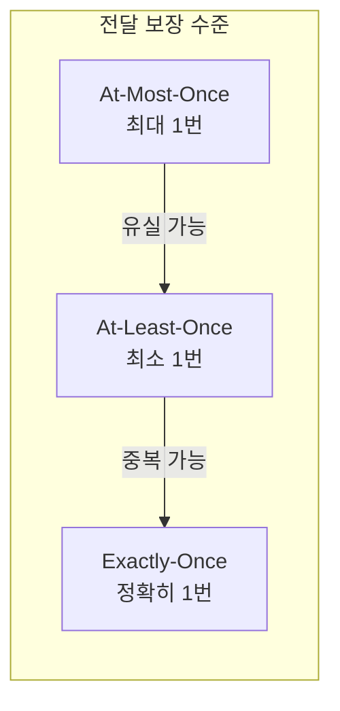
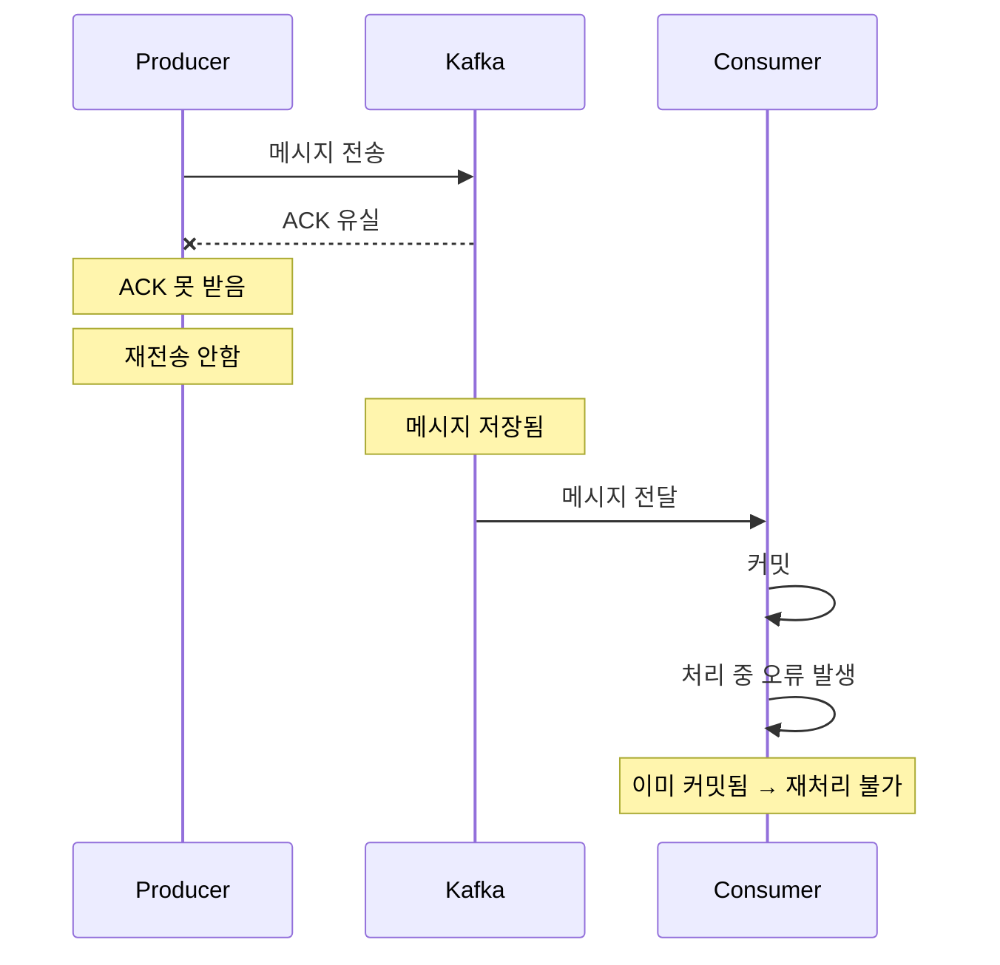
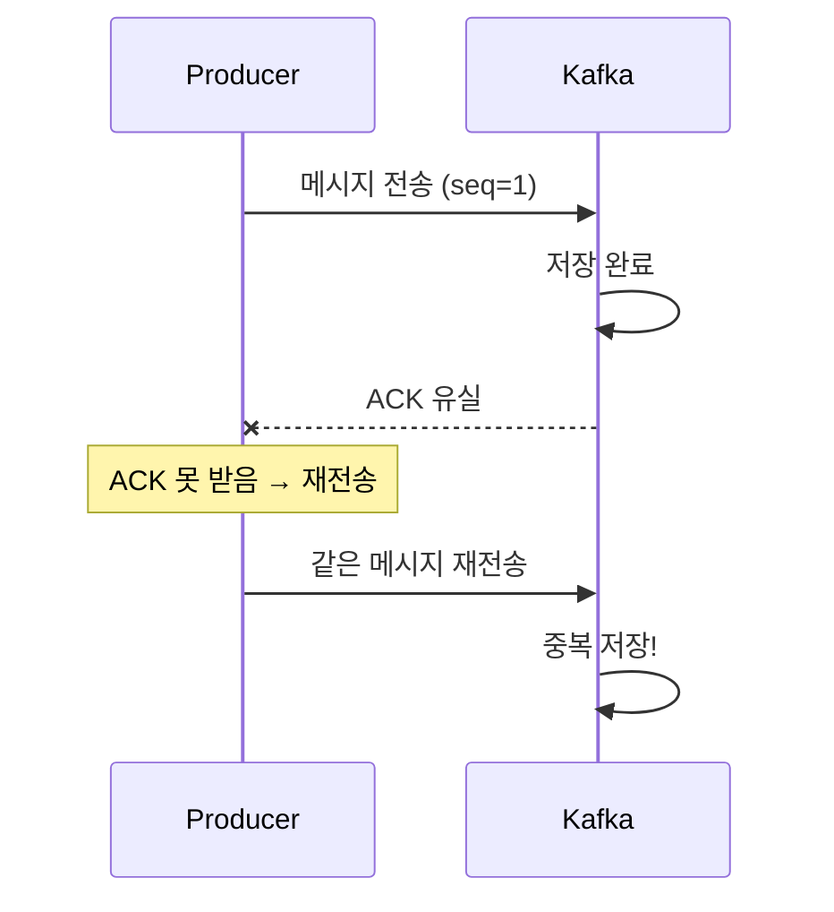
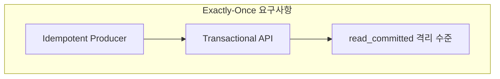
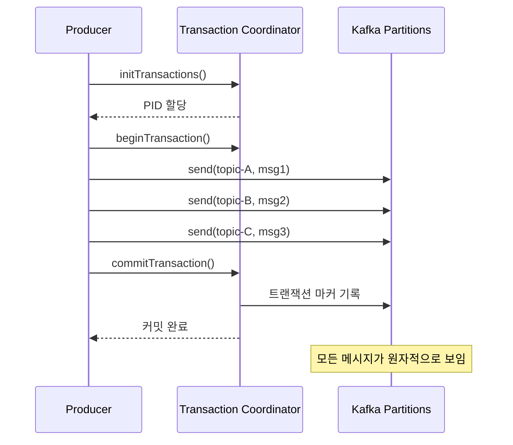
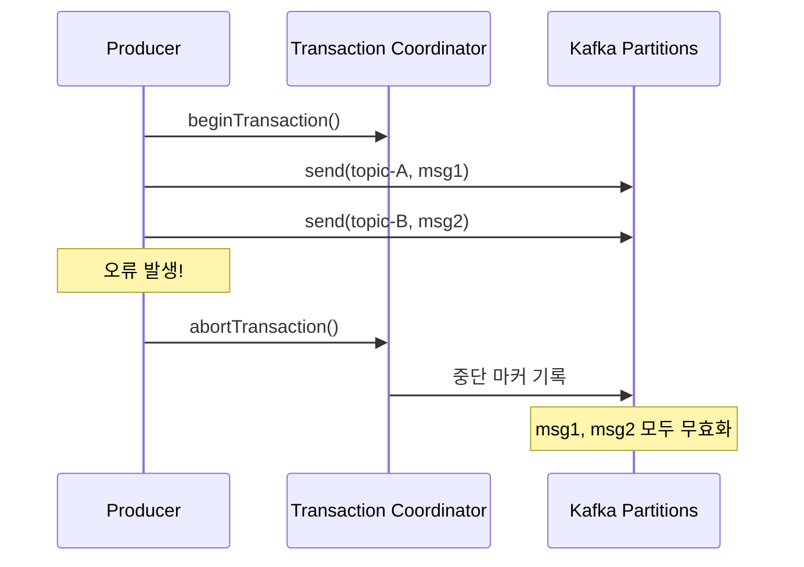
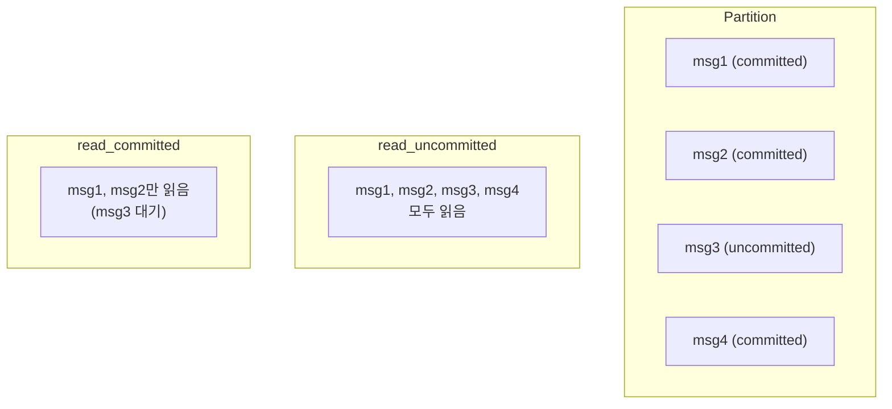
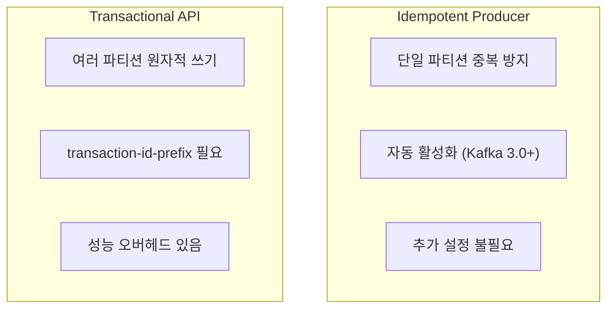
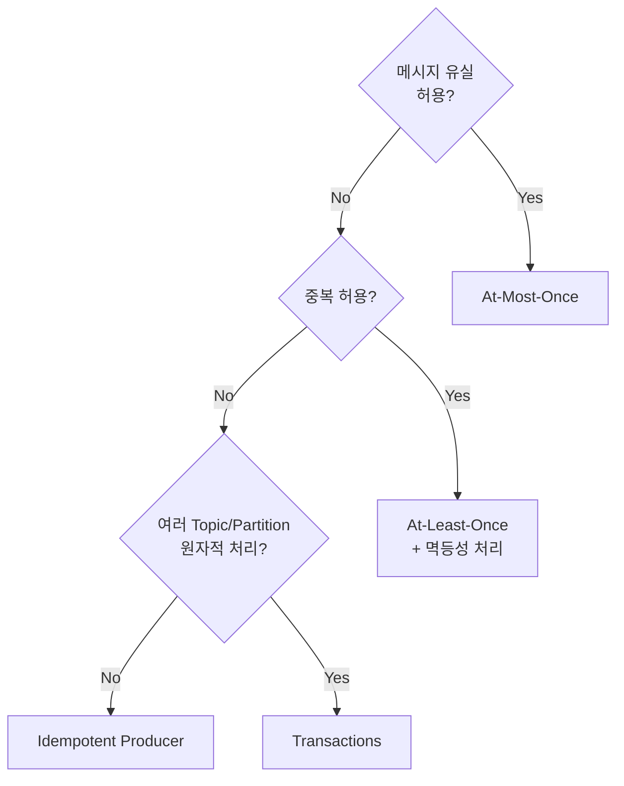
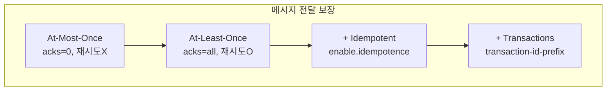

# 트랜잭션과 Exactly-Once Semantics

메시지 전달 보장 수준과 Kafka 트랜잭션을 이해합니다.

| 검증 환경 | 버전 |
|----------|------|
| Kafka | 3.6.1 (KRaft) |
| Spring Boot | 3.2.x |
| Spring Kafka | 3.1.x |
| Java | 17 |

> 이 문서의 코드 예제는 위 환경에서 컴파일 및 동작이 확인되었습니다.

## 왜 메시지 보장 수준이 중요한가?

"메시지가 전달됐으면 끝 아닌가?" 라고 생각할 수 있습니다. 하지만 분산 시스템에서는 **네트워크 장애, 프로세스 충돌, 타이밍 이슈** 때문에 단순하지 않습니다.

**실제로 발생하는 문제들:**

```
시나리오 1: 결제 이벤트 유실
- 주문 서비스 → Kafka → 결제 서비스
- 네트워크 순간 끊김으로 메시지 유실
- 고객: "결제가 안 됐는데 주문은 됐다고?"

시나리오 2: 포인트 중복 적립
- 주문 완료 이벤트 → 포인트 서비스
- ACK 유실로 재전송 발생
- 고객: "1000원 적립인데 왜 2000원이 들어왔지?" (손해)

시나리오 3: 재고 불일치
- 주문 이벤트 → 재고 서비스
- 중복 처리로 재고가 2배 차감
- 운영팀: "재고가 -10개?" (불가능한 상태)
```

**각 보장 수준의 실제 의미:**

| 수준 | 비즈니스 의미 | 실제 사례 |
|------|-------------|----------|
| At-Most-Once | 놓쳐도 괜찮다 | 로그 수집, 클릭 분석 |
| At-Least-Once | 놓치면 안 되지만 중복은 처리 가능 | 대부분의 이벤트 |
| Exactly-Once | 놓침도 중복도 치명적 | 금융 거래, 포인트, 재고 |

## 메시지 전달 보장 수준



### 비교

| 수준 | 유실 | 중복 | 성능 | 구현 복잡도 |
|------|------|------|------|-------------|
| **At-Most-Once** | O | X | 최고 | 낮음 |
| **At-Least-Once** | X | O | 높음 | 중간 |
| **Exactly-Once** | X | X | 중간 | 높음 |

## At-Most-Once

메시지를 **최대 한 번** 전달합니다. 유실될 수 있습니다.



### 구현 방법

```yaml
spring:
  kafka:
    producer:
      acks: 0  # 응답 대기 안함
      retries: 0  # 재시도 안함
```

**사용 사례:** 로그, 메트릭 등 유실해도 괜찮은 데이터

## At-Least-Once

메시지를 **최소 한 번** 전달합니다. 중복될 수 있습니다.



### 구현 방법

```yaml
spring:
  kafka:
    producer:
      acks: all
      retries: 3  # 재시도 활성화
    consumer:
      enable-auto-commit: false  # 수동 커밋
```

**사용 사례:** 일반적인 이벤트 처리 (멱등성 처리 필요)

## Exactly-Once Semantics (EOS)

메시지를 **정확히 한 번** 전달합니다. 유실도 중복도 없습니다.

### EOS 달성 조건



| 구성 요소 | 역할 |
|----------|------|
| **Idempotent Producer** | Producer → Broker 중복 방지 |
| **Transactional API** | 여러 메시지를 원자적으로 처리 |
| **read_committed** | 커밋된 메시지만 읽기 |

## Idempotent Producer 복습

> 이미 [심화 개념](../advanced-concepts/#idempotent-producer-멱등성-프로듀서)에서 다뤘지만, EOS의 기반이므로 다시 정리합니다.

```java
// Producer 설정
enable.idempotence = true  // Kafka 3.0+ 기본값

// 자동으로 설정됨
acks = all
retries = Integer.MAX_VALUE
max.in.flight.requests.per.connection = 5
```

**범위:** 단일 Producer → 단일 Partition의 중복 방지

## Kafka Transactions

여러 Partition에 걸친 **원자적 쓰기**를 보장합니다.

### 트랜잭션 흐름



### 트랜잭션 실패 시



## Spring Kafka 트랜잭션

### 설정

```yaml
spring:
  kafka:
    producer:
      transaction-id-prefix: tx-order-  # 트랜잭션 활성화
      acks: all
      properties:
        enable.idempotence: true
```

### 구현 방법 1: @Transactional

```java
@Service
public class OrderService {

    private final KafkaTemplate<String, OrderEvent> kafkaTemplate;

    @Transactional  // Kafka 트랜잭션
    public void processOrder(Order order) {
        // 여러 메시지가 원자적으로 전송됨
        kafkaTemplate.send("order-events", order.getId(),
            new OrderEvent(order, "CREATED"));

        kafkaTemplate.send("inventory-events", order.getId(),
            new InventoryEvent(order.getItems(), "RESERVE"));

        kafkaTemplate.send("notification-events", order.getId(),
            new NotificationEvent(order.getCustomerId(), "ORDER_RECEIVED"));

        // 하나라도 실패하면 모두 롤백
    }
}
```

### 구현 방법 2: executeInTransaction

```java
@Service
public class OrderService {

    private final KafkaTemplate<String, OrderEvent> kafkaTemplate;

    public void processOrder(Order order) {
        kafkaTemplate.executeInTransaction(operations -> {
            operations.send("order-events", order.getId(),
                new OrderEvent(order, "CREATED"));

            operations.send("inventory-events", order.getId(),
                new InventoryEvent(order.getItems(), "RESERVE"));

            // 예외 발생 시 자동 롤백
            if (order.getTotalAmount().compareTo(BigDecimal.ZERO) <= 0) {
                throw new IllegalStateException("Invalid order amount");
            }

            return true;
        });
    }
}
```

## Consumer의 Exactly-Once

### read_committed 격리 수준

```yaml
spring:
  kafka:
    consumer:
      isolation-level: read_committed  # 기본값: read_uncommitted
```



### Consume-Transform-Produce 패턴

입력을 읽어 변환 후 출력하는 패턴에서 EOS를 적용합니다.

```java
@Component
public class OrderProcessor {

    @KafkaListener(
        topics = "raw-orders",
        groupId = "order-processor"
    )
    @Transactional
    public void process(
            ConsumerRecord<String, RawOrder> record,
            @Header(KafkaHeaders.RECEIVED_PARTITION) int partition,
            Acknowledgment ack) {

        // 1. 메시지 처리
        ProcessedOrder processed = transform(record.value());

        // 2. 결과 전송 (트랜잭션 내)
        kafkaTemplate.send("processed-orders",
            record.key(), processed);

        // 3. 커밋 (트랜잭션 내)
        ack.acknowledge();

        // 모두 원자적으로 커밋됨
    }
}
```

## 트랜잭션 vs 멱등성



| 기능 | Idempotent | Transactional |
|------|------------|---------------|
| **범위** | 단일 Partition | 여러 Partition |
| **중복 방지** | O | O |
| **원자성** | X | O |
| **Consumer 격리** | X | O (read_committed) |
| **성능 영향** | 거의 없음 | 약간 있음 |

## 사용 가이드

### 언제 무엇을 사용하나?



### 권장 설정

```yaml
# 대부분의 경우 권장 (At-Least-Once + 멱등성)
spring:
  kafka:
    producer:
      acks: all
      properties:
        enable.idempotence: true  # Kafka 3.0+ 기본값

# 원자적 멀티 파티션 쓰기가 필요한 경우
spring:
  kafka:
    producer:
      transaction-id-prefix: tx-${spring.application.name}-
      acks: all
    consumer:
      isolation-level: read_committed
```

## 주의사항

### 트랜잭션 타임아웃

```yaml
spring:
  kafka:
    producer:
      properties:
        transaction.timeout.ms: 60000  # 기본 60초
```

트랜잭션이 타임아웃되면 자동으로 중단됩니다.

### 성능 고려

트랜잭션은 추가 오버헤드가 있습니다:

- 트랜잭션 코디네이터와의 통신
- 트랜잭션 마커 기록
- Consumer의 필터링 처리

---

## 분산 트랜잭션 방식 비교

Kafka 트랜잭션은 유일한 선택지가 아닙니다. 각 방식의 특성을 이해하세요.

### Two-Phase Commit (2PC) vs Kafka Transactions vs Saga

| 특성 | 2PC | Kafka Transactions | Saga |
|------|-----|-------------------|------|
| **범위** | 여러 DB | Kafka 내부 | 여러 서비스 |
| **일관성** | 강한 일관성 | Kafka 내 강한 일관성 | 결과적 일관성 |
| **성능** | 느림 (블로킹) | 중간 | 빠름 |
| **장애 복구** | 코디네이터 의존 | 자동 복구 | 보상 트랜잭션 |
| **확장성** | 제한적 | Kafka 수준 | 높음 |

**Kafka 트랜잭션의 한계:**

```
Kafka 트랜잭션으로 할 수 있는 것:
├── 여러 Kafka Topic에 원자적 쓰기 ✅
├── Consume-Transform-Produce 원자성 ✅
└── Kafka 내부에서의 Exactly-Once ✅

Kafka 트랜잭션으로 할 수 없는 것:
├── DB + Kafka 원자적 처리 ❌
├── 외부 API + Kafka 원자적 처리 ❌
└── 서비스 간 분산 트랜잭션 ❌
```

**DB + Kafka를 함께 다뤄야 할 때:**

```java
// ❌ 불가능: Kafka + DB 원자적 처리
@Transactional  // DB 트랜잭션
public void process(OrderEvent event) {
    orderRepository.save(order);          // DB 저장
    kafkaTemplate.send("results", result); // Kafka 전송
    // 둘 중 하나만 실패하면? → 불일치 발생
}

// ✅ 해결책: Outbox 패턴
@Transactional  // DB 트랜잭션만
public void process(OrderEvent event) {
    orderRepository.save(order);
    outboxRepository.save(new OutboxEvent("results", result));
    // DB 트랜잭션으로 원자성 보장
}
// 별도 프로세스가 Outbox에서 Kafka로 전송
```

---

## 트랜잭션 디버깅 가이드

### 흔한 에러와 해결책

**에러 1: `ProducerFencedException`**

```
org.apache.kafka.common.errors.ProducerFencedException:
Producer with transactional.id has been fenced by a newer instance
```

**원인:** 동일한 `transactional.id`를 가진 다른 Producer가 시작됨

**해결:**
```yaml
# 각 인스턴스마다 고유한 transactional.id 사용
spring:
  kafka:
    producer:
      transaction-id-prefix: tx-${spring.application.name}-${random.uuid}-
```

**에러 2: `InvalidTxnStateException`**

```
org.apache.kafka.common.errors.InvalidTxnStateException:
Cannot perform operation for transaction id ... in state ...
```

**원인:** 트랜잭션 상태 불일치 (타임아웃, 비정상 종료 등)

**해결:**
```java
// Producer 재생성 필요
kafkaTemplate.getProducerFactory().reset();
```

**에러 3: 트랜잭션 타임아웃**

```
org.apache.kafka.common.errors.TimeoutException:
Timeout expired while awaiting InitProducerId response
```

**원인:** 트랜잭션 코디네이터 응답 지연 또는 처리 시간 초과

**해결:**
```yaml
spring:
  kafka:
    producer:
      properties:
        transaction.timeout.ms: 120000  # 60초 → 120초로 증가
        max.block.ms: 60000
```

### 디버깅 체크리스트

```
□ transaction.id가 인스턴스마다 고유한가?
□ Broker 버전이 트랜잭션을 지원하는가? (0.11+)
□ 모든 Consumer가 isolation.level=read_committed인가?
□ 트랜잭션 타임아웃이 처리 시간보다 긴가?
□ 네트워크 지연이 비정상적이지 않은가?
```

---

## Kafka Streams와 Exactly-Once

Kafka Streams를 사용하면 EOS가 더 쉬워집니다.

```java
Properties props = new Properties();
props.put(StreamsConfig.PROCESSING_GUARANTEE_CONFIG,
    StreamsConfig.EXACTLY_ONCE_V2);  // Kafka 2.5+

// Streams 내부에서 자동으로:
// 1. 입력 offset 커밋
// 2. 상태 저장소 업데이트
// 3. 출력 레코드 전송
// 을 원자적으로 처리
```

**Streams EOS vs 직접 구현:**

| 측면 | Kafka Streams EOS | 직접 구현 |
|------|------------------|----------|
| 구현 복잡도 | 설정 한 줄 | 수십 줄 코드 |
| 상태 관리 | 자동 | 직접 관리 |
| Consumer Offset | 자동 관리 | sendOffsetsToTransaction() 필요 |
| 장애 복구 | 자동 | 직접 구현 |

**실제 성능 영향:**

| 설정 | 상대 처리량 | 지연시간 | 사용 상황 |
|------|-----------|---------|----------|
| `acks=0` | 100% (기준) | 최소 | 로그, 메트릭 |
| `acks=1` | ~95% | 낮음 | 일반적인 경우 |
| `acks=all` | ~90% | 중간 | 데이터 안정성 필요 |
| `acks=all` + Transaction | ~70-80% | 높음 | 원자성 필수 |

> **참고:** 실제 수치는 클러스터 구성, 네트워크, 메시지 크기에 따라 다릅니다.

**대안: 비즈니스 레벨 멱등성**

Kafka 트랜잭션 대신 애플리케이션에서 멱등성을 보장하면 성능을 유지하면서 중복을 방지할 수 있습니다:

```java
// DB 유니크 제약조건으로 멱등성 보장
@Transactional
public void handleOrder(OrderEvent event) {
    if (orderRepository.existsByEventId(event.getEventId())) {
        log.info("이미 처리된 이벤트: {}", event.getEventId());
        return;
    }
    // 처리 로직
    orderRepository.save(order);
}
```

---

## 실무 의사결정 가이드

### 언제 무엇을 선택하나?

```
질문 1: 메시지 유실이 허용되는가?
├── Yes → At-Most-Once (acks=0)
└── No → 질문 2로

질문 2: 중복 처리가 허용되는가?
├── Yes → At-Least-Once + 멱등성 처리 (권장)
└── No → 질문 3으로

질문 3: 여러 Topic/Partition에 원자적 쓰기가 필요한가?
├── Yes → Kafka Transactions
└── No → Idempotent Producer (기본값으로 충분)
```

### 대부분의 경우 권장하는 방식

**At-Least-Once + 비즈니스 멱등성**이 가장 실용적입니다:

```yaml
# Producer 설정
spring:
  kafka:
    producer:
      acks: all
      # enable.idempotence는 Kafka 3.0+에서 기본 true
```

```java
// Consumer에서 멱등성 처리
@KafkaListener(topics = "orders")
@Transactional
public void handleOrder(OrderEvent event) {
    // 1. 이미 처리했는지 확인
    if (processedEventRepository.existsById(event.getEventId())) {
        return;
    }

    // 2. 비즈니스 로직
    orderService.process(event);

    // 3. 처리 완료 기록 (같은 DB 트랜잭션)
    processedEventRepository.save(new ProcessedEvent(event.getEventId()));
}
```

### Kafka 트랜잭션이 꼭 필요한 경우

다음 조건을 **모두** 만족할 때만 Kafka 트랜잭션을 사용하세요:

1. **여러 Topic에 원자적으로 써야 함** (전부 성공 or 전부 실패)
2. **Kafka Streams 또는 Consume-Transform-Produce 패턴** 사용
3. **성능 오버헤드 감수 가능**

```java
// Kafka 트랜잭션이 필요한 예: Consume-Transform-Produce
@KafkaListener(topics = "raw-orders")
@Transactional("kafkaTransactionManager")
public void processAndProduce(RawOrder raw, Acknowledgment ack) {
    // 1. 변환
    ProcessedOrder processed = transform(raw);

    // 2. 여러 Topic에 원자적 쓰기
    kafkaTemplate.send("processed-orders", processed);
    kafkaTemplate.send("order-analytics", toAnalytics(processed));
    kafkaTemplate.send("order-notifications", toNotification(processed));

    // 3. Consumer offset 커밋도 같은 트랜잭션
    ack.acknowledge();

    // 모두 성공하거나 모두 롤백
}
```

## 정리



| 개념 | 핵심 |
|------|------|
| **Idempotent Producer** | 단일 Partition 중복 방지 |
| **Transactions** | 여러 Partition 원자적 쓰기 |
| **read_committed** | 커밋된 메시지만 읽기 |

## 다음 단계

- [Producer 튜닝](../producer-tuning/) - 성능 최적화 설정
