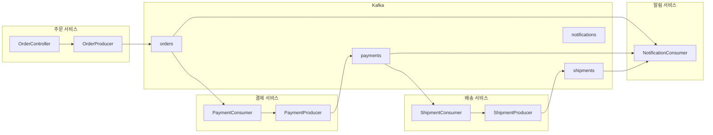

마이크로서비스 환경에서 Kafka를 활용한 이벤트 기반 통신을 구현합니다.

## 시나리오: 주문 처리 시스템



---

## 공통 이벤트 정의

### 이벤트 스키마

```java
// common-events/src/main/java/events/BaseEvent.java
public abstract class BaseEvent {
    private String eventId;
    private String eventType;
    private LocalDateTime occurredAt;
    private String correlationId;  // 추적용 ID

    // 생성자, getter, setter
}

// OrderCreatedEvent.java
public class OrderCreatedEvent extends BaseEvent {
    private String orderId;
    private String customerId;
    private List<OrderItem> items;
    private BigDecimal totalAmount;
    private String shippingAddress;
}

// PaymentCompletedEvent.java
public class PaymentCompletedEvent extends BaseEvent {
    private String paymentId;
    private String orderId;
    private BigDecimal amount;
    private PaymentMethod method;
    private PaymentStatus status;
}

// ShipmentCreatedEvent.java
public class ShipmentCreatedEvent extends BaseEvent {
    private String shipmentId;
    private String orderId;
    private String trackingNumber;
    private String carrier;
    private LocalDateTime estimatedDelivery;
}
```

---

## 주문 서비스 (Order Service)

### application.yml

```yaml
spring:
  application:
    name: order-service
  kafka:
    bootstrap-servers: localhost:9092
    producer:
      key-serializer: org.apache.kafka.common.serialization.StringSerializer
      value-serializer: org.springframework.kafka.support.serializer.JsonSerializer
      acks: all
      properties:
        enable.idempotence: true
    properties:
      spring.json.type.mapping: >
        orderCreated:com.example.events.OrderCreatedEvent

kafka:
  topics:
    orders: orders
```

### OrderProducer

```java
@Service
@RequiredArgsConstructor
@Slf4j
public class OrderProducer {
    private final KafkaTemplate<String, Object> kafkaTemplate;

    @Value("${kafka.topics.orders}")
    private String ordersTopic;

    public CompletableFuture<SendResult<String, Object>> publishOrderCreated(Order order) {
        OrderCreatedEvent event = OrderCreatedEvent.builder()
            .eventId(UUID.randomUUID().toString())
            .eventType("ORDER_CREATED")
            .occurredAt(LocalDateTime.now())
            .correlationId(order.getCorrelationId())
            .orderId(order.getId())
            .customerId(order.getCustomerId())
            .items(order.getItems())
            .totalAmount(order.getTotalAmount())
            .shippingAddress(order.getShippingAddress())
            .build();

        // orderId를 Key로 사용하여 같은 주문은 같은 Partition으로
        return kafkaTemplate.send(ordersTopic, order.getId(), event)
            .whenComplete((result, ex) -> {
                if (ex != null) {
                    log.error("주문 이벤트 발행 실패: orderId={}", order.getId(), ex);
                } else {
                    log.info("주문 이벤트 발행: orderId={}, partition={}, offset={}",
                        order.getId(),
                        result.getRecordMetadata().partition(),
                        result.getRecordMetadata().offset());
                }
            });
    }
}
```

### OrderController

```java
@RestController
@RequestMapping("/api/orders")
@RequiredArgsConstructor
public class OrderController {
    private final OrderService orderService;
    private final OrderProducer orderProducer;

    @PostMapping
    public ResponseEntity<OrderResponse> createOrder(@RequestBody CreateOrderRequest request) {
        // 1. 주문 생성 (로컬 DB 저장)
        Order order = orderService.createOrder(request);

        // 2. 이벤트 발행 (비동기)
        orderProducer.publishOrderCreated(order);

        // 3. 응답 반환
        return ResponseEntity.status(HttpStatus.CREATED)
            .body(OrderResponse.from(order));
    }
}
```

---

## 결제 서비스 (Payment Service)

### PaymentConsumer

```java
@Service
@RequiredArgsConstructor
@Slf4j
public class PaymentConsumer {
    private final PaymentService paymentService;
    private final PaymentProducer paymentProducer;

    @KafkaListener(
        topics = "${kafka.topics.orders}",
        groupId = "payment-service-group",
        containerFactory = "kafkaListenerContainerFactory"
    )
    public void handleOrderCreated(
        @Payload OrderCreatedEvent event,
        @Header(KafkaHeaders.RECEIVED_KEY) String key,
        @Header(KafkaHeaders.RECEIVED_PARTITION) int partition,
        Acknowledgment ack
    ) {
        log.info("주문 이벤트 수신: orderId={}, partition={}", event.getOrderId(), partition);

        try {
            // 멱등성 체크
            if (paymentService.isAlreadyProcessed(event.getOrderId())) {
                log.warn("이미 처리된 주문: orderId={}", event.getOrderId());
                ack.acknowledge();
                return;
            }

            // 결제 처리
            Payment payment = paymentService.processPayment(
                event.getOrderId(),
                event.getCustomerId(),
                event.getTotalAmount(),
                event.getCorrelationId()
            );

            // 결제 완료 이벤트 발행
            paymentProducer.publishPaymentCompleted(payment, event.getCorrelationId());

            ack.acknowledge();
            log.info("결제 처리 완료: orderId={}, paymentId={}", event.getOrderId(), payment.getId());

        } catch (PaymentFailedException e) {
            log.error("결제 실패: orderId={}", event.getOrderId(), e);
            // 결제 실패 이벤트 발행
            paymentProducer.publishPaymentFailed(event.getOrderId(), e.getMessage(), event.getCorrelationId());
            ack.acknowledge();  // 실패해도 커밋 (재시도는 별도 처리)

        } catch (Exception e) {
            log.error("결제 처리 중 오류: orderId={}", event.getOrderId(), e);
            // nack - 재시도
            throw e;
        }
    }
}
```

### PaymentProducer

```java
@Service
@RequiredArgsConstructor
@Slf4j
public class PaymentProducer {
    private final KafkaTemplate<String, Object> kafkaTemplate;

    @Value("${kafka.topics.payments}")
    private String paymentsTopic;

    public void publishPaymentCompleted(Payment payment, String correlationId) {
        PaymentCompletedEvent event = PaymentCompletedEvent.builder()
            .eventId(UUID.randomUUID().toString())
            .eventType("PAYMENT_COMPLETED")
            .occurredAt(LocalDateTime.now())
            .correlationId(correlationId)
            .paymentId(payment.getId())
            .orderId(payment.getOrderId())
            .amount(payment.getAmount())
            .method(payment.getMethod())
            .status(PaymentStatus.COMPLETED)
            .build();

        kafkaTemplate.send(paymentsTopic, payment.getOrderId(), event);
    }

    public void publishPaymentFailed(String orderId, String reason, String correlationId) {
        PaymentFailedEvent event = PaymentFailedEvent.builder()
            .eventId(UUID.randomUUID().toString())
            .eventType("PAYMENT_FAILED")
            .occurredAt(LocalDateTime.now())
            .correlationId(correlationId)
            .orderId(orderId)
            .reason(reason)
            .build();

        kafkaTemplate.send(paymentsTopic, orderId, event);
    }
}
```

---

## 배송 서비스 (Shipment Service)

### ShipmentConsumer

```java
@Service
@RequiredArgsConstructor
@Slf4j
public class ShipmentConsumer {
    private final ShipmentService shipmentService;
    private final ShipmentProducer shipmentProducer;

    @KafkaListener(
        topics = "${kafka.topics.payments}",
        groupId = "shipment-service-group"
    )
    public void handlePaymentCompleted(
        @Payload PaymentCompletedEvent event,
        Acknowledgment ack
    ) {
        // 결제 완료 이벤트만 처리
        if (event.getStatus() != PaymentStatus.COMPLETED) {
            ack.acknowledge();
            return;
        }

        log.info("결제 완료 이벤트 수신: orderId={}", event.getOrderId());

        try {
            // 배송 생성
            Shipment shipment = shipmentService.createShipment(
                event.getOrderId(),
                event.getCorrelationId()
            );

            // 배송 생성 이벤트 발행
            shipmentProducer.publishShipmentCreated(shipment, event.getCorrelationId());

            ack.acknowledge();
            log.info("배송 생성 완료: orderId={}, shipmentId={}", event.getOrderId(), shipment.getId());

        } catch (Exception e) {
            log.error("배송 생성 실패: orderId={}", event.getOrderId(), e);
            throw e;
        }
    }
}
```

---

## 알림 서비스 (Notification Service)

### NotificationConsumer

```java
@Service
@RequiredArgsConstructor
@Slf4j
public class NotificationConsumer {
    private final NotificationService notificationService;

    // 여러 토픽을 동시에 구독
    @KafkaListener(
        topics = {"${kafka.topics.orders}", "${kafka.topics.payments}", "${kafka.topics.shipments}"},
        groupId = "notification-service-group"
    )
    public void handleEvent(
        @Payload String payload,
        @Header(KafkaHeaders.RECEIVED_TOPIC) String topic,
        @Header("eventType") String eventType,
        Acknowledgment ack
    ) {
        log.info("이벤트 수신: topic={}, type={}", topic, eventType);

        try {
            NotificationRequest notification = switch (eventType) {
                case "ORDER_CREATED" -> createOrderNotification(payload);
                case "PAYMENT_COMPLETED" -> createPaymentNotification(payload);
                case "PAYMENT_FAILED" -> createPaymentFailedNotification(payload);
                case "SHIPMENT_CREATED" -> createShipmentNotification(payload);
                default -> {
                    log.warn("알 수 없는 이벤트 타입: {}", eventType);
                    yield null;
                }
            };

            if (notification != null) {
                notificationService.send(notification);
            }

            ack.acknowledge();

        } catch (Exception e) {
            log.error("알림 처리 실패: topic={}, type={}", topic, eventType, e);
            ack.acknowledge();  // 알림 실패는 재시도하지 않음
        }
    }

    private NotificationRequest createOrderNotification(String payload) {
        OrderCreatedEvent event = parseEvent(payload, OrderCreatedEvent.class);
        return NotificationRequest.builder()
            .customerId(event.getCustomerId())
            .type(NotificationType.EMAIL)
            .template("ORDER_CREATED")
            .data(Map.of(
                "orderId", event.getOrderId(),
                "totalAmount", event.getTotalAmount()
            ))
            .build();
    }

    // ... 다른 알림 생성 메서드
}
```

---

## Saga 패턴: 분산 트랜잭션

### 보상 트랜잭션 구현

```java
@Service
@RequiredArgsConstructor
@Slf4j
public class OrderSagaOrchestrator {
    private final OrderRepository orderRepository;
    private final KafkaTemplate<String, Object> kafkaTemplate;

    // 결제 실패 시 주문 취소
    @KafkaListener(topics = "${kafka.topics.payments}", groupId = "order-saga-group")
    public void handlePaymentEvent(@Payload String payload, @Header("eventType") String eventType) {
        if ("PAYMENT_FAILED".equals(eventType)) {
            PaymentFailedEvent event = parseEvent(payload, PaymentFailedEvent.class);
            compensateOrder(event.getOrderId(), event.getReason());
        }
    }

    // 배송 실패 시 주문 취소 + 환불 요청
    @KafkaListener(topics = "${kafka.topics.shipments}", groupId = "order-saga-group")
    public void handleShipmentEvent(@Payload String payload, @Header("eventType") String eventType) {
        if ("SHIPMENT_FAILED".equals(eventType)) {
            ShipmentFailedEvent event = parseEvent(payload, ShipmentFailedEvent.class);
            compensateOrderAndPayment(event.getOrderId(), event.getReason());
        }
    }

    private void compensateOrder(String orderId, String reason) {
        log.info("주문 보상 트랜잭션 실행: orderId={}, reason={}", orderId, reason);

        Order order = orderRepository.findById(orderId).orElseThrow();
        order.cancel(reason);
        orderRepository.save(order);

        // 주문 취소 이벤트 발행
        kafkaTemplate.send("orders", orderId, OrderCancelledEvent.builder()
            .orderId(orderId)
            .reason(reason)
            .build());
    }

    private void compensateOrderAndPayment(String orderId, String reason) {
        compensateOrder(orderId, reason);

        // 환불 요청 이벤트 발행
        kafkaTemplate.send("refunds", orderId, RefundRequestedEvent.builder()
            .orderId(orderId)
            .reason(reason)
            .build());
    }
}
```

---

## 모니터링: 분산 추적

### Correlation ID 전파

```java
@Configuration
public class KafkaTracingConfig {

    @Bean
    public ProducerFactory<String, Object> producerFactory() {
        Map<String, Object> config = new HashMap<>();
        config.put(ProducerConfig.BOOTSTRAP_SERVERS_CONFIG, "localhost:9092");
        config.put(ProducerConfig.KEY_SERIALIZER_CLASS_CONFIG, StringSerializer.class);
        config.put(ProducerConfig.VALUE_SERIALIZER_CLASS_CONFIG, JsonSerializer.class);

        DefaultKafkaProducerFactory<String, Object> factory =
            new DefaultKafkaProducerFactory<>(config);

        // Correlation ID 헤더 자동 추가
        factory.setProducerInterceptorClasses(List.of(TracingProducerInterceptor.class));

        return factory;
    }
}

// TracingProducerInterceptor.java
public class TracingProducerInterceptor implements ProducerInterceptor<String, Object> {

    @Override
    public ProducerRecord<String, Object> onSend(ProducerRecord<String, Object> record) {
        String correlationId = MDC.get("correlationId");
        if (correlationId == null) {
            correlationId = UUID.randomUUID().toString();
        }

        record.headers().add("correlationId", correlationId.getBytes(StandardCharsets.UTF_8));
        record.headers().add("serviceName", "order-service".getBytes(StandardCharsets.UTF_8));
        record.headers().add("timestamp", Instant.now().toString().getBytes(StandardCharsets.UTF_8));

        return record;
    }

    // ... 다른 메서드
}
```

### Consumer Lag 모니터링

```java
@Component
@RequiredArgsConstructor
@Slf4j
public class ConsumerLagMonitor {
    private final KafkaAdmin kafkaAdmin;
    private final MeterRegistry meterRegistry;

    @Scheduled(fixedRate = 30000)  // 30초마다
    public void checkConsumerLag() {
        try (AdminClient adminClient = AdminClient.create(kafkaAdmin.getConfigurationProperties())) {
            ListConsumerGroupOffsetsResult offsetsResult =
                adminClient.listConsumerGroupOffsets("payment-service-group");

            Map<TopicPartition, OffsetAndMetadata> offsets =
                offsetsResult.partitionsToOffsetAndMetadata().get();

            offsets.forEach((tp, offset) -> {
                // 현재 오프셋과 끝 오프셋 비교
                long currentOffset = offset.offset();
                long endOffset = getEndOffset(adminClient, tp);
                long lag = endOffset - currentOffset;

                meterRegistry.gauge("kafka.consumer.lag",
                    Tags.of("topic", tp.topic(), "partition", String.valueOf(tp.partition())),
                    lag);

                if (lag > 1000) {
                    log.warn("Consumer lag 경고: topic={}, partition={}, lag={}",
                        tp.topic(), tp.partition(), lag);
                }
            });
        } catch (Exception e) {
            log.error("Consumer lag 조회 실패", e);
        }
    }
}
```

---

## 테스트

### 통합 테스트 (Testcontainers)

```java
@SpringBootTest
@Testcontainers
class OrderServiceIntegrationTest {

    @Container
    static KafkaContainer kafka = new KafkaContainer(
        DockerImageName.parse("confluentinc/cp-kafka:7.5.0")
    );

    @DynamicPropertySource
    static void kafkaProperties(DynamicPropertyRegistry registry) {
        registry.add("spring.kafka.bootstrap-servers", kafka::getBootstrapServers);
    }

    @Autowired
    private OrderController orderController;

    @Autowired
    private KafkaTemplate<String, Object> kafkaTemplate;

    @Test
    void 주문_생성_시_이벤트가_발행된다() throws Exception {
        // Given
        CreateOrderRequest request = new CreateOrderRequest(
            "customer-1",
            List.of(new OrderItem("product-1", 2, BigDecimal.valueOf(10000))),
            "서울시 강남구"
        );

        // When
        ResponseEntity<OrderResponse> response = orderController.createOrder(request);

        // Then
        assertThat(response.getStatusCode()).isEqualTo(HttpStatus.CREATED);

        // 이벤트 수신 확인
        ConsumerRecords<String, String> records = consumeRecords("orders", 5000);
        assertThat(records.count()).isEqualTo(1);

        ConsumerRecord<String, String> record = records.iterator().next();
        assertThat(record.key()).isEqualTo(response.getBody().orderId());
    }
}
```

---

## 체크리스트

- [ ] 모든 이벤트에 correlationId 포함
- [ ] Consumer에서 멱등성 처리
- [ ] Dead Letter Topic 설정
- [ ] 보상 트랜잭션 (Saga) 구현
- [ ] Consumer Lag 모니터링
- [ ] 재시도 정책 설정
- [ ] 이벤트 스키마 버전 관리

---

## 다음 단계

- [에러 처리]() - DLT, 재시도 전략
- [모니터링]() - 메트릭 수집과 알림
- [DDD 연동]() - 도메인 이벤트 설계
