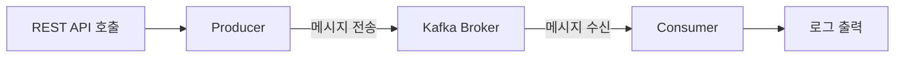
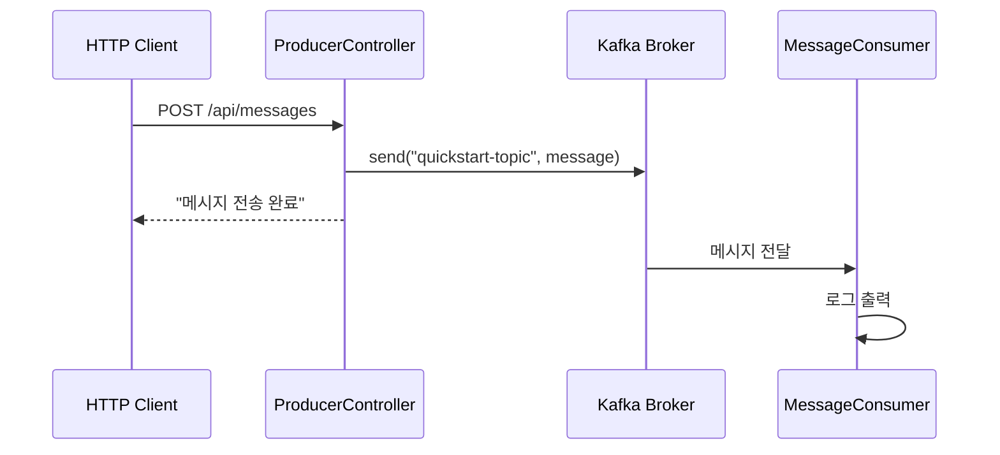

5분 만에 Kafka 메시지 송수신을 경험해보세요.

#### 전체 흐름

Quick Start에서는 REST API 요청을 받아 Kafka로 메시지를 전송하고, Consumer가 이를 수신하여 로그로 출력하는 과정을 구현합니다.



시작하기 전에 Docker Desktop 또는 Docker Engine, Java 17 이상, 그리고 IntelliJ IDEA나 VS Code 같은 IDE가 필요합니다.

#### Step 1: Kafka 시작

이 저장소의 루트 디렉토리에서 Docker Compose로 Kafka를 실행합니다.

```bash
# 저장소 루트의 docker 디렉토리로 이동
cd docker
docker-compose up -d
```

docker-compose.yml 파일이 없다면 [환경 구성 가이드](../examples/setup/)에서 내용을 확인하고 `docker/docker-compose.yml`로 저장하세요.

정상 실행 여부를 확인합니다.

```bash
docker-compose ps
```

예상 결과는 다음과 같습니다.

```
NAME      COMMAND                  STATUS
kafka     "/etc/kafka/docker..."   Up
```

Kafka가 완전히 시작되기까지 10-20초 정도 걸릴 수 있습니다.

#### Step 2: 예제 프로젝트 실행

새 터미널에서 Quick Start 예제를 실행합니다.

```bash
# 저장소 루트에서 예제 디렉토리로 이동
cd examples/quick-start
./gradlew bootRun
```

Windows 사용자는 `gradlew.bat bootRun` 명령을 사용합니다. 실행 완료 시 `Started QuickStartApplication in X.XXX seconds`라는 로그가 표시됩니다.

#### Step 3: 메시지 전송

새 터미널에서 REST API로 메시지를 전송합니다.

```bash
curl -X POST http://localhost:8080/api/messages \
  -H "Content-Type: text/plain" \
  -d "Hello Kafka!"
```

`메시지 전송 완료: Hello Kafka!`라는 응답이 반환됩니다.

#### Step 4: 메시지 수신 확인

Spring Boot 애플리케이션이 실행 중인 터미널에서 Consumer가 메시지를 수신한 로그를 확인합니다.

```
INFO  c.e.quickstart.MessageConsumer : 메시지 수신: Hello Kafka!
```

축하합니다! Kafka를 통한 메시지 송수신에 성공했습니다.

#### 종료

실행 중인 애플리케이션과 Kafka를 종료합니다.

```bash
# Spring Boot 애플리케이션: Ctrl+C

# Kafka 종료 (docker 디렉토리에서)
cd docker
docker-compose down
```

#### 무엇이 일어났나요?

방금 실행한 과정을 단계별로 살펴봅니다.



먼저 curl로 HTTP 요청을 보냈습니다. ProducerController가 이 요청을 받아 메시지를 Kafka에 발행했습니다. Kafka Broker는 메시지를 `quickstart-topic`에 저장했습니다. 마지막으로 MessageConsumer가 해당 Topic을 구독하고 있어 메시지를 수신하고 로그로 출력했습니다.

토픽은 언제 생성되는지 궁금할 수 있습니다. Kafka는 기본적으로 존재하지 않는 토픽에 메시지를 보내면 자동으로 토픽을 생성합니다. 이는 `auto.create.topics.enable=true` 설정 때문입니다.

#### 코드 살펴보기

Quick Start 예제가 어떻게 구성되어 있는지 살펴봅니다.

**Producer (메시지 전송)**

ProducerController는 REST 요청을 받아 Kafka로 메시지를 전송합니다.

```java
// ProducerController.java
@RestController
@RequestMapping("/api/messages")
public class ProducerController {

    private static final String TOPIC = "quickstart-topic";
    private final KafkaTemplate<String, String> kafkaTemplate;

    public ProducerController(KafkaTemplate<String, String> kafkaTemplate) {
        this.kafkaTemplate = kafkaTemplate;
    }

    @PostMapping
    public String sendMessage(@RequestBody String message) {
        kafkaTemplate.send(TOPIC, message);
        return "메시지 전송 완료: " + message;
    }
}
```

KafkaTemplate은 Spring Kafka가 제공하는 메시지 전송 클래스입니다. `send(topic, message)` 메서드를 호출하면 지정한 토픽에 메시지가 전송됩니다.

**Consumer (메시지 수신)**

MessageConsumer는 @KafkaListener 어노테이션으로 특정 Topic의 메시지를 자동으로 수신합니다.

```java
// MessageConsumer.java
@Component
public class MessageConsumer {

    private static final Logger log = LoggerFactory.getLogger(MessageConsumer.class);

    @KafkaListener(topics = "quickstart-topic", groupId = "quickstart-group")
    public void consume(String message) {
        log.info("메시지 수신: {}", message);
    }
}
```

@KafkaListener는 지정한 토픽의 메시지를 자동으로 수신하는 어노테이션입니다. groupId는 Consumer Group ID로, 같은 그룹의 Consumer들은 메시지를 분배받아 처리합니다.

**설정 (application.yml)**

```yaml
spring:
  kafka:
    bootstrap-servers: localhost:9092
    consumer:
      group-id: quickstart-group
      auto-offset-reset: earliest
    producer:
      key-serializer: org.apache.kafka.common.serialization.StringSerializer
      value-serializer: org.apache.kafka.common.serialization.StringSerializer
```

bootstrap-servers는 Kafka 브로커 주소입니다. auto-offset-reset을 earliest로 설정하면 Consumer 시작 시 가장 오래된 메시지부터 읽습니다.

#### 트러블슈팅

**Kafka 연결 실패**

`Connection to node -1 could not be established` 오류가 발생하면 Docker가 실행 중인지 `docker ps` 명령으로 확인합니다. Kafka 컨테이너 상태는 `docker-compose ps`로 확인합니다. Kafka가 완전히 시작될 때까지 최대 30초 기다립니다. 문제가 지속되면 `docker-compose restart`로 Kafka를 재시작합니다.

**포트 충돌**

`Port 9092 is already in use` 오류는 기존 Kafka 프로세스가 실행 중임을 의미합니다. 기존 프로세스를 종료하거나 docker-compose.yml에서 포트를 변경합니다.

**Gradle 빌드 실패**

`Could not resolve dependencies` 오류가 발생하면 Java 17 이상이 설치되어 있는지 `java -version`으로 확인합니다. Gradle 캐시 문제라면 `./gradlew clean`으로 정리합니다.

**Consumer 로그가 안 보여요**

메시지를 전송했는데 Consumer 로그가 출력되지 않는다면 Spring Boot가 실행 중인 터미널을 확인하세요. curl을 실행한 터미널이 아닙니다. 애플리케이션 시작 로그에서 KafkaMessageListenerContainer 관련 로그가 있는지 확인합니다. 없다면 Kafka 연결에 문제가 있을 수 있습니다.

#### 다음 단계

Quick Start를 완료했다면 다음 단계로 진행하세요. Kafka 개념을 이해하려면 [핵심 구성요소](../concepts/core-components/)를 읽어보세요. 더 복잡한 예제를 실습하려면 [기본 예제](../examples/basic/)를 참고하세요. 프로덕션 설정을 알아보려면 [환경 구성](../examples/setup/)을 확인하세요.
