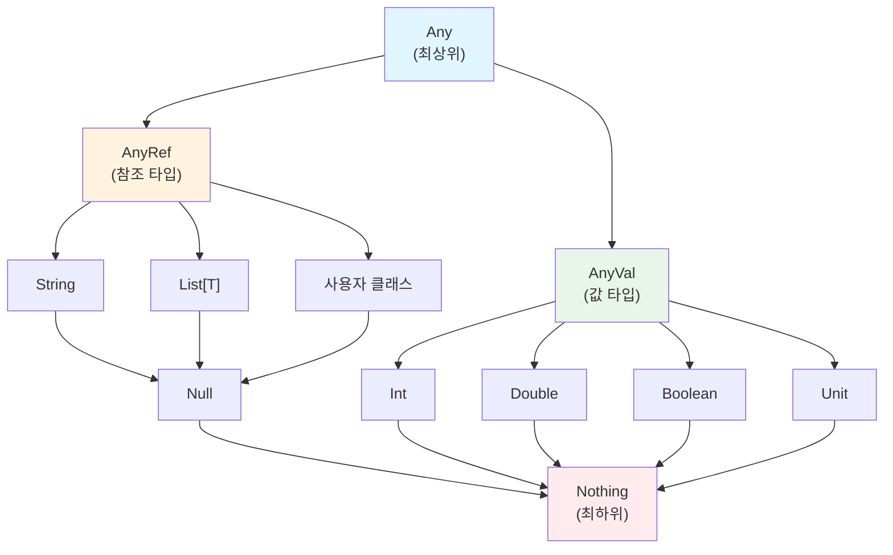

변수 선언, 기본 타입, 타입 추론 등 Scala의 기본 문법을 배웁니다.

## 변수와 상수

Scala에서는 `val`(불변)과 `var`(가변) 두 가지 방식으로 값을 선언합니다.

### val - 불변 (권장)

`val`로 선언한 값은 재할당할 수 없습니다. 함수형 프로그래밍에서 권장하는 방식입니다.

```scala
val name = "Scala"
val year = 2024
val pi = 3.14159

// 재할당 불가
// name = "Java"  // 컴파일 에러!
```

> **왜 불변이 좋은가?**
> - 코드 예측이 쉬움 (값이 변하지 않으므로)
> - 동시성 프로그래밍에서 안전
> - 버그 발생 가능성 감소

### var - 가변

`var`로 선언한 값은 재할당할 수 있습니다. 필요한 경우에만 사용하세요.

```scala
var count = 0
count = count + 1  // OK
count += 1         // OK (축약형)

var message = "Hello"
message = "World"  // OK
```

### 지연 초기화 (lazy val)

`lazy val`은 처음 접근할 때까지 초기화를 지연합니다.

```scala
lazy val expensiveValue = {
  println("계산 중...")
  Thread.sleep(1000)
  42
}

println("선언됨")
println(expensiveValue)  // 여기서 "계산 중..." 출력
println(expensiveValue)  // 캐시된 값 사용, 재계산 없음
```

## 타입 시스템

### 기본 타입

Scala의 모든 값은 객체입니다. Java의 원시 타입(primitive type)도 Scala에서는 객체로 취급됩니다.

| 타입 | 설명 | 예시 |
|------|------|------|
| `Byte` | 8비트 정수 | `val b: Byte = 127` |
| `Short` | 16비트 정수 | `val s: Short = 32767` |
| `Int` | 32비트 정수 | `val i: Int = 42` |
| `Long` | 64비트 정수 | `val l: Long = 1234567890L` |
| `Float` | 32비트 부동소수점 | `val f: Float = 3.14f` |
| `Double` | 64비트 부동소수점 | `val d: Double = 3.14159` |
| `Char` | 16비트 유니코드 문자 | `val c: Char = 'A'` |
| `Boolean` | 참/거짓 | `val flag: Boolean = true` |
| `String` | 문자열 | `val s: String = "Hello"` |
| `Unit` | 값 없음 (void 유사) | `val u: Unit = ()` |

### 타입 계층 구조



- **Any**: 모든 타입의 최상위 타입
- **AnyVal**: 값 타입의 부모 (Int, Double 등)
- **AnyRef**: 참조 타입의 부모 (String, List, 사용자 클래스 등)
- **Null**: 모든 참조 타입의 하위 타입 (`null` 값의 타입)
- **Nothing**: 모든 타입의 하위 타입

#### Nothing은 언제 사용될까?

`Nothing`은 정상적으로 값을 반환하지 않는 경우에 사용됩니다:

```scala
// 1. 예외를 던지는 함수
def fail(message: String): Nothing =
  throw new RuntimeException(message)

// Nothing은 모든 타입의 하위 타입이므로 어디서나 사용 가능
val result: Int = if (true) 42 else fail("error")

// 2. 빈 컬렉션의 타입
val empty: List[Nothing] = Nil  // List[Int], List[String] 등에 할당 가능

// 3. Option.None의 타입
val none: Option[Nothing] = None  // Option[Int], Option[String] 등에 할당 가능
```

> 💡 **왜 유용한가?** `Nothing`이 모든 타입의 하위 타입이기 때문에, `Nil`이나 `None`을 어떤 타입의 리스트나 Option에도 사용할 수 있습니다.

## 타입 추론

Scala 컴파일러는 대부분의 경우 타입을 자동으로 추론합니다.

### 추론되는 경우

```scala
val name = "Scala"     // String으로 추론
val count = 42         // Int로 추론
val pi = 3.14          // Double로 추론
val flag = true        // Boolean으로 추론
val numbers = List(1, 2, 3)  // List[Int]로 추론
```

### 명시적 타입 선언이 필요한 경우

```scala
// 1. 특정 타입을 원할 때
val longNum: Long = 42        // Int 대신 Long
val floatNum: Float = 3.14f   // Double 대신 Float

// 2. 빈 컬렉션
val emptyList: List[Int] = List()
val emptyMap: Map[String, Int] = Map()

// 3. 함수 매개변수 (항상 필요)
def greet(name: String): String = s"Hello, $name"

// 4. 재귀 함수의 반환 타입
def factorial(n: Int): Int =
  if (n <= 1) 1 else n * factorial(n - 1)

// 5. 복잡한 표현식
val result: Either[String, Int] = Right(42)
```

## 문자열

### 문자열 보간 (String Interpolation)

Scala는 강력한 문자열 보간 기능을 제공합니다.

**s-보간 (기본):**

```scala
val name = "Scala"
val version = 3

println(s"$name $version")           // Scala 3
println(s"${name.toUpperCase}")      // SCALA
println(s"1 + 1 = ${1 + 1}")         // 1 + 1 = 2
```

**f-보간 (포맷팅):**

```scala
val pi = 3.14159
val count = 42

println(f"pi = $pi%.2f")          // pi = 3.14
println(f"count = $count%05d")    // count = 00042
println(f"hex = $count%x")        // hex = 2a
```

**raw-보간 (이스케이프 무시):**

```scala
println(raw"Hello\nWorld")  // Hello\nWorld (줄바꿈 안 됨)
println(s"Hello\nWorld")    // Hello
                            // World
```

### 여러 줄 문자열

```scala
val sql = """
  SELECT *
  FROM users
  WHERE age > 18
"""

// stripMargin으로 앞쪽 공백 제거
val formatted = """
  |SELECT *
  |FROM users
  |WHERE age > 18
  """.stripMargin
```

## Scala 2 vs Scala 3 차이점

### 기본 문법

대부분의 기본 문법은 동일합니다. 주요 차이점:


{}
```scala
// 들여쓰기 기반 문법 (선택)
@main def hello() =
  val name = "World"
  println(s"Hello, $name!")

// 중괄호도 여전히 사용 가능
@main def hello2(): Unit = {
  val name = "World"
  println(s"Hello, $name!")
}
```
{}
{}
```scala
// 중괄호 필수
object Main {
  def main(args: Array[String]): Unit = {
    val name = "World"
    println(s"Hello, $name!")
  }
}
```
{}


### 와일드카드 import


{}
```scala
import scala.collection.mutable.*
```
{}
{}
```scala
import scala.collection.mutable._
```
{}


## 흔한 실수와 Anti-patterns

### ❌ 피해야 할 것

```scala
// 1. 무분별한 var 사용
var list = List(1, 2, 3)
list = list :+ 4  // 매번 새 리스트 생성 - 비효율적!

// 2. null 사용
val name: String = null  // NullPointerException 위험!

// 3. 타입 추론에 과도한 의존
val x = if (condition) 1 else "error"  // Any로 추론됨

// 4. Unit을 반환하는 표현식 무시
val result = list.foreach(println)  // result는 Unit
```

### ✅ 올바른 방법

```scala
// 1. val과 불변 연산 사용
val list = List(1, 2, 3)
val newList = list :+ 4  // 새 리스트를 새 val에 할당

// 2. Option 사용
val name: Option[String] = None

// 3. 복잡한 표현식은 타입 명시
val x: Int | String = if (condition) 1 else "error"  // Scala 3
val x: Either[String, Int] = if (condition) Right(1) else Left("error")

// 4. Unit 반환 함수는 명확히 표시
def printAll(list: List[Int]): Unit = list.foreach(println)
```

## 연습 문제

### 1. 변수 선언

다음 코드의 출력 결과를 예측하세요:

```scala
val x = 10
var y = 20
y = y + x
println(s"x = $x, y = $y")
```

<details>
<summary>정답 보기</summary>

```
x = 10, y = 30
```

`x`는 `val`이므로 10으로 고정, `y`는 `var`이므로 20 + 10 = 30으로 변경됩니다.

</details>

### 2. 타입 추론

다음 변수들의 타입을 추론하세요:

```scala
val a = 42
val b = 3.14
val c = "Hello"
val d = List(1, 2, 3)
val e = Map("a" -> 1, "b" -> 2)
```

<details>
<summary>정답 보기</summary>

- `a`: `Int`
- `b`: `Double`
- `c`: `String`
- `d`: `List[Int]`
- `e`: `Map[String, Int]`

</details>

### 3. 문자열 보간

이름과 나이를 받아 "홍길동님은 25세입니다." 형식으로 출력하는 코드를 작성하세요.

<details>
<summary>정답 보기</summary>

```scala
val name = "홍길동"
val age = 25
println(s"${name}님은 ${age}세입니다.")
```

</details>

## 다음 단계

- [제어 구조](../control-structures/) — if, for, while, match 표현식
- [함수와 메서드](../functions-methods/) — 함수 정의와 고급 기능
