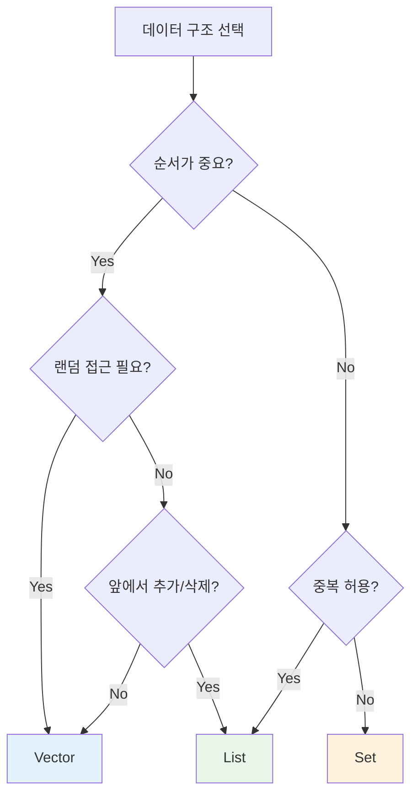

Scala 컬렉션 라이브러리는 함수형 프로그래밍에 최적화된 풍부한 데이터 구조를 제공합니다.

## 컬렉션 계층 구조

```
                  Iterable
                     │
        ┌────────────┼────────────┐
        │            │            │
       Seq          Set          Map
        │            │            │
   ┌────┴────┐       │       ┌────┴────┐
   │         │       │       │         │
IndexedSeq LinearSeq SortedSet HashMap SortedMap
   │         │       │
Vector    List    TreeSet
Array   LazyList
```

## 불변 vs 가변

Scala는 **불변 컬렉션**을 기본으로 사용합니다.

```scala
// 불변 (기본)
import scala.collection.immutable._  // 암시적으로 import됨
val list = List(1, 2, 3)
val set = Set(1, 2, 3)
val map = Map("a" -> 1, "b" -> 2)

// 가변 (명시적 import 필요)
import scala.collection.mutable
val mutableList = mutable.ListBuffer(1, 2, 3)
val mutableSet = mutable.Set(1, 2, 3)
val mutableMap = mutable.Map("a" -> 1)
```

## Seq (시퀀스)

순서가 있는 컬렉션입니다.

### List (연결 리스트)

```scala
val list = List(1, 2, 3, 4, 5)

// 요소 접근
list.head          // 1
list.tail          // List(2, 3, 4, 5)
list(2)            // 3 (인덱스 접근 - O(n))

// 요소 추가 (앞에 - O(1))
val newList = 0 :: list    // List(0, 1, 2, 3, 4, 5)
val concat = list :+ 6     // List(1, 2, 3, 4, 5, 6) - O(n)

// 리스트 연결
val combined = List(1, 2) ::: List(3, 4)  // List(1, 2, 3, 4)
// 또는
val combined2 = List(1, 2) ++ List(3, 4)

// 패턴 매칭
list match {
  case Nil          => "빈 리스트"
  case head :: tail => s"첫 번째: $head, 나머지: $tail"
}
```

### Vector (인덱스 시퀀스)

랜덤 접근이 빠른 불변 시퀀스입니다.

```scala
val vector = Vector(1, 2, 3, 4, 5)

// 랜덤 접근 - O(~1) (사실상 상수 시간)
vector(2)  // 3

// 업데이트 (새 Vector 반환)
val updated = vector.updated(2, 100)  // Vector(1, 2, 100, 4, 5)

// 추가
val appended = vector :+ 6
val prepended = 0 +: vector
```

### Range

숫자 범위를 나타냅니다.

```scala
val r1 = 1 to 10      // 1부터 10까지 (포함)
val r2 = 1 until 10   // 1부터 9까지 (10 제외)
val r3 = 1 to 10 by 2 // 1, 3, 5, 7, 9

r1.toList  // List(1, 2, 3, 4, 5, 6, 7, 8, 9, 10)
```

## Set (집합)

중복이 없는 컬렉션입니다.

```scala
val set = Set(1, 2, 3, 2, 1)  // Set(1, 2, 3)

// 포함 여부
set.contains(2)  // true
set(2)           // true (apply = contains)

// 추가/제거
val added = set + 4       // Set(1, 2, 3, 4)
val removed = set - 2     // Set(1, 3)

// 집합 연산
val a = Set(1, 2, 3)
val b = Set(2, 3, 4)

a union b      // Set(1, 2, 3, 4)
a | b          // 위와 동일

a intersect b  // Set(2, 3)
a & b          // 위와 동일

a diff b       // Set(1)
a -- b         // 위와 동일
```

### SortedSet

정렬된 집합입니다.

```scala
import scala.collection.immutable.SortedSet

val sorted = SortedSet(3, 1, 4, 1, 5, 9, 2, 6)
// SortedSet(1, 2, 3, 4, 5, 6, 9)

sorted.firstKey  // 1
sorted.lastKey   // 9
sorted.range(2, 6)  // SortedSet(2, 3, 4, 5)
```

## Map (맵)

키-값 쌍의 컬렉션입니다.

```scala
val map = Map("a" -> 1, "b" -> 2, "c" -> 3)

// 값 접근
map("a")              // 1
map.get("a")          // Some(1)
map.get("z")          // None
map.getOrElse("z", 0) // 0

// 추가/수정
val added = map + ("d" -> 4)
val updated = map + ("a" -> 10)

// 제거
val removed = map - "a"

// 순회
for ((key, value) <- map) {
  println(s"$key = $value")
}

// keys, values
map.keys    // Iterable("a", "b", "c")
map.values  // Iterable(1, 2, 3)
```

## 컬렉션 연산

### 변환 연산

```scala
val numbers = List(1, 2, 3, 4, 5)

// map: 각 요소 변환
numbers.map(_ * 2)           // List(2, 4, 6, 8, 10)
numbers.map(n => n * n)      // List(1, 4, 9, 16, 25)

// flatMap: 변환 후 평탄화
numbers.flatMap(n => List(n, n * 10))
// List(1, 10, 2, 20, 3, 30, 4, 40, 5, 50)

// filter: 조건에 맞는 요소만
numbers.filter(_ % 2 == 0)   // List(2, 4)

// filterNot: 조건에 안 맞는 요소만
numbers.filterNot(_ % 2 == 0) // List(1, 3, 5)

// collect: 패턴 매칭으로 필터링 + 변환
numbers.collect {
  case n if n % 2 == 0 => n * 10
}  // List(20, 40)
```

### 축소 연산

```scala
val numbers = List(1, 2, 3, 4, 5)

// reduce: 요소들을 하나로 축소
numbers.reduce(_ + _)      // 15
numbers.reduce(_ * _)      // 120

// fold: 초기값과 함께 축소
numbers.foldLeft(0)(_ + _)   // 15
numbers.foldLeft(10)(_ + _)  // 25

// foldLeft vs foldRight
List("a", "b", "c").foldLeft("")(_ + _)   // "abc"
List("a", "b", "c").foldRight("")(_ + _)  // "abc" (순서 동일, 계산 방향 다름)
```

### 분할 연산

```scala
val numbers = List(1, 2, 3, 4, 5, 6)

// partition: 조건으로 둘로 분리
val (evens, odds) = numbers.partition(_ % 2 == 0)
// evens = List(2, 4, 6), odds = List(1, 3, 5)

// groupBy: 키로 그룹화
val grouped = numbers.groupBy(_ % 3)
// Map(0 -> List(3, 6), 1 -> List(1, 4), 2 -> List(2, 5))

// span: 조건이 참인 동안 분리
val (before, after) = numbers.span(_ < 4)
// before = List(1, 2, 3), after = List(4, 5, 6)

// splitAt: 인덱스로 분리
val (first, second) = numbers.splitAt(3)
// first = List(1, 2, 3), second = List(4, 5, 6)
```

### 검색 연산

```scala
val numbers = List(1, 2, 3, 4, 5)

// find: 첫 번째 매칭 요소
numbers.find(_ > 3)    // Some(4)
numbers.find(_ > 10)   // None

// exists: 조건에 맞는 요소가 있는지
numbers.exists(_ > 3)  // true

// forall: 모든 요소가 조건을 만족하는지
numbers.forall(_ > 0)  // true

// contains: 특정 값 포함 여부
numbers.contains(3)    // true

// count: 조건에 맞는 요소 개수
numbers.count(_ % 2 == 0)  // 2
```

### 정렬 연산

```scala
val numbers = List(3, 1, 4, 1, 5, 9, 2, 6)

numbers.sorted           // List(1, 1, 2, 3, 4, 5, 6, 9)
numbers.sortWith(_ > _)  // List(9, 6, 5, 4, 3, 2, 1, 1)

case class Person(name: String, age: Int)
val people = List(Person("Alice", 30), Person("Bob", 25), Person("Carol", 35))

people.sortBy(_.age)        // 나이순
people.sortBy(_.name)       // 이름순
people.sortWith(_.age > _.age)  // 나이 내림차순
```

## Option 다루기

```scala
val maybeValue: Option[Int] = Some(42)
val noValue: Option[Int] = None

// map
maybeValue.map(_ * 2)  // Some(84)
noValue.map(_ * 2)     // None

// flatMap
def safeDivide(a: Int, b: Int): Option[Int] =
  if (b == 0) None else Some(a / b)

maybeValue.flatMap(v => safeDivide(v, 2))  // Some(21)

// getOrElse
maybeValue.getOrElse(0)  // 42
noValue.getOrElse(0)     // 0

// fold
maybeValue.fold(0)(_ * 2)  // 84
noValue.fold(0)(_ * 2)     // 0

// for comprehension
for {
  a <- Some(10)
  b <- Some(20)
} yield a + b  // Some(30)
```

## 성능 특성

| 컬렉션 | head | tail | 인덱스 접근 | 업데이트 | 추가(앞) | 추가(뒤) |
|--------|------|------|-----------|---------|---------|---------|
| List | O(1) | O(1) | O(n) | O(n) | O(1) | O(n) |
| Vector | O(1) | O(1) | O(log₃₂n)* | O(log₃₂n)* | O(log₃₂n)* | O(log₃₂n)* |
| Array | O(1) | O(n) | O(1) | O(1) | - | - |
| Set | - | - | O(log n)** | O(log n)** | O(log n)** | - |
| Map | - | - | O(log n)** | O(log n)** | O(log n)** | - |

> **참고:**
> - `*` Vector의 O(log₃₂n)은 n이 10억이어도 약 6단계로, **사실상 상수 시간**으로 간주됩니다.
> - `**` HashSet/HashMap은 평균 O(1), TreeSet/TreeMap은 O(log n)

### 어떤 컬렉션을 선택할까?

```scala
// 앞에서 추가/제거가 많음 → List
val queue = 1 :: 2 :: 3 :: Nil

// 랜덤 접근이 많음 → Vector
val indexed = Vector(1, 2, 3, 4, 5)
indexed(3)  // 빠름!

// 중복 없이 빠른 검색 → Set
val unique = Set(1, 2, 3)
unique.contains(2)  // 빠름!

// 키-값 검색 → Map
val lookup = Map("a" -> 1, "b" -> 2)
lookup.get("a")  // 빠름!
```

## 흔한 실수와 Anti-patterns

### ❌ 피해야 할 것

```scala
// 1. 인덱스 기반 접근 남용 (List에서)
val list = List(1, 2, 3, 4, 5)
for (i <- 0 until list.length) {
  println(list(i))  // O(n^2) - 매우 느림!
}

// 2. 가변 컬렉션 남용
val mutableList = mutable.ListBuffer[Int]()
for (i <- 1 to 1000) {
  mutableList += i  // 불필요한 가변성
}

// 3. map 후 flatten 대신 flatMap
list.map(x => List(x, x * 2)).flatten  // 비효율적

// 4. 빈 컬렉션에서 head/last 호출
List.empty[Int].head  // NoSuchElementException!
```

### ✅ 올바른 방법

```scala
// 1. foreach나 iterator 사용
list.foreach(println)  // O(n)
// 또는 인덱스 접근이 많으면 Vector 사용
val vector = Vector(1, 2, 3, 4, 5)
vector(2)  // O(~1)

// 2. 불변 컬렉션과 함수형 변환
val result = (1 to 1000).toList

// 3. flatMap 사용
list.flatMap(x => List(x, x * 2))

// 4. headOption/lastOption 사용
List.empty[Int].headOption  // None
List(1, 2, 3).headOption    // Some(1)
```

### 컬렉션 선택 가이드



## 연습 문제

### 1. 단어 빈도수

문자열 리스트에서 각 단어의 빈도수를 계산하세요.

<details>
<summary>정답 보기</summary>

```scala
val words = List("apple", "banana", "apple", "cherry", "banana", "apple")

val frequency = words.groupBy(identity).map { case (word, list) =>
  word -> list.length
}
// Map(apple -> 3, banana -> 2, cherry -> 1)

// 또는
val frequency2 = words.groupMapReduce(identity)(_ => 1)(_ + _)
```

</details>

### 2. 중첩 리스트 평탄화

중첩된 리스트를 1차원으로 평탄화하세요.

<details>
<summary>정답 보기</summary>

```scala
val nested = List(List(1, 2), List(3, 4, 5), List(6))

val flat = nested.flatten  // List(1, 2, 3, 4, 5, 6)

// 또는
val flat2 = nested.flatMap(identity)
```

</details>

## 다음 단계

- [고차 함수](../higher-order-functions/) — map, filter, fold 심화
- [For Comprehension](../for-comprehensions/) — 모나딕 연산
