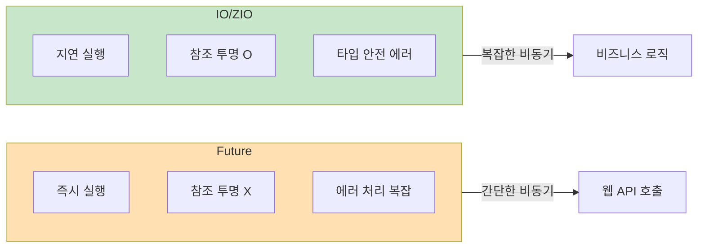

Scala는 `Future`를 통해 비동기 프로그래밍을 지원합니다. 이 문서에서는 `Future`, `Promise`, `ExecutionContext`를 다룹니다.

## Future 기초

`Future`는 아직 계산되지 않았거나 진행 중인 값을 나타냅니다.

### 생성

```scala
import scala.concurrent.{Future, ExecutionContext}
import scala.concurrent.ExecutionContext.Implicits.global

// 비동기 계산 시작
val future: Future[Int] = Future {
  Thread.sleep(1000)  // 시간이 오래 걸리는 작업
  42
}

// 즉시 반환, 계산은 백그라운드에서 진행
println("계산 시작됨")
```

### ExecutionContext

`Future`는 스레드 풀을 관리하는 `ExecutionContext`가 필요합니다.

```scala
import scala.concurrent.ExecutionContext.Implicits.global

// 또는 커스텀 ExecutionContext
import java.util.concurrent.Executors
implicit val ec: ExecutionContext =
  ExecutionContext.fromExecutor(Executors.newFixedThreadPool(4))
```

## Future 조합

### map

성공 결과를 변환합니다.

```scala
val future = Future(42)
val doubled = future.map(_ * 2)  // Future(84)
```

### flatMap

Future를 반환하는 함수로 변환합니다.

```scala
def fetchUser(id: Int): Future[String] = Future(s"User$id")
def fetchOrders(user: String): Future[List[String]] =
  Future(List(s"Order1-$user", s"Order2-$user"))

val orders: Future[List[String]] = fetchUser(1).flatMap(fetchOrders)
```

### for comprehension

```scala
val result = for {
  user <- fetchUser(1)
  orders <- fetchOrders(user)
} yield (user, orders)

// Future(("User1", List("Order1-User1", "Order2-User1")))
```

### 병렬 실행

```scala
// 순차 실행 (for comprehension)
val sequential = for {
  a <- Future(slowComputation1())
  b <- Future(slowComputation2())
} yield a + b

// 병렬 실행
val futureA = Future(slowComputation1())
val futureB = Future(slowComputation2())

val parallel = for {
  a <- futureA
  b <- futureB
} yield a + b
```

## 에러 처리

### recover

실패를 기본값으로 대체합니다.

```scala
val future = Future {
  throw new RuntimeException("에러!")
}

val recovered = future.recover {
  case _: RuntimeException => 0
}
// Future(0)
```

### recoverWith

실패를 다른 Future로 대체합니다.

```scala
val fallback = future.recoverWith {
  case _: RuntimeException => Future(0)
}
```

### failed

실패한 Future의 예외를 추출합니다.

```scala
val failure = Future.failed(new Exception("에러"))
val exception: Future[Throwable] = failure.failed
```

## 결과 대기

### Await (테스트용)

```scala
import scala.concurrent.Await
import scala.concurrent.duration._

val future = Future(42)
val result = Await.result(future, 5.seconds)  // 42
```

> **주의:** 프로덕션 코드에서는 `Await` 사용을 피하세요!

### 콜백

```scala
import scala.util.{Success, Failure}

future.onComplete {
  case Success(value) => println(s"성공: $value")
  case Failure(e)     => println(s"실패: ${e.getMessage}")
}
```

## Promise

`Promise`는 Future를 직접 완료할 수 있게 해줍니다.

```scala
import scala.concurrent.Promise

val promise = Promise[Int]()
val future: Future[Int] = promise.future

// 다른 스레드에서 완료
Future {
  Thread.sleep(1000)
  promise.success(42)  // 또는 promise.failure(exception)
}

// future가 완료됨
future.foreach(println)  // 42
```

### 사용 사례

```scala
def timeout[T](future: Future[T], duration: FiniteDuration): Future[T] = {
  val promise = Promise[T]()

  // 타임아웃 설정
  Future {
    Thread.sleep(duration.toMillis)
    promise.tryFailure(new TimeoutException())
  }

  // 원본 Future 연결
  future.onComplete(result => promise.tryComplete(result))

  promise.future
}
```

## 유틸리티 메서드

### Future.sequence

`List[Future[A]]`를 `Future[List[A]]`로 변환합니다.

```scala
val futures: List[Future[Int]] = List(Future(1), Future(2), Future(3))
val combined: Future[List[Int]] = Future.sequence(futures)
// Future(List(1, 2, 3))
```

### Future.traverse

리스트의 각 요소에 비동기 함수를 적용합니다.

```scala
val ids = List(1, 2, 3)
val users: Future[List[String]] = Future.traverse(ids)(fetchUser)
// Future(List("User1", "User2", "User3"))
```

### Future.firstCompletedOf

가장 먼저 완료되는 Future를 반환합니다.

```scala
val futures = List(
  Future { Thread.sleep(100); "fast" },
  Future { Thread.sleep(1000); "slow" }
)

val first = Future.firstCompletedOf(futures)
// Future("fast")
```

## 고급 라이브러리

Scala 생태계에서는 `Future`보다 더 강력한 비동기 라이브러리를 많이 사용합니다.

### Cats Effect

순수 함수형 비동기 프로그래밍 (의존성: `"org.typelevel" %% "cats-effect" % "3.5.2"`):

```scala
import cats.effect.{IO, IOApp}
import scala.concurrent.duration.*

object MyApp extends IOApp.Simple:
  val program: IO[Unit] = for
    _ <- IO.println("Hello")
    _ <- IO.sleep(1.second)
    _ <- IO.println("World")
  yield ()

  def run: IO[Unit] = program
```

> 💡 `unsafeRunSync()`보다는 `IOApp`을 사용하는 것이 권장됩니다.

### ZIO

효과 시스템과 의존성 주입 (의존성: `"dev.zio" %% "zio" % "2.0.19"`):

```scala
import zio.*

object MyApp extends ZIOAppDefault:
  val program: ZIO[Any, java.io.IOException, Unit] = for
    _ <- Console.printLine("Hello")
    _ <- ZIO.sleep(1.second)
    _ <- Console.printLine("World")
  yield ()

  def run = program
```

### Akka (Classic & Typed)

액터 기반 동시성:

```scala
import akka.actor.typed.*
import akka.actor.typed.scaladsl.*

object HelloWorld {
  final case class Greet(whom: String, replyTo: ActorRef[Greeted])
  final case class Greeted(whom: String)

  def apply(): Behavior[Greet] = Behaviors.receive { (context, message) =>
    context.log.info("Hello {}!", message.whom)
    message.replyTo ! Greeted(message.whom)
    Behaviors.same
  }
}
```

## 모범 사례

### DO

- 비동기 작업에는 Future 사용
- ExecutionContext를 명시적으로 관리
- 에러 처리 항상 포함
- 병렬 실행이 가능한 경우 활용

### DON'T

- `Await.result` 프로덕션에서 사용 금지
- 무한 블로킹 피하기
- Future 내에서 예외 삼키지 않기

## 흔한 실수와 Anti-patterns

### ❌ 피해야 할 것

```scala
import scala.concurrent.{Future, Await}
import scala.concurrent.duration._
import scala.concurrent.ExecutionContext.Implicits.global

// 1. Await.result 프로덕션 사용
val result = Await.result(future, 5.seconds)  // 블로킹! 스레드 낭비

// 2. Future 내에서 블로킹 작업
Future {
  Thread.sleep(10000)  // 스레드 풀 고갈 위험
  Await.result(anotherFuture, 5.seconds)  // 데드락 가능!
}

// 3. 순차 실행 의도치 않게 발생
for {
  a <- Future(compute1())  // 먼저 실행
  b <- Future(compute2())  // a 완료 후 실행 (순차!)
} yield a + b

// 4. 예외 무시
future.foreach(println)  // 실패 시 아무 일도 안 일어남!
```

### ✅ 올바른 방법

```scala
// 1. 콜백이나 조합 사용
future.map(process).recover {
  case e: Exception => defaultValue
}

// 2. 블로킹 작업은 별도 ExecutionContext
val blockingEc = ExecutionContext.fromExecutor(
  Executors.newCachedThreadPool()
)
Future {
  blocking {  // 블로킹 표시
    Thread.sleep(10000)
  }
}(blockingEc)

// 3. 병렬 실행 명시
val futureA = Future(compute1())  // 즉시 시작
val futureB = Future(compute2())  // 즉시 시작
for {
  a <- futureA
  b <- futureB
} yield a + b

// 4. 에러 처리 포함
future.onComplete {
  case Success(v) => println(s"성공: $v")
  case Failure(e) => println(s"실패: ${e.getMessage}")
}
```

### Future vs IO/ZIO 비교



## 연습 문제

### 1. 병렬 API 호출

세 개의 API를 병렬로 호출하고 결과를 합치세요.

<details>
<summary>정답 보기</summary>

```scala
def fetchA(): Future[Int] = Future { Thread.sleep(100); 1 }
def fetchB(): Future[Int] = Future { Thread.sleep(100); 2 }
def fetchC(): Future[Int] = Future { Thread.sleep(100); 3 }

// 병렬 실행
val aF = fetchA()
val bF = fetchB()
val cF = fetchC()

val result = for {
  a <- aF
  b <- bF
  c <- cF
} yield a + b + c

// 또는
val result2 = Future.sequence(List(fetchA(), fetchB(), fetchC()))
  .map(_.sum)
```

</details>

## 다음 단계

- [함수형 패턴](../functional-patterns/) — Functor, Monad 심화
- [Akka 공식 문서](https://akka.io/)
- [ZIO 공식 문서](https://zio.dev/)
