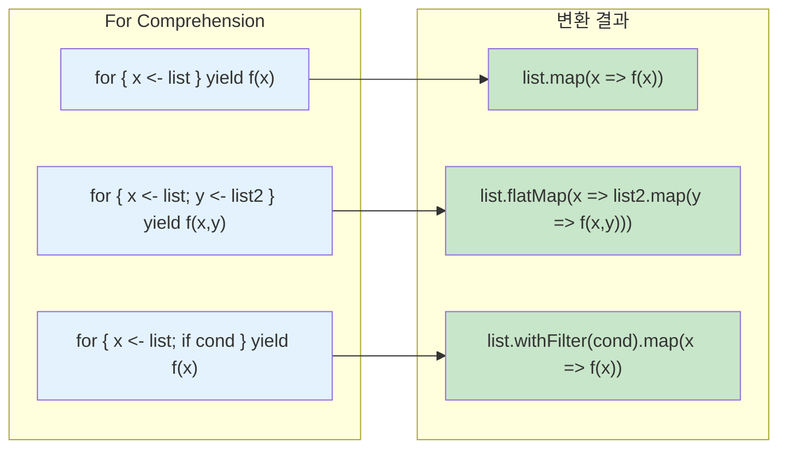

For Comprehension은 `flatMap`, `map`, `withFilter`를 우아하게 표현하는 문법적 설탕(syntactic sugar)입니다.

## 기본 문법

### 변환 규칙 시각화



```scala
// 기본 형태
for {
  x <- collection
} yield expression

// 여러 생성자
for {
  x <- collection1
  y <- collection2
} yield (x, y)
```

## map/flatMap으로 변환

### 단일 생성자 → map

```scala
// for comprehension
for (x <- List(1, 2, 3)) yield x * 2

// 변환됨
List(1, 2, 3).map(x => x * 2)

// 결과: List(2, 4, 6)
```

### 여러 생성자 → flatMap + map

```scala
// for comprehension
for {
  x <- List(1, 2, 3)
  y <- List("a", "b")
} yield (x, y)

// 변환됨
List(1, 2, 3).flatMap { x =>
  List("a", "b").map { y =>
    (x, y)
  }
}

// 결과: List((1,a), (1,b), (2,a), (2,b), (3,a), (3,b))
```

### 가드 → withFilter

```scala
// for comprehension
for {
  x <- List(1, 2, 3, 4, 5)
  if x % 2 == 0
} yield x * 2

// 변환됨
List(1, 2, 3, 4, 5)
  .withFilter(x => x % 2 == 0)
  .map(x => x * 2)

// 결과: List(4, 8)
```

## 값 정의 (=)

```scala
for {
  x <- List(1, 2, 3)
  doubled = x * 2       // 중간 값 정의
  squared = doubled * doubled
} yield squared

// 변환됨
List(1, 2, 3).map { x =>
  val doubled = x * 2
  val squared = doubled * doubled
  squared
}

// 결과: List(4, 16, 36)
```

## Option과 함께

Option은 for comprehension과 자주 사용됩니다.

```scala
case class User(name: String)
case class Address(city: String)

def findUser(id: Int): Option[User] =
  if (id > 0) Some(User(s"User$id")) else None

def findAddress(user: User): Option[Address] =
  if (user.name.nonEmpty) Some(Address("서울")) else None

// None이 하나라도 있으면 전체가 None
val result = for {
  user <- findUser(1)
  address <- findAddress(user)
} yield s"${user.name}는 ${address.city}에 산다"

result  // Some("User1는 서울에 산다")

// 실패 케이스
val failed = for {
  user <- findUser(-1)    // None
  address <- findAddress(user)
} yield s"${user.name}는 ${address.city}에 산다"

failed  // None
```

## Either와 함께

```scala
def parseInt(s: String): Either[String, Int] =
  s.toIntOption.toRight(s"'$s'는 숫자가 아님")

def divide(a: Int, b: Int): Either[String, Int] =
  if (b == 0) Left("0으로 나눌 수 없음")
  else Right(a / b)

// 모든 연산이 Right면 계속, Left가 나오면 중단
val result = for {
  a <- parseInt("10")
  b <- parseInt("2")
  c <- divide(a, b)
} yield c

result  // Right(5)

val failed = for {
  a <- parseInt("10")
  b <- parseInt("zero")  // Left
  c <- divide(a, b)
} yield c

failed  // Left("'zero'는 숫자가 아님")
```

## Future와 함께

비동기 연산을 순차적으로 조합합니다.

```scala
import scala.concurrent.{Future, ExecutionContext}
import scala.concurrent.ExecutionContext.Implicits.global

def fetchUser(id: Int): Future[String] =
  Future(s"User$id")

def fetchOrders(user: String): Future[List[String]] =
  Future(List(s"Order1 for $user", s"Order2 for $user"))

// 순차 실행
val result = for {
  user <- fetchUser(1)
  orders <- fetchOrders(user)
} yield (user, orders)

// result: Future((User1, List(Order1 for User1, Order2 for User1)))
```

## List 조합

```scala
// 데카르트 곱
val pairs = for {
  x <- List(1, 2, 3)
  y <- List("a", "b")
} yield (x, y)
// List((1,a), (1,b), (2,a), (2,b), (3,a), (3,b))

// 필터링 포함
val evenPairs = for {
  x <- List(1, 2, 3, 4)
  if x % 2 == 0
  y <- List("a", "b")
} yield (x, y)
// List((2,a), (2,b), (4,a), (4,b))

// 구구단
val gugudan = for {
  i <- 2 to 9
  j <- 1 to 9
} yield s"$i x $j = ${i * j}"
```

## 부수 효과 (yield 없이)

`yield` 없이 사용하면 부수 효과만 실행합니다.

```scala
// foreach로 변환됨
for (x <- List(1, 2, 3)) {
  println(x)
}

// 등가
List(1, 2, 3).foreach(x => println(x))
```

## 패턴 매칭

```scala
val pairs = List((1, "one"), (2, "two"), (3, "three"))

// 튜플 분해
for ((num, str) <- pairs) {
  println(s"$num = $str")
}

// Option 필터링
val maybes = List(Some(1), None, Some(3), None, Some(5))

for (Some(x) <- maybes) {
  println(x)  // 1, 3, 5
}
```

## Scala 3 문법


{}
```scala
// do 키워드
for x <- List(1, 2, 3) do
  println(x)

// 들여쓰기 기반
for
  x <- List(1, 2, 3)
  y <- List("a", "b")
yield (x, y)
```
{}
{}
```scala
// 중괄호 필수
for (x <- List(1, 2, 3)) {
  println(x)
}

for {
  x <- List(1, 2, 3)
  y <- List("a", "b")
} yield (x, y)
```
{}


## 커스텀 타입에서 사용

`map`, `flatMap`, `withFilter`를 구현하면 for comprehension 사용 가능합니다.

```scala
case class Box[A](value: A) {
  def map[B](f: A => B): Box[B] = Box(f(value))
  def flatMap[B](f: A => Box[B]): Box[B] = f(value)
}

val result = for {
  x <- Box(1)
  y <- Box(2)
} yield x + y

result  // Box(3)
```

## 연습 문제

### 1. 안전한 계산기 ⭐⭐

for comprehension으로 안전한 사칙연산을 구현하세요.

<details>
<summary>정답 보기</summary>

```scala
def safeAdd(a: Int, b: Int): Option[Int] = Some(a + b)
def safeSub(a: Int, b: Int): Option[Int] = Some(a - b)
def safeMul(a: Int, b: Int): Option[Int] = Some(a * b)
def safeDiv(a: Int, b: Int): Option[Int] =
  if (b == 0) None else Some(a / b)

// (10 + 5) * 2 / 3
val result = for {
  sum <- safeAdd(10, 5)
  product <- safeMul(sum, 2)
  quotient <- safeDiv(product, 3)
} yield quotient

result  // Some(10)
```

</details>

### 2. 중첩 Option 평탄화 ⭐

중첩된 Option을 for comprehension으로 처리하세요.

<details>
<summary>정답 보기</summary>

```scala
case class Company(address: Option[Address])
case class Address(street: Option[String])

val company = Company(Some(Address(Some("강남대로 123"))))

val street = for {
  address <- company.address
  street <- address.street
} yield street

street  // Some("강남대로 123")

// 중간에 None이 있으면
val noStreet = Company(Some(Address(None)))
val result = for {
  address <- noStreet.address
  street <- address.street
} yield street

result  // None
```

</details>

## 다음 단계

- [Implicit/Given](../implicits/) — 문맥적 추상화
- [함수형 패턴](../functional-patterns/) — Monad, Functor 심화
