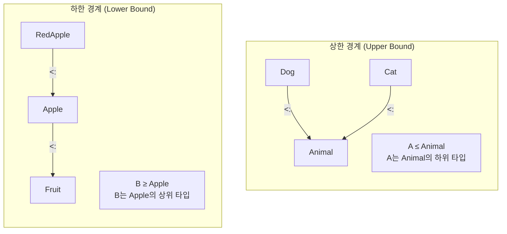

제네릭(Generics)을 사용하면 타입 안전하면서 재사용 가능한 코드를 작성할 수 있습니다. 타입 매개변수를 통해 다양한 타입에서 동작하는 클래스와 메서드를 정의할 수 있으며, 컴파일 시점에 타입 안전성을 보장받을 수 있습니다.

#### 타입 매개변수

타입 매개변수는 클래스, 트레이트, 메서드에서 사용할 수 있습니다. 대괄호 `[]` 안에 타입 변수를 선언하며, 관례적으로 A, B, T 등의 단일 대문자를 사용합니다.

**클래스에서**

클래스에 타입 매개변수를 선언하면 해당 타입으로 일반화된 클래스를 만들 수 있습니다.

```scala
// 단일 타입 매개변수
class Box[A](value: A) {
  def get: A = value
  def map[B](f: A => B): Box[B] = new Box(f(value))
}

val intBox = new Box(42)
val strBox = new Box("hello")

intBox.get        // 42
strBox.get        // "hello"
intBox.map(_ * 2) // Box(84)
```

여러 타입 매개변수를 동시에 사용할 수도 있습니다.

```scala
// 여러 타입 매개변수
class Pair[A, B](val first: A, val second: B) {
  def swap: Pair[B, A] = new Pair(second, first)
}

val pair = new Pair(1, "one")
pair.first   // 1
pair.second  // "one"
pair.swap    // Pair("one", 1)
```

**메서드에서**

메서드에도 독립적인 타입 매개변수를 선언할 수 있습니다. 메서드 호출 시 컴파일러가 인자 타입에서 타입을 추론합니다.

```scala
def identity[A](x: A): A = x

identity(42)      // 42
identity("hello") // "hello"

def swap[A, B](pair: (A, B)): (B, A) = (pair._2, pair._1)

swap((1, "one"))  // ("one", 1)
```

**트레이트에서**

트레이트도 타입 매개변수를 가질 수 있으며, 이를 구현하는 클래스에서 구체적인 타입을 지정합니다.

```scala
trait Container[A] {
  def get: A
  def map[B](f: A => B): Container[B]
}

class Box[A](value: A) extends Container[A] {
  def get: A = value
  def map[B](f: A => B): Container[B] = new Box(f(value))
}
```

#### 타입 경계 (Type Bounds)

타입 경계는 타입 매개변수가 가질 수 있는 타입의 범위를 제한합니다. 상한 경계와 하한 경계를 통해 타입 계층 구조에서 허용되는 범위를 지정할 수 있습니다.

**타입 경계 시각화**

아래 다이어그램은 상한 경계와 하한 경계의 개념을 시각화한 것입니다.



**상한 경계 (Upper Bound)**

상한 경계는 타입 매개변수가 특정 타입의 하위 타입이어야 함을 지정합니다.

`A <: B`는 A가 B의 하위 타입이어야 함을 의미합니다.

```scala
trait Animal {
  def name: String
}

class Dog(val name: String) extends Animal
class Cat(val name: String) extends Animal

// A는 Animal의 하위 타입이어야 함
def printNames[A <: Animal](animals: List[A]): Unit =
  animals.foreach(a => println(a.name))

printNames(List(Dog("바둑이"), Dog("멍멍이")))
// printNames(List("not an animal"))  // 컴파일 에러
```

**하한 경계 (Lower Bound)**

하한 경계는 타입 매개변수가 특정 타입의 상위 타입이어야 함을 지정합니다. 공변 타입에서 메서드 매개변수를 다룰 때 자주 사용됩니다.

`A >: B`는 A가 B의 상위 타입이어야 함을 의미합니다.

```scala
class Fruit
class Apple extends Fruit
class RedApple extends Apple

// B는 Apple의 상위 타입이어야 함
def addFruit[B >: Apple](fruits: List[B], fruit: B): List[B] =
  fruit :: fruits

val fruits: List[Fruit] = List(new Apple)
addFruit(fruits, new Fruit)     // OK - Fruit >: Apple
addFruit(fruits, new Apple)     // OK - Apple >: Apple (같은 타입)
addFruit(fruits, new RedApple)  // OK - RedApple은 Apple의 서브타입이므로 Apple로 업캐스트됨
```

> 💡 **하한 경계의 핵심:** `B >: Apple`은 "B는 Apple이거나 Apple의 상위 타입"을 의미합니다. 서브타입(RedApple)도 Apple로 업캐스트되어 사용 가능합니다.

**컨텍스트 경계 (Context Bound)**

컨텍스트 경계는 특정 타입 클래스의 인스턴스가 암시적으로 존재해야 함을 선언합니다. `A : Ordering` 형태로 작성하며, 이는 `Ordering[A]` 타입의 암시적 값이 스코프에 있어야 함을 의미합니다.

`A : Ordering`는 `Ordering[A]`의 암시적 인스턴스가 필요함을 의미합니다.

```scala
// 컨텍스트 경계
def max[A: Ordering](a: A, b: A): A = {
  val ord = implicitly[Ordering[A]]
  if (ord.gt(a, b)) a else b
}

max(1, 2)        // 2
max("a", "b")    // "b"

// 위와 동등한 표현
def max2[A](a: A, b: A)(implicit ord: Ordering[A]): A =
  if (ord.gt(a, b)) a else b
```

#### 타입 추론

Scala 컴파일러는 대부분의 경우 타입 매개변수를 자동으로 추론합니다. 명시적 타입 지정이 필요한 경우는 빈 컬렉션 생성이나 None과 같이 추론할 정보가 부족할 때입니다.

```scala
// 타입이 추론됨
val list = List(1, 2, 3)           // List[Int]
val map = Map("a" -> 1, "b" -> 2)  // Map[String, Int]

// 명시적 타입 필요한 경우
val empty = List.empty[Int]        // List[Int]
val none: Option[Int] = None       // Option[Int]
```

#### 공통 제네릭 타입

Scala 표준 라이브러리에는 널리 사용되는 제네릭 타입들이 있습니다. Option, Either, Try는 실패 가능한 연산을 타입 안전하게 표현하는 대표적인 타입들입니다.

**Option[A]**

Option은 값이 있거나 없을 수 있는 경우를 표현합니다. null 대신 사용하여 NullPointerException을 방지합니다.

```scala
val some: Option[Int] = Some(42)
val none: Option[Int] = None

some.map(_ * 2)        // Some(84)
none.map(_ * 2)        // None
some.getOrElse(0)      // 42
none.getOrElse(0)      // 0
```

**Either[A, B]**

Either는 두 가지 가능한 타입 중 하나의 값을 가집니다. 관례상 Left는 실패(에러 정보), Right는 성공 값을 담습니다.

```scala
val right: Either[String, Int] = Right(42)
val left: Either[String, Int] = Left("error")

right.map(_ * 2)       // Right(84)
left.map(_ * 2)        // Left("error")

// 패턴 매칭
right match {
  case Right(value) => s"값: $value"
  case Left(error)  => s"오류: $error"
}
```

**Try[A]**

Try는 예외가 발생할 수 있는 연산을 캡슐화합니다. Success 또는 Failure로 결과를 표현하며, 예외를 던지는 대신 값으로 다룹니다.

```scala
import scala.util.{Try, Success, Failure}

val success: Try[Int] = Try("42".toInt)
val failure: Try[Int] = Try("abc".toInt)

success.map(_ * 2)     // Success(84)
failure.map(_ * 2)     // Failure(NumberFormatException)

success.getOrElse(0)   // 42
failure.getOrElse(0)   // 0
```

#### 제네릭 ADT

제네릭을 사용하여 대수적 데이터 타입(ADT)을 정의할 수 있습니다. 타입 매개변수를 통해 다양한 결과 타입을 표현하는 범용적인 구조를 만들 수 있습니다.

```scala
// 제네릭 결과 타입
sealed trait Result[+E, +A]
case class Success[A](value: A) extends Result[Nothing, A]
case class Error[E](error: E) extends Result[E, Nothing]

def divide(a: Int, b: Int): Result[String, Int] =
  if (b == 0) Error("0으로 나눌 수 없음")
  else Success(a / b)

divide(10, 2) match {
  case Success(v) => println(s"결과: $v")
  case Error(e)   => println(s"오류: $e")
}
```

#### Java 제네릭과의 비교

Scala와 Java의 제네릭 문법은 유사하지만 몇 가지 차이점이 있습니다. 아래 표는 주요 차이점을 정리한 것입니다.

| 특성 | Scala | Java |
|------|-------|------|
| 문법 | `[A]` | `<A>` |
| 상한 경계 | `A <: B` | `A extends B` |
| 하한 경계 | `A >: B` | `A super B` |
| 와일드카드 | `_` | `?` |
| 변성 | 선언 시점 | 사용 시점 |

```scala
// Scala
class Box[A](val value: A)
def process[A <: Comparable[A]](a: A): Unit = ???

// Java 등가
// class Box<A> { ... }
// void process<A extends Comparable<A>>(A a) { ... }
```

#### 연습 문제

다음 연습 문제들을 통해 제네릭 개념을 복습해보세요.

**1. 제네릭 Stack 구현 ⭐⭐⭐**

불변 Stack을 제네릭으로 구현하세요.

<details>
<summary>정답 보기</summary>

```scala
sealed trait Stack[+A] {
  def push[B >: A](elem: B): Stack[B]
  def pop: (A, Stack[A])
  def isEmpty: Boolean
}

case object EmptyStack extends Stack[Nothing] {
  def push[B](elem: B): Stack[B] = NonEmptyStack(elem, this)
  def pop: Nothing = throw new NoSuchElementException("Empty stack")
  def isEmpty: Boolean = true
}

case class NonEmptyStack[+A](top: A, rest: Stack[A]) extends Stack[A] {
  def push[B >: A](elem: B): Stack[B] = NonEmptyStack(elem, this)
  def pop: (A, Stack[A]) = (top, rest)
  def isEmpty: Boolean = false
}

val stack = EmptyStack.push(1).push(2).push(3)
val (top, rest) = stack.pop  // (3, Stack(2, 1))
```

</details>

**2. 제네릭 find 함수 ⭐⭐**

리스트에서 조건에 맞는 첫 번째 요소를 찾는 제네릭 함수를 구현하세요.

<details>
<summary>정답 보기</summary>

```scala
def find[A](list: List[A])(predicate: A => Boolean): Option[A] =
  list match {
    case Nil                        => None
    case head :: _ if predicate(head) => Some(head)
    case _ :: tail                  => find(tail)(predicate)
  }

find(List(1, 2, 3, 4, 5))(_ > 3)  // Some(4)
find(List("a", "bb", "ccc"))(_.length > 2)  // Some("ccc")
```

</details>

#### 다음 단계

- [공변성/반공변성](../variance/) — 제네릭 타입의 변성
- [타입 클래스](../type-classes/) — Ad-hoc 다형성
