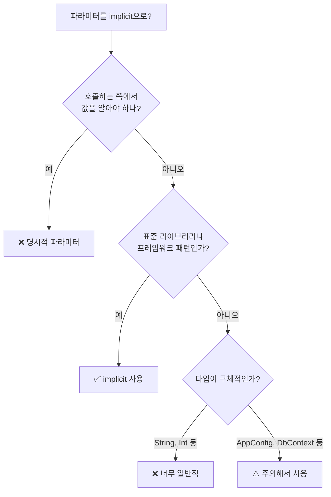

암시적 기능은 Scala의 강력한 기능 중 하나입니다. 컴파일러가 자동으로 값을 전달하거나 타입을 변환하여 보일러플레이트 코드를 줄이고 표현력을 높입니다. Scala 2의 `implicit`과 Scala 3의 `given`/`using`을 모두 다룹니다.

#### 왜 Implicit이 필요한가?

암시적 기능이 해결하는 세 가지 주요 문제를 살펴봅니다.

**문제 1: 보일러플레이트 파라미터**

Java 스타일로 컨텍스트를 전달하면 모든 메서드에 반복적으로 매개변수가 필요합니다:

```java
// Java: ExecutionContext를 매번 전달
public class OrderService {
    public CompletableFuture<Order> createOrder(OrderRequest req, ExecutionContext ec) {
        return validateOrder(req, ec)
            .thenCompose(valid -> saveOrder(valid, ec))
            .thenCompose(saved -> notifyUser(saved, ec));
    }

    private CompletableFuture<Order> validateOrder(OrderRequest req, ExecutionContext ec) { ... }
    private CompletableFuture<Order> saveOrder(Order order, ExecutionContext ec) { ... }
    private CompletableFuture<Void> notifyUser(Order order, ExecutionContext ec) { ... }
}
```

**Scala의 해결책:** `implicit`/`using`으로 컨텍스트를 자동 전달합니다:

```scala
// Scala: ExecutionContext를 암시적으로 전달
class OrderService(using ec: ExecutionContext):
  def createOrder(req: OrderRequest): Future[Order] =
    validateOrder(req)
      .flatMap(saveOrder)
      .flatMap(notifyUser)

  private def validateOrder(req: OrderRequest): Future[Order] = ...
  private def saveOrder(order: Order): Future[Order] = ...
  private def notifyUser(order: Order): Future[Unit] = ...

// 사용 시 한 번만 제공
given ExecutionContext = ExecutionContext.global
val service = OrderService()
service.createOrder(request)  // ec 자동 주입
```

**문제 2: 외부 라이브러리 타입 확장 불가**

Java에서는 `String`에 메서드를 추가하려면 래퍼 클래스가 필요합니다:

```java
// Java: String에 toSlug 메서드를 추가하고 싶다면
public class StringUtils {
    public static String toSlug(String s) {
        return s.toLowerCase().replaceAll(" ", "-");
    }
}
// 사용: StringUtils.toSlug(title) — 어색함

// 또는 래퍼 클래스
public class RichString {
    private final String value;
    public RichString(String value) { this.value = value; }
    public String toSlug() { return value.toLowerCase().replaceAll(" ", "-"); }
}
// 사용: new RichString(title).toSlug() — 더 어색함
```

**Scala의 해결책:** Extension 메서드로 기존 타입을 확장합니다:

```scala
// Scala 3: String에 직접 메서드 추가
extension (s: String)
  def toSlug: String = s.toLowerCase.replace(" ", "-")
  def words: List[String] = s.split("\\s+").toList

// 사용: 마치 String의 원래 메서드인 것처럼
"Hello World".toSlug   // "hello-world"
"Hello World".words    // List("Hello", "World")
```

**문제 3: 타입별 동작 구현의 어려움**

Java에서 다양한 타입을 같은 방식으로 처리하려면 복잡한 조건문이 필요합니다:

```java
// Java: 타입별로 다른 직렬화 로직
public class JsonSerializer {
    public String toJson(Object obj) {
        if (obj instanceof String) {
            return "\"" + obj + "\"";
        } else if (obj instanceof Integer) {
            return obj.toString();
        } else if (obj instanceof List) {
            List<?> list = (List<?>) obj;
            return list.stream()
                .map(this::toJson)
                .collect(Collectors.joining(",", "[", "]"));
        }
        throw new IllegalArgumentException("Unsupported type");
    }
}
// 문제: 새 타입 추가 시 이 메서드를 수정해야 함 (Open-Closed 원칙 위반)
```

**Scala의 해결책:** 타입 클래스로 확장 가능하게 설계합니다:

```scala
// Scala: 타입 클래스 패턴
trait JsonEncoder[A]:
  def encode(a: A): String

given JsonEncoder[String] with
  def encode(a: String): String = s"\"$a\""

given JsonEncoder[Int] with
  def encode(a: Int): String = a.toString

given [A](using enc: JsonEncoder[A]): JsonEncoder[List[A]] with
  def encode(list: List[A]): String =
    list.map(enc.encode).mkString("[", ",", "]")

def toJson[A](a: A)(using enc: JsonEncoder[A]): String = enc.encode(a)

// 새 타입 추가 - 기존 코드 수정 없이 확장
case class User(name: String, age: Int)
given JsonEncoder[User] with
  def encode(u: User): String = s"""{"name":"${u.name}","age":${u.age}}"""

toJson(List("a", "b"))  // ["a","b"]
toJson(User("Kim", 30)) // {"name":"Kim","age":30}
```

#### Implicit/Given 사용 가이드

암시적 기능은 강력하지만 잘못 사용하면 코드 가독성을 해칠 수 있습니다. 언제 사용하고 피해야 하는지 알아봅니다.

**언제 사용해야 하는가?**

아래 표는 상황별 암시적 사용의 적합성을 정리한 것입니다.

| 상황 | 적합성 | 이유 |
|------|--------|------|
| `ExecutionContext` 전달 | ✅ 적합 | 표준 패턴, 명확한 컨텍스트 |
| 타입 클래스 인스턴스 (`Ordering`, `Show` 등) | ✅ 적합 | 컴파일 타임 안전성 |
| JSON/DB 코덱 | ✅ 적합 | 라이브러리 표준 패턴 |
| 로거, 설정 객체 | ⚠️ 주의 | 명시적 DI가 더 나을 수 있음 |
| 비즈니스 로직 파라미터 | ❌ 부적합 | 가독성 저하, 디버깅 어려움 |
| 기본값/폴백 값 | ❌ 부적합 | 예상치 못한 동작 유발 |

**사용 결정 플로우차트**

암시적 사용 여부를 결정하는 데 도움이 되는 플로우차트입니다.



**피해야 할 안티패턴**

```scala
// ❌ 안티패턴 1: 너무 일반적인 타입
given String = "default"  // 모든 String 파라미터에 주입됨!
given Int = 0             // 위험!

// ✅ 올바른 방법: 래퍼 타입 사용
case class ApiKey(value: String)
given ApiKey = ApiKey("default-key")

// ❌ 안티패턴 2: 비즈니스 로직 숨기기
def processOrder(orderId: String)(using discount: Double): Order = ...
// 할인율이 어디서 오는지 추적 어려움

// ✅ 올바른 방법: 명시적 파라미터
def processOrder(orderId: String, discount: Double): Order = ...

// ❌ 안티패턴 3: 암시적 변환 남용
given Conversion[String, Int] = _.toInt
val x: Int = "123"  // 컴파일되지만 위험

// ✅ 올바른 방법: 명시적 변환 또는 extension
extension (s: String)
  def toIntSafe: Option[Int] = s.toIntOption
```

#### Scala 2: Implicit

Scala 2에서는 implicit 키워드 하나로 여러 기능을 표현했습니다.

**Implicit 값**

암시적 값을 정의하고 사용하는 기본 방법입니다.

```scala
// 암시적 값 정의
implicit val defaultName: String = "Guest"

// 암시적 매개변수 사용
def greet(implicit name: String): String = s"Hello, $name!"

greet              // "Hello, Guest!" (암시적으로 전달)
greet("Alice")     // "Hello, Alice!" (명시적 전달)
```

**Implicit 매개변수**

클래스나 설정 객체를 암시적으로 전달하는 패턴입니다.

```scala
case class Config(url: String, timeout: Int)

implicit val defaultConfig: Config = Config("localhost", 5000)

def connect(implicit config: Config): Unit =
  println(s"Connecting to ${config.url} with timeout ${config.timeout}")

connect  // 암시적 Config 사용
```

**Implicit 변환**

타입 간 자동 변환을 정의합니다. 강력하지만 남용 시 코드 이해가 어려워지므로 주의해서 사용해야 합니다.

```scala
// Int에서 String으로 암시적 변환
implicit def intToString(i: Int): String = i.toString

val s: String = 42  // 자동으로 "42"로 변환

// 위험할 수 있으므로 주의해서 사용!
```

**Implicit 클래스 (확장 메서드)**

기존 타입에 새 메서드를 추가하는 패턴입니다.

```scala
implicit class RichString(s: String) {
  def exclaim: String = s + "!"
  def words: List[String] = s.split(" ").toList
}

"Hello".exclaim          // "Hello!"
"Hello World".words      // List("Hello", "World")
```

#### Scala 3: Given / Using

Scala 3에서는 `implicit`이 더 명확한 키워드들로 분리되었습니다. given은 값을 제공하고, using은 값을 요청하며, extension은 메서드를 추가합니다.

**Given 인스턴스**

given으로 암시적 인스턴스를 정의합니다.


{}
```scala
// given으로 인스턴스 정의
given defaultName: String = "Guest"

// using으로 사용
def greet(using name: String): String = s"Hello, $name!"

greet              // "Hello, Guest!"
greet(using "Alice") // "Hello, Alice!"
```
{}
{}
```scala
implicit val defaultName: String = "Guest"

def greet(implicit name: String): String = s"Hello, $name!"

greet              // "Hello, Guest!"
greet("Alice")     // "Hello, Alice!"
```
{}


**익명 Given**

이름 없이 given을 정의할 수도 있습니다.

```scala
// 이름 없는 given
given String = "Guest"

// 타입만으로 참조
summon[String]  // "Guest"
```

**Using 절**

using 절로 암시적 매개변수를 선언합니다.

```scala
case class Config(url: String, timeout: Int)

given Config = Config("localhost", 5000)

def connect(using config: Config): Unit =
  println(s"Connecting to ${config.url}")

connect  // Config를 암시적으로 사용
```

**Extension 메서드 (Scala 3)**

extension 키워드로 기존 타입에 메서드를 추가합니다.


{}
```scala
extension (s: String)
  def exclaim: String = s + "!"
  def words: List[String] = s.split(" ").toList
  def repeatN(n: Int): String = s * n

"Hello".exclaim      // "Hello!"
"Hello".repeatN(3)   // "HelloHelloHello"
```
{}
{}
```scala
implicit class StringOps(s: String) {
  def exclaim: String = s + "!"
  def words: List[String] = s.split(" ").toList
  def repeatN(n: Int): String = s * n
}

"Hello".exclaim      // "Hello!"
"Hello".repeatN(3)   // "HelloHelloHello"
```
{}


#### 타입 클래스 패턴

타입 클래스는 암시적 기능의 가장 중요한 활용 사례입니다. 기존 타입에 새로운 기능을 추가하면서도 타입 안전성을 유지합니다.

**정의**


{}
```scala
// 타입 클래스 정의
trait Show[A]:
  def show(a: A): String

// 인스턴스 정의
given Show[Int] with
  def show(a: Int): String = a.toString

given Show[String] with
  def show(a: String): String = s"\"$a\""

// 사용
def print[A](a: A)(using s: Show[A]): Unit =
  println(s.show(a))

print(42)       // "42"
print("hello")  // "\"hello\""
```
{}
{}
```scala
// 타입 클래스 정의
trait Show[A] {
  def show(a: A): String
}

// 인스턴스 정의
implicit val intShow: Show[Int] = new Show[Int] {
  def show(a: Int): String = a.toString
}

implicit val stringShow: Show[String] = new Show[String] {
  def show(a: String): String = s"\"$a\""
}

// 사용
def print[A](a: A)(implicit s: Show[A]): Unit =
  println(s.show(a))

print(42)       // "42"
print("hello")  // "\"hello\""
```
{}


**컨텍스트 경계**

컨텍스트 경계는 타입 클래스 인스턴스를 요구하는 간결한 문법입니다.

```scala
// 컨텍스트 경계 문법
def print[A: Show](a: A): Unit = {
  val s = summon[Show[A]]  // Scala 3
  // val s = implicitly[Show[A]]  // Scala 2
  println(s.show(a))
}
```

#### 암시적 범위 (Implicit Scope)

암시적 값은 다음 순서로 검색됩니다:

1. **현재 범위** - 지역 변수, import된 암시적
2. **연관 타입의 컴패니언 객체** - 타입 매개변수, 부모 타입 등

```scala
case class User(name: String)

object User {
  // 컴패니언 객체에 암시적 정의
  implicit val ordering: Ordering[User] =
    Ordering.by(_.name)
}

// 자동으로 User.ordering을 찾음
List(User("Bob"), User("Alice")).sorted
// List(User("Alice"), User("Bob"))
```

#### Given Import (Scala 3)

Scala 3에서는 given을 명시적으로 import해야 합니다.

```scala
object Givens:
  given Int = 42
  given String = "hello"
  val normalValue = 100

// 특정 타입의 given만 import (중괄호 사용)
import Givens.{given Int}

// 모든 given import
import Givens.given

// 일반 멤버와 given 모두 import
import Givens.*       // normalValue만 import
import Givens.given   // given Int, given String만 import

// 둘 다 필요하면
import Givens.{*, given}
```

> 💡 **Scala 2와 차이점:** Scala 2에서는 `import Givens._`로 implicit도 함께 import되었지만, Scala 3에서는 `given`을 명시적으로 import해야 합니다.

#### 마이그레이션 가이드

Scala 2에서 Scala 3로 마이그레이션할 때 참고할 키워드 대응표입니다.

| Scala 2 | Scala 3 |
|---------|---------|
| `implicit val x: T = ...` | `given x: T = ...` |
| `implicit def f: T = ...` | `given f: T = ...` |
| `def f(implicit x: T)` | `def f(using x: T)` |
| `implicitly[T]` | `summon[T]` |
| `implicit class` | `extension` |

**점진적 마이그레이션**

Scala 3에서도 `implicit`을 사용할 수 있습니다:

```scala
// Scala 3에서도 동작
implicit val x: Int = 42
def f(implicit n: Int): Int = n * 2
```

#### 모범 사례

**DO**

```scala
// 타입 클래스에 사용
given Ordering[MyClass] = ???

// 설정/컨텍스트 전달
def process(data: Data)(using config: Config): Result = ???

// 확장 메서드
extension (s: String)
  def toSlug: String = s.toLowerCase.replace(" ", "-")
```

**DON'T**

```scala
// 무분별한 암시적 변환 (피하세요)
given Conversion[Int, String] = _.toString

// 너무 일반적인 타입의 암시적 (피하세요)
given String = "default"  // 어디서나 String이 필요하면 사용됨
```

#### 흔한 실수와 Anti-patterns

**❌ 피해야 할 것**

```scala
// 1. 너무 일반적인 타입의 암시적 정의
implicit val defaultString: String = "hello"
// 모든 곳에서 String이 필요하면 이 값이 주입됨!

// 2. 무분별한 암시적 변환
implicit def stringToInt(s: String): Int = s.toInt
val x: Int = "123"  // 암시적으로 변환됨 - 위험!
val y: Int = "abc"  // NumberFormatException!

// 3. 암시적 범위 충돌
import library1._
import library2._  // 둘 다 같은 타입의 implicit 정의
// "ambiguous implicit values" 에러!

// 4. 복잡한 암시적 체인
// A → B → C → D 변환이 필요하면 컴파일 시간이 급격히 증가
```

**✅ 올바른 방법**

```scala
// 1. 구체적인 래퍼 타입 사용
case class AppConfig(dbUrl: String, timeout: Int)
given AppConfig = AppConfig("localhost", 5000)

// 2. 암시적 변환 대신 extension 메서드
extension (s: String)
  def toIntSafe: Option[Int] = s.toIntOption

"123".toIntSafe  // Some(123)
"abc".toIntSafe  // None

// 3. 명시적 import로 충돌 해결
import library1.{given OrderingInstance}  // 특정 given만 import

// 4. 단순한 타입 클래스 계층 유지
trait Show[A]:
  def show(a: A): String

// 파생 인스턴스는 한 단계로 제한
given [A: Show]: Show[List[A]] = ...
```

**디버깅 팁**

어떤 암시적 값이 선택되었는지 확인하는 방법입니다.

```scala
// 어떤 implicit이 선택되었는지 확인
// scalac: -Xprint:typer
// sbt: set scalacOptions += "-Xprint:typer"

// Scala 3에서 summon 사용
val ord = summon[Ordering[Int]]
println(ord)  // scala.math.Ordering$Int$@...
```

#### 연습 문제

다음 연습 문제들을 통해 암시적 기능을 복습해보세요.

**1. Printable 타입 클래스**

`Printable` 타입 클래스를 정의하고 `Int`, `String`, `List[A]`에 대한 인스턴스를 구현하세요.

<details>
<summary>정답 보기</summary>

```scala
// Scala 3
trait Printable[A]:
  def format(a: A): String

given Printable[Int] with
  def format(a: Int): String = a.toString

given Printable[String] with
  def format(a: String): String = s"\"$a\""

given [A](using p: Printable[A]): Printable[List[A]] with
  def format(list: List[A]): String =
    list.map(p.format).mkString("[", ", ", "]")

def print[A](a: A)(using p: Printable[A]): Unit =
  println(p.format(a))

print(42)                    // 42
print("hello")               // "hello"
print(List(1, 2, 3))         // [1, 2, 3]
print(List("a", "b", "c"))   // ["a", "b", "c"]
```

</details>

**2. Extension 메서드 구현**

`Int`에 `times` 메서드를 추가하세요: `3.times { println("Hello") }`

<details>
<summary>정답 보기</summary>

```scala
extension (n: Int)
  def times(action: => Unit): Unit =
    for _ <- 1 to n do action

3.times {
  println("Hello")
}
// Hello
// Hello
// Hello
```

</details>

#### 다음 단계

- [타입 클래스](../type-classes/) — 타입 클래스 패턴 심화
- [함수형 패턴](../functional-patterns/) — Functor, Monad
