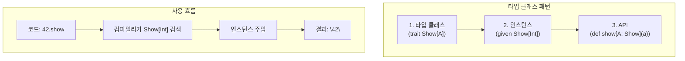

타입 클래스(Type Class)는 기존 타입에 새로운 기능을 추가하는 패턴입니다. 상속 없이 다형성을 구현할 수 있습니다.

## 왜 타입 클래스가 필요한가?

### 상속의 한계

Java/Scala의 일반 상속으로는 해결하기 어려운 문제가 있습니다:

```scala
// 문제: Int, String 등 기존 타입에 새 메서드를 추가하고 싶다면?
// → Int를 상속받을 수 없음!

// 문제: 외부 라이브러리의 클래스에 기능을 추가하고 싶다면?
// → 소스 코드를 수정할 수 없음!

// 문제: 같은 타입에 대해 상황에 따라 다른 동작이 필요하다면?
// → Person을 이름순, 나이순 등 여러 방식으로 정렬하고 싶음
```

### 타입 클래스의 해결책

```scala
// 1. 기존 타입(Int)에 새 기능 추가 가능
given Show[Int] with
  def show(i: Int): String = i.toString

// 2. 외부 라이브러리 타입에도 적용 가능
given Show[java.time.LocalDate] with
  def show(d: java.time.LocalDate): String = d.toString

// 3. 같은 타입에 여러 인스턴스 정의 가능
val byName: Ordering[Person] = Ordering.by(_.name)
val byAge: Ordering[Person] = Ordering.by(_.age)
people.sorted(using byAge)  // 상황에 맞게 선택!
```

## 타입 클래스란?

### 타입 클래스 구조



타입 클래스는 세 부분으로 구성됩니다:

1. **타입 클래스 자체** - 트레이트로 정의된 인터페이스
2. **타입 클래스 인스턴스** - 특정 타입에 대한 구현
3. **인터페이스 메서드** - 타입 클래스를 사용하는 API

## 기본 예제: Show

값을 문자열로 변환하는 `Show` 타입 클래스:

### 정의


{}
```scala
// 1. 타입 클래스 정의
trait Show[A]:
  def show(a: A): String

// 2. 인스턴스 정의
object Show:
  given Show[Int] with
    def show(a: Int): String = a.toString

  given Show[String] with
    def show(a: String): String = s"\"$a\""

  given Show[Boolean] with
    def show(a: Boolean): String = if a then "yes" else "no"

// 3. 인터페이스 메서드
def show[A](a: A)(using s: Show[A]): String = s.show(a)

// extension 메서드로 더 자연스럽게
extension [A](a: A)(using s: Show[A])
  def show: String = s.show(a)
```
{}
{}
```scala
// 1. 타입 클래스 정의
trait Show[A] {
  def show(a: A): String
}

// 2. 인스턴스 정의
object Show {
  implicit val intShow: Show[Int] = new Show[Int] {
    def show(a: Int): String = a.toString
  }

  implicit val stringShow: Show[String] = new Show[String] {
    def show(a: String): String = s""""$a""""
  }

  implicit val boolShow: Show[Boolean] = new Show[Boolean] {
    def show(a: Boolean): String = if (a) "yes" else "no"
  }
}

// 3. 인터페이스 메서드
def show[A](a: A)(implicit s: Show[A]): String = s.show(a)

// implicit class로 extension
implicit class ShowOps[A](a: A)(implicit s: Show[A]) {
  def show: String = s.show(a)
}
```
{}


### 사용

```scala
import Show.given  // Scala 3
// import Show._   // Scala 2

show(42)           // "42"
show("hello")      // "\"hello\""
show(true)         // "yes"

// extension 메서드
42.show            // "42"
"hello".show       // "\"hello\""
```

## 파생 인스턴스

기존 인스턴스로부터 새 인스턴스를 유도합니다.

```scala
// List[A]의 Show 인스턴스 (A의 Show가 있으면)
given [A](using s: Show[A]): Show[List[A]] with
  def show(list: List[A]): String =
    list.map(s.show).mkString("[", ", ", "]")

// Option[A]의 Show 인스턴스
given [A](using s: Show[A]): Show[Option[A]] with
  def show(opt: Option[A]): String = opt match
    case Some(a) => s"Some(${s.show(a)})"
    case None    => "None"

// 사용
List(1, 2, 3).show        // "[1, 2, 3]"
Some("hello").show        // "Some(\"hello\")"
List(Some(1), None).show  // "[Some(1), None]"
```

## Eq 타입 클래스

동등성 비교를 위한 타입 클래스:

```scala
trait Eq[A]:
  def eqv(a: A, b: A): Boolean
  def neqv(a: A, b: A): Boolean = !eqv(a, b)

object Eq:
  given Eq[Int] with
    def eqv(a: Int, b: Int): Boolean = a == b

  given Eq[String] with
    def eqv(a: String, b: String): Boolean = a == b

extension [A](a: A)(using eq: Eq[A])
  def ===(b: A): Boolean = eq.eqv(a, b)
  def =!=(b: A): Boolean = eq.neqv(a, b)

// 사용
1 === 1      // true
1 === 2      // false
"a" === "a"  // true

// 타입 안전: 다른 타입 비교 불가
// 1 === "1"  // 컴파일 에러!
```

## Ordering 타입 클래스

정렬을 위한 표준 라이브러리 타입 클래스:

```scala
case class Person(name: String, age: Int)

// Person에 대한 Ordering 인스턴스
given Ordering[Person] = Ordering.by(_.age)

val people = List(
  Person("Alice", 30),
  Person("Bob", 25),
  Person("Carol", 35)
)

people.sorted
// List(Person(Bob,25), Person(Alice,30), Person(Carol,35))

// 다른 기준으로 정렬
people.sorted(using Ordering.by(_.name))
// List(Person(Alice,30), Person(Bob,25), Person(Carol,35))
```

## Monoid 타입 클래스

결합 연산과 항등원을 정의합니다:

```scala
trait Monoid[A]:
  def empty: A
  def combine(a: A, b: A): A

object Monoid:
  given Monoid[Int] with
    def empty: Int = 0
    def combine(a: Int, b: Int): Int = a + b

  given Monoid[String] with
    def empty: String = ""
    def combine(a: String, b: String): String = a + b

  given [A]: Monoid[List[A]] with
    def empty: List[A] = Nil
    def combine(a: List[A], b: List[A]): List[A] = a ++ b

// 제네릭 combineAll 함수
def combineAll[A](list: List[A])(using m: Monoid[A]): A =
  list.foldLeft(m.empty)(m.combine)

combineAll(List(1, 2, 3, 4, 5))            // 15
combineAll(List("a", "b", "c"))            // "abc"
combineAll(List(List(1, 2), List(3, 4)))   // List(1, 2, 3, 4)
```

## 타입 클래스 vs 상속

| 특성 | 타입 클래스 | 상속 |
|------|-----------|------|
| 타입 수정 | 불필요 | 필요 |
| 여러 구현 | 가능 | 불가 |
| 기존 타입 확장 | 가능 | 제한적 |
| 성능 | 약간의 오버헤드 | 직접 호출 |

## 모범 사례

### 컴패니언 객체에 인스턴스 정의

```scala
case class Email(value: String)

object Email:
  // 컴패니언 객체에 인스턴스 정의
  given Show[Email] with
    def show(e: Email): String = e.value

  given Eq[Email] with
    def eqv(a: Email, b: Email): Boolean = a.value == b.value
```

### 인스턴스 우선순위

```scala
trait LowPriorityInstances:
  given [A]: Show[List[A]] with
    def show(list: List[A]): String = list.toString

object Show extends LowPriorityInstances:
  // 더 구체적인 인스턴스가 우선
  given (using s: Show[Int]): Show[List[Int]] with
    def show(list: List[Int]): String =
      list.map(s.show).mkString("[", ", ", "]")
```

## 연습 문제

### 1. JsonEncoder 타입 클래스

JSON 인코딩을 위한 타입 클래스를 구현하세요.

<details>
<summary>정답 보기</summary>

```scala
trait JsonEncoder[A]:
  def encode(a: A): String

object JsonEncoder:
  given JsonEncoder[Int] with
    def encode(a: Int): String = a.toString

  given JsonEncoder[String] with
    def encode(a: String): String = s""""$a""""

  given JsonEncoder[Boolean] with
    def encode(a: Boolean): String = a.toString

  given [A](using e: JsonEncoder[A]): JsonEncoder[List[A]] with
    def encode(list: List[A]): String =
      list.map(e.encode).mkString("[", ",", "]")

  given [A](using e: JsonEncoder[A]): JsonEncoder[Option[A]] with
    def encode(opt: Option[A]): String = opt match
      case Some(a) => e.encode(a)
      case None    => "null"

extension [A](a: A)(using e: JsonEncoder[A])
  def toJson: String = e.encode(a)

// 사용
42.toJson                  // "42"
"hello".toJson             // "\"hello\""
List(1, 2, 3).toJson       // "[1,2,3]"
Some("world").toJson       // "\"world\""
None.toJson                // "null"
```

</details>

## 다음 단계

- [공변성/반공변성](../variance/) — 제네릭 타입의 변성
- [고급 타입](../type-system-advanced/) — Scala 3의 고급 타입 기능
