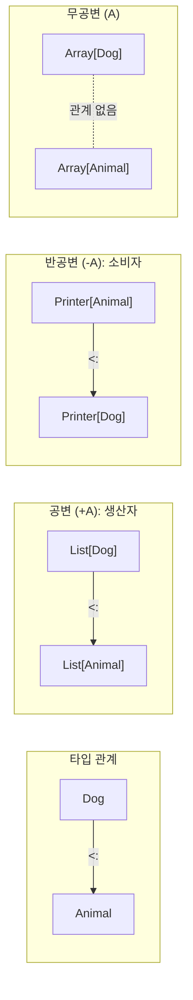
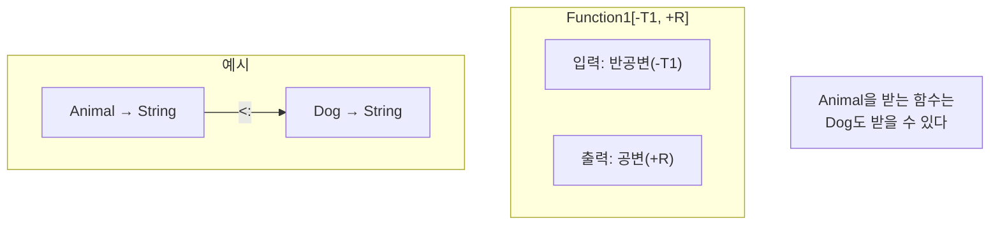

변성(Variance)은 타입 매개변수의 서브타이핑 관계를 정의합니다. 타입 안전한 제네릭 코드를 작성하는 데 핵심적인 개념입니다.

## 기본 개념

`Dog <: Animal` (Dog가 Animal의 서브타입)일 때:

- **공변(Covariant)**: `List[Dog] <: List[Animal]`
- **반공변(Contravariant)**: `Printer[Animal] <: Printer[Dog]`
- **무공변(Invariant)**: 관계 없음



> 💡 **기억법:**
> - **공변(+)**: "같은 방향" - Dog → Animal이면 Box[Dog] → Box[Animal]
> - **반공변(-)**: "반대 방향" - Dog → Animal이면 Handler[Animal] → Handler[Dog]

## 공변성 (+A)

**"생산자"** 위치에서 사용합니다. 값을 반환하는 타입에 적합합니다.

```scala
// +A: 공변
class Box[+A](val value: A)

class Animal
class Dog extends Animal
class Cat extends Animal

val dogBox: Box[Dog] = new Box(new Dog)
val animalBox: Box[Animal] = dogBox  // OK! Dog <: Animal이면 Box[Dog] <: Box[Animal]

// List도 공변
val dogs: List[Dog] = List(new Dog, new Dog)
val animals: List[Animal] = dogs  // OK!
```

### 공변의 제약

공변 타입 매개변수는 메서드 매개변수 위치에 사용할 수 없습니다:

```scala
// 컴파일 에러!
class Box[+A](var value: A)  // var는 setter가 있으므로 불가

// 컴파일 에러!
class Box[+A] {
  def set(a: A): Unit = ???  // 매개변수 위치에서 불가
}
```

### 해결책: 하한 경계

```scala
class Box[+A](val value: A) {
  // B >: A (B는 A의 상위 타입)
  def set[B >: A](b: B): Box[B] = new Box(b)
}

val dogBox: Box[Dog] = new Box(new Dog)
val animalBox: Box[Animal] = dogBox.set(new Cat)  // OK!
```

## 반공변성 (-A)

**"소비자"** 위치에서 사용합니다. 값을 받는 타입에 적합합니다.

```scala
// -A: 반공변
trait Printer[-A] {
  def print(a: A): Unit
}

val animalPrinter: Printer[Animal] = new Printer[Animal] {
  def print(a: Animal): Unit = println(s"Animal: $a")
}

// Animal을 출력할 수 있으면 Dog도 출력 가능
val dogPrinter: Printer[Dog] = animalPrinter  // OK!

dogPrinter.print(new Dog)  // "Animal: Dog@..."
```

### 반공변의 제약

반공변 타입 매개변수는 반환 위치에 사용할 수 없습니다:

```scala
// 컴파일 에러!
trait Printer[-A] {
  def get: A  // 반환 위치에서 불가
}
```

## 무공변 (A)

기본값입니다. 읽기와 쓰기가 모두 필요한 경우에 사용합니다.

```scala
// 무공변
class Container[A](var value: A)

val dogContainer: Container[Dog] = new Container(new Dog)
// val animalContainer: Container[Animal] = dogContainer  // 컴파일 에러!
```

## Function의 변성

Scala의 `Function1[-A, +B]`는 입력에 대해 반공변, 출력에 대해 공변입니다:

```scala
// Function1[-T1, +R]
val animalToString: Animal => String = (a: Animal) => a.toString

// Dog => String은 Animal => String의 상위 타입
val dogToString: Dog => String = animalToString

// 왜? Animal을 받는 함수는 Dog도 받을 수 있으니까
```

### 직관적 이해



> **해석:** `Animal => String` 함수를 `Dog => String`이 필요한 곳에 쓸 수 있습니다.
> Animal을 처리할 수 있으면 Dog도 당연히 처리할 수 있기 때문입니다.

## 실제 예제

### 컬렉션

```scala
// List[+A]: 공변
val dogs: List[Dog] = List(new Dog)
val animals: List[Animal] = dogs  // OK

// Array[A]: 무공변 (Java 호환성)
val dogArray: Array[Dog] = Array(new Dog)
// val animalArray: Array[Animal] = dogArray  // 컴파일 에러
```

### 옵저버 패턴

```scala
// 이벤트 핸들러는 반공변
trait EventHandler[-E] {
  def handle(event: E): Unit
}

class ClickEvent
class ButtonClickEvent extends ClickEvent

val clickHandler: EventHandler[ClickEvent] =
  (event: ClickEvent) => println("Clicked!")

// ClickEvent 핸들러를 ButtonClickEvent 핸들러로 사용 가능
val buttonHandler: EventHandler[ButtonClickEvent] = clickHandler
```

## 변성 규칙 요약

| 위치 | 공변 (+A) | 반공변 (-A) | 무공변 (A) |
|------|----------|------------|-----------|
| 반환 타입 | O | X | O |
| 매개변수 타입 | X | O | O |
| val 필드 | O | X | O |
| var 필드 | X | X | O |

## 모범 사례

### 불변 컬렉션은 공변으로

```scala
sealed trait MyList[+A]
case object MyNil extends MyList[Nothing]
case class MyCons[+A](head: A, tail: MyList[A]) extends MyList[A]
```

### 콜백/핸들러는 반공변으로

```scala
trait Callback[-A] {
  def onResult(result: A): Unit
}
```

### 읽기/쓰기가 모두 필요하면 무공변

```scala
class MutableBuffer[A] {
  private var items: List[A] = Nil
  def add(item: A): Unit = items = item :: items
  def get(index: Int): A = items(index)
}
```

## 연습 문제

### 1. 변성 적용 ⭐⭐

다음 타입에 적절한 변성을 적용하세요:

```scala
trait Comparator[???A] {
  def compare(a: A, b: A): Int
}

trait Producer[???A] {
  def produce(): A
}

trait Transformer[???A, ???B] {
  def transform(a: A): B
}
```

<details>
<summary>정답 보기</summary>

```scala
// 매개변수로만 사용 -> 반공변
trait Comparator[-A] {
  def compare(a: A, b: A): Int
}

// 반환으로만 사용 -> 공변
trait Producer[+A] {
  def produce(): A
}

// 입력은 반공변, 출력은 공변
trait Transformer[-A, +B] {
  def transform(a: A): B
}
```

</details>

## 다음 단계

- [고급 타입](../type-system-advanced/) — Union, Intersection, Match Types
- [타입 클래스](../type-classes/) — Ad-hoc 다형성 심화
