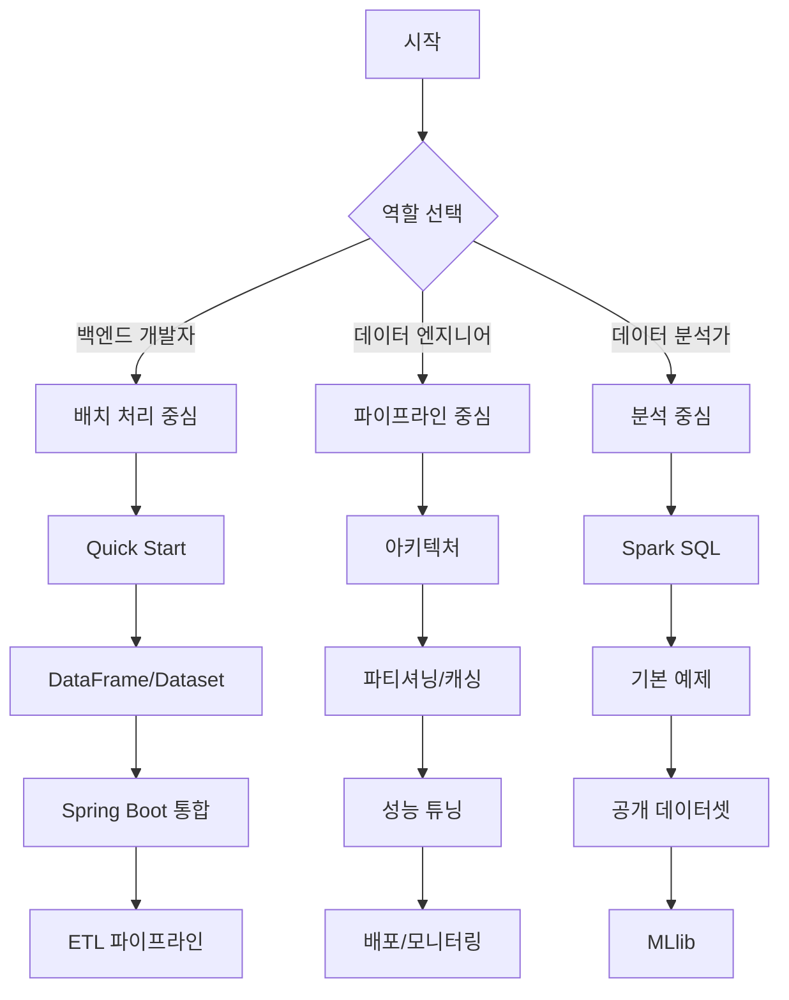

## Apache Spark란?

Apache Spark는 **대규모 데이터 처리를 위한 통합 분석 엔진**입니다. 하둡 MapReduce보다 메모리에서 최대 100배, 디스크에서 10배 빠른 처리 속도를 제공하며, Java, Scala, Python, R 등 다양한 언어를 지원합니다.

Spark가 "통합" 엔진인 이유는 하나의 플랫폼에서 배치 처리, 실시간 스트리밍, 머신러닝, 그래프 분석까지 모두 처리할 수 있기 때문입니다.

### 왜 Spark가 필요한가?

Java/Spring 개발자가 대용량 데이터를 다룰 때 흔히 마주치는 상황을 생각해봅시다:

| 기존 방식의 문제 | Spark의 해결책 |
|-----------------|---------------|
| 수천만 건 데이터를 for 루프로 처리하면 OOM | 분산 처리로 여러 노드에 부하 분산 |
| JDBC로 대용량 조회 시 메모리 부족 | 지연 평가(Lazy Evaluation)로 필요한 데이터만 처리 |
| 복잡한 집계 쿼리가 DB에 부하 유발 | DB 부하 없이 Spark에서 분석 처리 |
| 배치와 실시간 처리를 별도 시스템으로 구축 | 동일한 API로 배치와 스트리밍 통합 |
| 데이터 파이프라인마다 다른 도구 학습 필요 | SQL, DataFrame, ML 모두 하나의 API로 통합 |

### Spark의 핵심 특징

**1. 인메모리 컴퓨팅**
중간 결과를 디스크가 아닌 메모리에 저장하여 반복 연산에서 극적인 성능 향상을 제공합니다. 머신러닝 알고리즘처럼 같은 데이터를 여러 번 반복 처리하는 경우에 특히 효과적입니다.

**2. 지연 평가(Lazy Evaluation)**
Transformation 연산을 호출해도 즉시 실행하지 않고, Action이 호출될 때 비로소 실행 계획을 최적화하여 처리합니다. 이는 불필요한 연산을 제거하고 효율적인 실행 계획을 수립하는 데 도움을 줍니다.

**3. 장애 복구(Fault Tolerance)**
RDD의 lineage(혈통) 정보를 통해 데이터 손실 시 자동으로 재계산합니다. 체크포인트 없이도 안정적인 처리가 가능합니다.

**4. 통합 스택**
- **Spark SQL**: 구조화된 데이터 처리
- **Structured Streaming**: 실시간 스트림 처리
- **MLlib**: 분산 머신러닝
- **GraphX**: 그래프 분석

### 언제 Spark를 써야 할까?

**적합한 경우:**
- 수십 GB 이상의 대용량 데이터 처리가 필요할 때
- 복잡한 ETL(Extract-Transform-Load) 파이프라인 구축 시
- 머신러닝 모델을 대규모 데이터로 학습할 때
- 실시간과 배치 처리를 통합해야 할 때
- 데이터 레이크에서 분석 쿼리를 실행할 때

**과할 수 있는 경우:**
- 데이터가 수 GB 이하로 단일 서버에서 처리 가능할 때
- 단순 CRUD 작업이 주인 경우
- 밀리초 단위의 초저지연이 필요한 실시간 처리
- 팀에 분산 시스템 운영 경험이 없고 일정이 촉박할 때

## 이 가이드에서 다루는 것

### [Quick Start](quick-start/)
5분 만에 Spark 애플리케이션을 실행해봅니다. 개념보다 먼저 동작하는 코드를 확인하세요.

### [개념 이해](concepts/)
Spark의 핵심 원리를 **Java/Spring 개발자의 관점**에서 설명합니다.

| 주제 | 배우는 것 |
|------|----------|
| [아키텍처](concepts/architecture/) | Driver, Executor, Cluster Manager의 역할과 동작 원리 |
| [RDD 기초](concepts/rdd/) | Spark의 기본 추상화, 분산 컬렉션의 개념 |
| [DataFrame과 Dataset](concepts/dataframe-dataset/) | 타입 안전한 분산 데이터 처리의 현대적 API |
| [Spark SQL](concepts/spark-sql/) | SQL로 분산 데이터 쿼리하기 |
| [Transformation과 Action](concepts/transformations-actions/) | 지연 평가와 즉시 실행의 차이 |
| [파티셔닝과 셔플](concepts/partitioning/) | 분산 처리의 핵심, 데이터 분배 전략 |
| [캐싱과 영속성](concepts/caching/) | 인메모리 처리의 활용법 |
| [Structured Streaming](concepts/structured-streaming/) | 실시간 스트림 데이터 처리 |
| [MLlib](concepts/mllib/) | 분산 환경에서의 머신러닝 |
| [성능 튜닝](concepts/tuning/) | 메모리, 파티션, 셔플 최적화 |
| [배포와 클러스터 관리](concepts/deployment/) | Standalone, YARN, Kubernetes 환경 구성 |

### [실습 예제](examples/)
Spring Boot 기반의 실행 가능한 예제 코드입니다.

- [환경 설정](examples/setup/) - Java/Spring Boot와 Spark 통합 환경 구성
- [기본 예제](examples/basic/) - 데이터 로딩, 변환, 집계의 기초

### [부록](appendix/)
- [용어 사전](appendix/glossary/) - Spark 용어 빠른 참조
- [FAQ](appendix/faq/) - 자주 묻는 질문
- [참고 자료](appendix/references/) - 공식 문서 및 추가 학습 자료

## Spark vs Hadoop MapReduce

Spark와 하둡 MapReduce를 비교하면 Spark의 위치를 이해하기 쉽습니다:

| 항목 | Hadoop MapReduce | Apache Spark |
|------|-----------------|--------------|
| 처리 모델 | 디스크 기반 | 메모리 기반 |
| 반복 연산 | 매번 디스크 I/O | 메모리에 캐시 후 재사용 |
| 처리 속도 | 기준점 | 10~100배 빠름 |
| 실시간 처리 | 지원 안 함 | Structured Streaming |
| API 수준 | 저수준 (Map, Reduce) | 고수준 (SQL, DataFrame) |
| 언어 지원 | 주로 Java | Java, Scala, Python, R |
| 학습 곡선 | 가파름 | 상대적으로 완만 |

> **참고:** Spark는 하둡을 대체하는 것이 아니라 하둡 생태계(HDFS, YARN) 위에서 동작할 수 있습니다. 많은 기업이 저장소는 HDFS, 처리 엔진은 Spark를 사용합니다.

## 선수 지식

- **필수**: Java 기본, 컬렉션 API (Stream, Lambda)
- **도움됨**: SQL 기초, Spring Boot 경험, 기본적인 분산 시스템 개념

## 학습 경로 가이드

### 역할별 학습 경로



### 난이도별 문서 분류

| 문서 | 난이도 | 예상 시간 | 선수 문서 |
|------|--------|----------|----------|
| **Quick Start** | ⭐ 입문 | 30분 | 없음 |
| **아키텍처** | ⭐ 입문 | 45분 | 없음 |
| **RDD 기초** | ⭐ 입문 | 30분 | 없음 |
| **DataFrame/Dataset** | ⭐⭐ 기초 | 60분 | Quick Start |
| **Spark SQL** | ⭐⭐ 기초 | 45분 | DataFrame |
| **Transformation/Action** | ⭐⭐ 기초 | 30분 | RDD 또는 DataFrame |
| **기본 예제** | ⭐⭐ 기초 | 60분 | DataFrame, Spark SQL |
| **파티셔닝과 셔플** | ⭐⭐⭐ 중급 | 60분 | 아키텍처, Transformation |
| **캐싱과 영속성** | ⭐⭐⭐ 중급 | 30분 | 파티셔닝 |
| **Spring Boot 통합** | ⭐⭐⭐ 중급 | 90분 | 기본 예제 |
| **모니터링** | ⭐⭐⭐ 중급 | 60분 | 아키텍처 |
| **성능 튜닝** | ⭐⭐⭐⭐ 고급 | 90분 | 파티셔닝, 캐싱 |
| **Structured Streaming** | ⭐⭐⭐⭐ 고급 | 90분 | DataFrame, 파티셔닝 |
| **ETL 파이프라인** | ⭐⭐⭐⭐ 고급 | 120분 | Spring Boot, 기본 예제 |
| **MLlib** | ⭐⭐⭐⭐ 고급 | 90분 | DataFrame, SQL |
| **배포** | ⭐⭐⭐⭐ 고급 | 60분 | 아키텍처, 성능 튜닝 |
| **Spark Connect** | ⭐⭐⭐⭐⭐ 심화 | 45분 | 배포 |

### 목표별 추천 경로

**1주차 - 기초 다지기 (입문자)**
```
Day 1-2: Quick Start → 아키텍처
Day 3-4: DataFrame/Dataset → Spark SQL
Day 5:   Transformation/Action → 기본 예제
```

**2주차 - 실무 적용 (중급자)**
```
Day 1-2: Spring Boot 통합 → 모니터링
Day 3-4: 파티셔닝 → 캐싱 → 성능 튜닝
Day 5:   ETL 파이프라인
```

**3주차 - 고급 기능 (고급자)**
```
Day 1-2: Structured Streaming
Day 3-4: MLlib
Day 5:   배포 → Spark Connect
```

각 문서는 독립적으로 읽을 수 있지만, 처음이라면 위 순서를 추천합니다.

## 흔한 오해

**"Spark는 하둡이 필수다"** — 아닙니다. Spark는 독립 실행(Standalone), Kubernetes, YARN 등 다양한 환경에서 실행할 수 있습니다. 로컬 개발 시에는 하둡 없이 바로 실행 가능합니다.

**"Spark는 Scala로만 써야 한다"** — 아닙니다. Java API가 완벽히 지원되며, 이 가이드는 Java/Spring 개발자를 위해 Java 예제를 제공합니다. 다만 Spark 자체가 Scala로 작성되어 일부 고급 기능은 Scala가 더 간결합니다.

**"Spark는 실시간 처리를 못한다"** — 아닙니다. Structured Streaming을 통해 밀리초~초 단위의 마이크로 배치 처리가 가능합니다. 다만 Kafka Streams나 Flink 같은 순수 스트리밍 엔진과는 특성이 다릅니다.

**"Spark는 빅데이터에서만 쓴다"** — 개발/테스트 환경에서는 로컬 모드로 소규모 데이터도 처리할 수 있습니다. 코드를 변경 없이 로컬에서 개발하고 클러스터에서 대규모 처리가 가능한 것이 Spark의 장점입니다.
