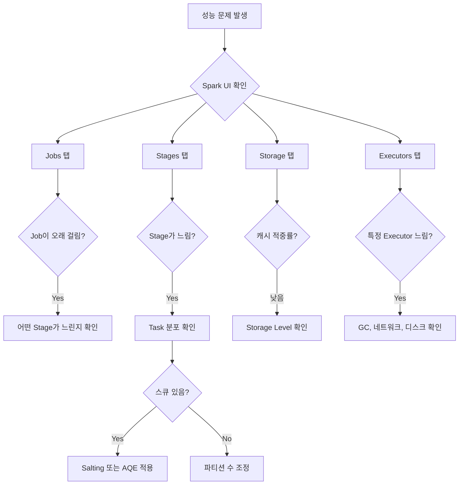

자주 묻는 질문과 흔히 발생하는 문제의 해결 방법을 제공합니다.

#### 일반 질문

**Spark는 어떤 Java 버전을 지원하나요?**

Spark 3.5는 Java 8, 11, 17을 지원합니다. Java 21은 아직 공식 지원되지 않습니다.

```bash
java -version  # 버전 확인
```

**Scala 없이 Java만으로 Spark를 사용할 수 있나요?**

네, 가능합니다. Spark는 Java API를 완벽히 지원합니다. 다만 Spark 런타임이 Scala로 작성되어 있어 Scala 라이브러리가 의존성에 포함됩니다.

**DataFrame과 Dataset의 차이는 무엇인가요?**

- **DataFrame** (`Dataset<Row>`): 스키마는 있지만 컴파일 타임 타입 체크 없음
- **Dataset** (`Dataset<T>`): POJO 타입을 사용해 컴파일 타임 타입 안전성 제공

Java에서는 DataFrame이 `Dataset<Row>`의 별칭입니다.

**RDD와 DataFrame 중 무엇을 사용해야 하나요?**

**DataFrame을 권장합니다.** 이유:
- Catalyst Optimizer의 자동 최적화
- 더 간결한 API
- 다양한 데이터 소스 지원

RDD는 저수준 제어가 필요하거나 비구조화 데이터를 처리할 때 사용합니다.

#### 오류 해결

**OutOfMemoryError**

```
java.lang.OutOfMemoryError: Java heap space
```

**원인**: Driver나 Executor 메모리 부족

**해결**:
```java
// Driver 메모리 증가
.config("spark.driver.memory", "4g")

// Executor 메모리 증가
.config("spark.executor.memory", "8g")

// 또는 spark-submit에서
spark-submit --driver-memory 4g --executor-memory 8g
```

**Shuffle 중 디스크 공간 부족**

```
No space left on device
```

**해결**:
```properties
# 셔플 디렉토리 변경
spark.local.dir=/data/spark-local

# 또는 여러 디렉토리 지정
spark.local.dir=/data/spark1,/data/spark2
```

**Task 실패 후 재시도 소진**

```
Task failed, total retries exceeded
```

**해결**:
```properties
# 재시도 횟수 증가
spark.task.maxFailures=8

# 또는 추측 실행 활성화
spark.speculation=true
```

**직렬화 오류**

```
NotSerializableException
```

**원인**: 클로저에서 직렬화 불가능한 객체 참조

**해결**:
```java
// 나쁜 예: 외부 객체 참조
MyService service = new MyService();  // 직렬화 불가
df.foreach(row -> service.process(row));  // 오류!

// 좋은 예: 직렬화 가능한 값만 사용
String config = getConfig();  // String은 직렬화 가능
df.foreach(row -> process(row, config));

// 또는 foreachPartition에서 객체 생성
df.foreachPartition(partition -> {
    MyService service = new MyService();  // 파티션 내에서 생성
    while (partition.hasNext()) {
        service.process(partition.next());
    }
});
```

**로깅 충돌**

```
SLF4J: Class path contains multiple SLF4J bindings
```

**해결**:
```groovy
// build.gradle
configurations.all {
    exclude group: 'org.slf4j', module: 'slf4j-log4j12'
    exclude group: 'log4j', module: 'log4j'
}
```

**SparkContext 중복 생성**

```
Only one SparkContext may be running in this JVM
```

**해결**:
```java
// getOrCreate 사용
SparkSession spark = SparkSession.builder()
    .getOrCreate();

// 또는 기존 세션 중지 후 생성
if (SparkSession.getActiveSession().isDefined()) {
    SparkSession.getActiveSession().get().stop();
}
```

**Windows에서 Hadoop 오류**

```
Could not locate executable winutils.exe
```

**해결**:
1. winutils 다운로드: https://github.com/steveloughran/winutils
2. `C:\hadoop\bin`에 복사
3. 환경 변수 설정: `HADOOP_HOME=C:\hadoop`

또는 코드에서:
```java
System.setProperty("hadoop.home.dir", "C:\\hadoop");
```

#### 성능 관련

**작업이 예상보다 느립니다**

**체크리스트**:
1. **셔플 최소화**: Wide Transformation 줄이기
2. **파티션 수 확인**: 너무 적거나 많지 않은지
3. **데이터 스큐**: 특정 파티션에 데이터 집중 확인
4. **브로드캐스트 조인**: 작은 테이블 브로드캐스트
5. **캐싱**: 반복 사용 데이터 캐시
6. **Parquet 사용**: 컬럼 기반 포맷으로 변경

**적절한 파티션 수는 얼마인가요?**

```
권장 파티션 수 = 총 코어 수 × 2~4
권장 파티션 크기 = 100~200MB
```

예시:
- 50코어 클러스터 → 100~200 파티션
- 100GB 데이터 → 500~1000 파티션

**캐싱이 효과가 없는 것 같습니다**

**확인 사항**:
1. 실제로 캐시되었는지: Spark UI의 Storage 탭 확인
2. 캐시 후 Action 호출: cache() 후 첫 Action에서 캐싱
3. 메모리 충분한지: Storage Level 조정 (MEMORY_AND_DISK)

```java
df.cache();
df.count();  // 여기서 실제 캐싱 발생
df.show();   // 캐시에서 읽음
```

**조인이 너무 느립니다**

**해결 방법**:
1. **작은 테이블 브로드캐스트**
```java
largeTable.join(broadcast(smallTable), "key")
```

2. **조인 전 필터링**
```java
filtered = large.filter(condition);
filtered.join(small, "key")
```

3. **버케팅 사용**
```java
df.write().bucketBy(100, "key").saveAsTable("bucketed");
```

#### 스트리밍 관련

**스트리밍 쿼리가 멈춥니다**

**확인 사항**:
1. 체크포인트 디렉토리 쓰기 권한
2. Kafka 연결 상태
3. 상태 저장소 메모리

**늦게 도착하는 데이터가 처리되지 않습니다**

**해결**: Watermark 설정
```java
df.withWatermark("timestamp", "10 minutes")
  .groupBy(window(col("timestamp"), "5 minutes"))
  .count()
```

#### 배포 관련

**YARN에서 실행이 안 됩니다**

**확인 사항**:
1. `HADOOP_CONF_DIR` 환경 변수 설정
2. YARN 큐 권한
3. 리소스 설정 (메모리, 코어)

**Kubernetes에서 Pod가 Pending 상태입니다**

**확인 사항**:
1. 리소스 요청량 확인
2. PV/PVC 상태
3. Service Account 권한

**애플리케이션 로그를 어디서 볼 수 있나요?**

```bash
# YARN
yarn logs -applicationId application_xxx

# Kubernetes
kubectl logs spark-driver-xxx
kubectl logs spark-executor-xxx

# Spark History Server
http://history-server:18080
```

#### 기타

**Spark UI에 접속할 수 없습니다**

**로컬 모드**:
```
http://localhost:4040
```

**클러스터 모드**:
```bash
# YARN
yarn application -list  # Application ID 확인
# Application Master URL로 접속

# History Server
http://history-server:18080
```

**특정 Executor만 느립니다**

**가능한 원인**:
1. 데이터 스큐: 특정 파티션에 데이터 집중
2. 하드웨어 문제: 해당 노드의 디스크/네트워크 확인
3. GC 문제: Executor GC 로그 확인

**해결**:
```properties
# 추측 실행 활성화
spark.speculation=true
spark.speculation.multiplier=1.5
```

**DataFrame을 POJO 리스트로 변환하려면?**

```java
Encoder<Employee> encoder = Encoders.bean(Employee.class);
List<Employee> employees = df.as(encoder).collectAsList();
```

주의: `collect()`는 모든 데이터를 Driver로 가져오므로 대용량 데이터에서는 사용하지 마세요.

#### Spark UI 활용 디버깅 가이드

Spark 성능 문제 해결의 핵심은 Spark UI를 체계적으로 분석하는 것입니다.

**디버깅 플로우**



**1. Jobs 탭 분석**

```
확인 항목:
- Duration: 전체 Job 소요 시간
- Stages: 완료/실패/진행 중 Stage 수
- Tasks: 총 Task 수와 진행 상황
```

**문제 신호:**
- 특정 Job이 비정상적으로 오래 걸림
- 반복 Job 간 시간 편차가 큼

**2. Stages 탭 분석 (가장 중요)**

```
핵심 메트릭:
┌─────────────────────────────────────────────────────────┐
│ Shuffle Read    : Stage가 읽은 셔플 데이터 크기        │
│ Shuffle Write   : Stage가 쓴 셔플 데이터 크기          │
│ Spill (Memory)  : 메모리 → 디스크 스필 (성능 저하)     │
│ Spill (Disk)    : 디스크 스필 총량 (심각한 메모리 부족)│
└─────────────────────────────────────────────────────────┘
```

**Task 분포 분석:**

| 메트릭 | 정상 | 문제 |
|--------|------|------|
| Min/Max Duration | 비슷함 | 10배 이상 차이 → **스큐** |
| Shuffle Read | 균등 분포 | 일부만 큼 → **스큐** |
| GC Time | < 10% | > 30% → **메모리 부족** |

**3. 스큐 진단 및 해결**

**진단 코드:**

```java
// 파티션별 데이터 분포 확인
df.groupBy(spark_partition_id().alias("partition"))
  .count()
  .orderBy(col("count").desc())
  .show(20);

// 예상 출력 (스큐 있음):
// +----------+--------+
// |partition |  count |
// +----------+--------+
// |        5 | 1000000|  ← 비정상적으로 큼!
// |        3 |   5000 |
// |        1 |   4800 |
// ...
```

**해결책:**

```java
// 1. AQE 스큐 조인 (Spark 3.0+)
spark.conf().set("spark.sql.adaptive.enabled", "true");
spark.conf().set("spark.sql.adaptive.skewJoin.enabled", "true");

// 2. Salting (수동)
int saltBuckets = 10;
Dataset<Row> salted = df.withColumn("salted_key",
    concat(col("key"), lit("_"), lit(Math.abs(rand().hashCode() % saltBuckets))));

// 3. Broadcast Join (작은 테이블)
df1.join(broadcast(smallDf), "key");
```

**4. OOM 디버깅**

**Driver OOM:**
```
java.lang.OutOfMemoryError: Java heap space
  at org.apache.spark.sql.Dataset.collect
```

→ `collect()`, `toPandas()` 등이 원인. 결과 크기 확인.

**Executor OOM:**
```
ExecutorLostFailure (executor X exited caused by one of the running tasks)
Reason: Container killed by YARN for exceeding memory limits
```

→ 파티션당 데이터 크기 확인, 메모리 증가 또는 파티션 수 증가.

**해결 체크리스트:**

```java
// 1. 파티션 수 확인
int numPartitions = df.rdd().getNumPartitions();
System.out.println("파티션 수: " + numPartitions);

// 2. 파티션당 예상 크기
long totalSize = spark.sessionState().executePlan(df.queryExecution().logical())
    .optimizedPlan().stats().sizeInBytes().longValue();
System.out.println("파티션당 크기: " + (totalSize / numPartitions / 1024 / 1024) + "MB");

// 3. 파티션 수 조정
df = df.repartition(200);  // 파티션 크기가 200MB 정도 되도록
```

**5. 셔플 최적화 진단**

**셔플이 많은지 확인:**

```java
// 실행 계획에서 Exchange 확인
df.explain();
// Exchange hashpartitioning ← 셔플 발생!
```

**셔플 줄이기:**

```java
// Before: 두 번의 셔플
df.groupBy("a").count()
  .join(df.groupBy("a").sum("b"), "a");

// After: 한 번의 셔플
df.groupBy("a").agg(
    count("*").alias("count"),
    sum("b").alias("sum_b")
);
```

**6. 로그 분석**

```bash
# Driver 로그에서 오류 찾기
grep -i "error\|exception\|oom\|killed" driver.log

# 셔플 관련 문제
grep -i "shuffle\|fetch\|timeout" executor.log

# GC 문제
grep -i "gc\|pause\|heap" executor.log
```

**7. 성능 체크리스트**

```
□ 셔플 파티션 수가 적절한가? (기본 200, 데이터 크기에 따라 조정)
□ 브로드캐스트 조인을 사용할 수 있는가? (작은 테이블)
□ 파티션 스큐가 있는가? (Spark UI Stage 탭에서 확인)
□ GC 시간이 과도한가? (> 10%)
□ 디스크 스필이 발생하는가? (메모리 부족)
□ 필요한 컬럼만 선택했는가? (Column Pruning)
□ 필터를 최대한 앞에 적용했는가? (Predicate Pushdown)
□ Parquet 같은 컬럼 기반 포맷을 사용하는가?
□ AQE가 활성화되어 있는가? (Spark 3.0+)
```
