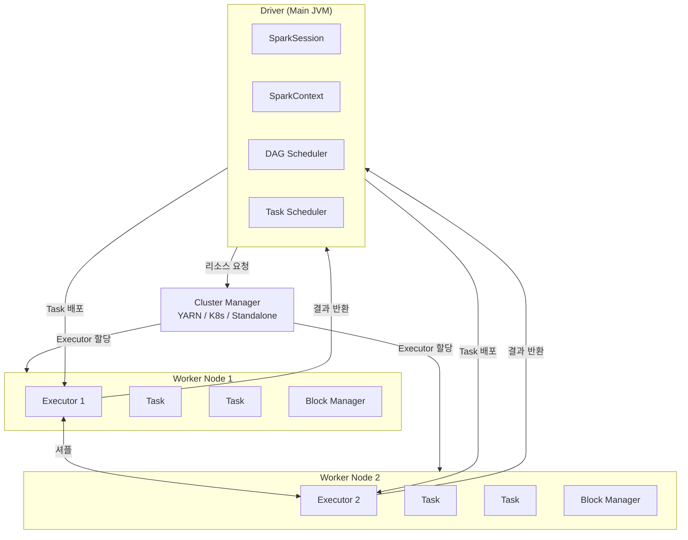
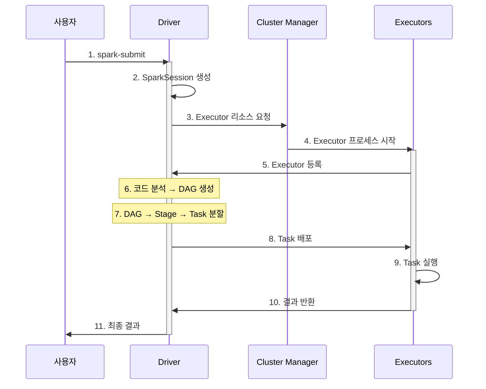
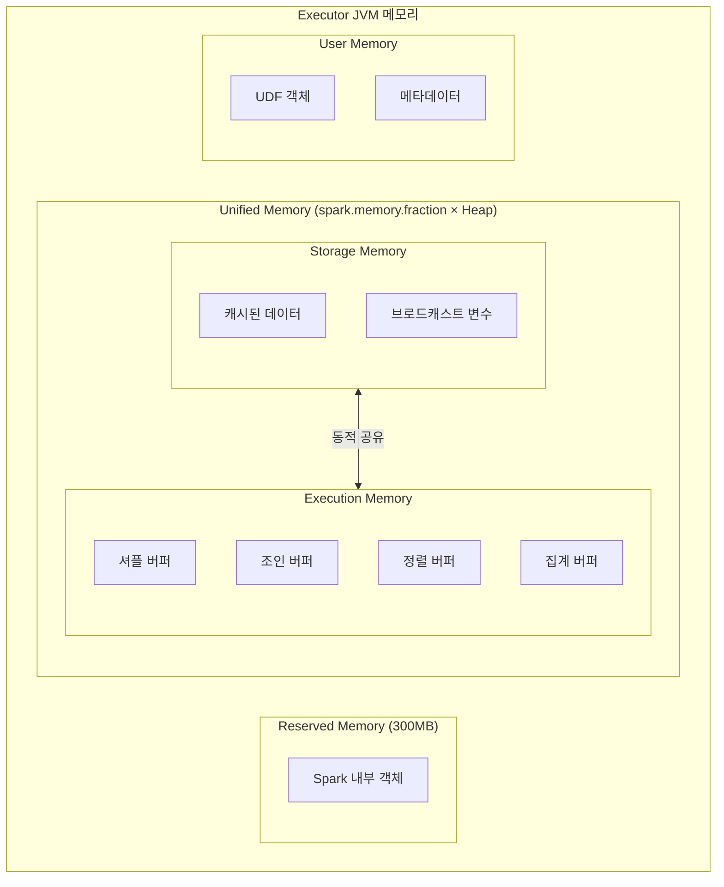

Spark 애플리케이션이 어떻게 분산 환경에서 실행되는지 이해합니다. Java/Spring 개발자에게 익숙한 개념과 비교하며 설명합니다.

#### 핵심 구성요소

Spark 클러스터는 세 가지 주요 컴포넌트로 구성됩니다:



아래에서 각 구성요소의 역할과 상호작용을 자세히 살펴봅니다.

**1. Driver**

**Driver**는 Spark 애플리케이션의 중앙 조율자입니다. `main()` 메서드가 실행되는 JVM 프로세스입니다.

```java
// 이 코드가 실행되는 곳이 Driver
public static void main(String[] args) {
    SparkSession spark = SparkSession.builder()
            .appName("MyApp")
            .master("local[*]")
            .getOrCreate();

    // SparkSession 생성 시점에 Driver가 시작됨
    Dataset<Row> df = spark.read().csv("data.csv");
    df.show();  // Action 호출 시 Executor에 작업 분배
}
```

**Driver의 역할:**
- `SparkSession`/`SparkContext` 생성 및 관리
- 사용자 코드의 Transformation을 분석하여 실행 계획(DAG) 생성
- 실행 계획을 Stage와 Task로 분할
- Cluster Manager에 리소스 요청
- Executor에 Task 배포 및 진행 상황 모니터링
- 결과 수집 및 사용자에게 반환

**Java 개발자 관점:**
Driver는 Spring 애플리케이션의 메인 컨텍스트와 유사합니다. 모든 설정과 조율이 여기서 이루어지고, 실제 작업은 Executor(워커)가 수행합니다.

**2. Executor**

**Executor**는 클러스터의 워커 노드에서 실행되는 JVM 프로세스입니다. 실제 데이터 처리를 담당합니다.

**Executor의 역할:**
- Driver가 할당한 Task 실행
- 데이터를 메모리나 디스크에 저장 (캐싱)
- 처리 결과를 Driver에게 반환
- 애플리케이션 수명 동안 유지됨

**특징:**
- 하나의 애플리케이션에 여러 Executor 할당 가능
- 각 Executor는 독립적인 JVM으로 격리
- 코어 수에 따라 병렬로 여러 Task 실행
- Executor 간 데이터 이동은 셔플을 통해 발생

```
┌─────────────────────────────────────────────────────┐
│                    Executor JVM                      │
│  ┌──────────┐ ┌──────────┐ ┌──────────┐            │
│  │  Task 1  │ │  Task 2  │ │  Task 3  │  ...       │
│  └──────────┘ └──────────┘ └──────────┘            │
│                                                      │
│  ┌─────────────────────────────────────────────┐   │
│  │              Block Manager                   │   │
│  │         (캐시된 데이터 저장)                   │   │
│  └─────────────────────────────────────────────┘   │
└─────────────────────────────────────────────────────┘
```

**3. Cluster Manager**

**Cluster Manager**는 클러스터 전체의 리소스를 관리합니다. Driver의 요청에 따라 Executor를 할당합니다.

**지원하는 Cluster Manager:**

| 종류 | 특징 | 사용 시점 |
|------|------|----------|
| **Standalone** | Spark에 내장, 설정 간단 | 소규모 클러스터, 학습용 |
| **YARN** | Hadoop 생태계 통합 | 기존 Hadoop 클러스터 활용 시 |
| **Kubernetes** | 컨테이너 기반, 유연한 확장 | 클라우드 네이티브 환경 |
| **Mesos** | 범용 리소스 관리 | 다양한 워크로드 혼합 시 |
| **Local** | 단일 JVM | 개발/테스트 환경 |

각 Cluster Manager는 사용 환경과 요구사항에 따라 선택합니다. 개발 환경에서는 Local이나 Standalone을, 프로덕션 환경에서는 YARN이나 Kubernetes를 주로 사용합니다.

**로컬 모드 vs 클러스터 모드:**

```java
// 로컬 모드 - 개발/테스트용
.master("local[*]")      // Driver와 Executor가 같은 JVM

// 클러스터 모드 - 프로덕션용
.master("spark://host:7077")  // Standalone
.master("yarn")               // YARN
.master("k8s://https://...")  // Kubernetes
```

#### 애플리케이션 실행 흐름

Spark 애플리케이션이 제출되면 다음 순서로 실행됩니다:



## Job, Stage, Task

Action이 호출되면 Spark는 내부적으로 Job → Stage → Task 계층으로 작업을 분할합니다.

### Job

**Job**은 하나의 Action에 대응하는 전체 계산 단위입니다.

```java
// 각 Action마다 하나의 Job 생성
df.count();         // Job 1
df.collect();       // Job 2
df.write().csv();   // Job 3
```

### Stage

**Stage**는 셔플 경계로 나뉜 Task의 집합입니다.

- **Narrow Transformation** (map, filter): 같은 Stage 내에서 파이프라이닝
- **Wide Transformation** (groupBy, join): 셔플 발생 → 새 Stage 생성

```java
df.filter(col("age").gt(30))     // Narrow - Stage 1에 포함
  .groupBy("department")          // Wide - 여기서 Stage 분리
  .count()                        // Stage 2
  .show();                        // Action → Job 실행
```

### Task

**Task**는 단일 파티션에서 실행되는 최소 작업 단위입니다.

- 파티션 수 = Task 수
- 각 Task는 독립적으로 Executor에서 실행
- Task는 직렬화되어 Executor로 전송됨

```
예: 4개 파티션, 2개 Stage

Stage 1: [Task 1-1] [Task 1-2] [Task 1-3] [Task 1-4]
              ↓          ↓          ↓          ↓
         (셔플 - 데이터 재분배)
              ↓          ↓          ↓          ↓
Stage 2: [Task 2-1] [Task 2-2] [Task 2-3] [Task 2-4]
```

## DAG (Directed Acyclic Graph)

Spark는 Transformation을 **DAG**로 표현합니다. 이는 연산의 의존 관계를 나타내는 방향성 비순환 그래프입니다.

```java
Dataset<Row> df1 = spark.read().csv("file1.csv");
Dataset<Row> df2 = spark.read().csv("file2.csv");

Dataset<Row> filtered = df1.filter(col("status").equalTo("ACTIVE"));
Dataset<Row> joined = filtered.join(df2, "id");
Dataset<Row> result = joined.groupBy("category").count();

result.show();  // Action → DAG 실행
```

**DAG 구조:**
```
[df1 읽기] → [filter] ─┐
                       ├→ [join] → [groupBy] → [count] → [show]
[df2 읽기] ────────────┘
```

**DAG의 장점:**

1. **지연 평가**: Action 전까지 실행하지 않음
2. **최적화**: Catalyst Optimizer가 DAG를 분석하여 실행 계획 최적화
3. **장애 복구**: 파티션 손실 시 DAG를 따라 재계산 가능

## Java 개발자 관점에서 이해하기

### Spring과의 비교

| Spring 애플리케이션 | Spark 애플리케이션 |
|-------------------|-------------------|
| Spring Container | SparkSession |
| Main Thread | Driver |
| Thread Pool Worker | Executor |
| ExecutorService | Cluster Manager |
| Runnable/Callable | Task |
| CompletableFuture | Job/Stage |

### 분산 처리 관점

```java
// 일반 Java 코드 (단일 JVM)
List<Employee> employees = loadAll();
List<Employee> highPaid = employees.stream()
    .filter(e -> e.getSalary() > 100000)
    .collect(Collectors.toList());

// Spark 코드 (분산 처리)
Dataset<Row> employees = spark.read().parquet("employees");
Dataset<Row> highPaid = employees
    .filter(col("salary").gt(100000));
```

두 코드의 차이점:
1. **데이터 위치**: Java는 메모리에 전체 로드, Spark는 분산 저장소에 존재
2. **실행 위치**: Java는 단일 JVM, Spark는 여러 Executor에 분산
3. **장애 처리**: Java는 예외 발생 시 실패, Spark는 자동 재시도

## 메모리 모델 (Unified Memory Management)

Spark 1.6부터 도입된 **통합 메모리 관리(Unified Memory Management)**는 실행과 저장 메모리를 동적으로 공유합니다.

### Executor 메모리 구조



### 메모리 영역별 역할

| 영역 | 비율 (기본값) | 용도 |
|------|--------------|------|
| **Reserved** | 300MB 고정 | Spark 내부 객체, OOM 방지 버퍼 |
| **Unified Memory** | Heap × 0.6 | 실행과 저장 공유 |
| ├─ Storage | 동적 (초기 50%) | 캐시, 브로드캐스트, 언롤링 |
| └─ Execution | 동적 (초기 50%) | 셔플, 조인, 정렬, 집계 |
| **User Memory** | Heap × 0.4 | 사용자 코드, UDF, RDD 메타데이터 |

### 동적 메모리 공유

**핵심 원리**: Execution 메모리가 부족하면 Storage 메모리를 빌려 사용하고, 그 반대도 가능합니다.

```java
// 메모리 설정 예시
SparkSession spark = SparkSession.builder()
    .config("spark.memory.fraction", "0.6")           // Unified Memory 비율
    .config("spark.memory.storageFraction", "0.5")    // Storage 초기 비율
    .getOrCreate();
```

**동작 방식:**

1. **Execution → Storage 차용**: 셔플 중 메모리 부족 시 캐시 공간 사용
2. **Storage → Execution 차용**: 캐시 중 메모리 부족 시 실행 공간 사용
3. **우선순위**: Execution이 우선 - 필요 시 캐시 데이터 삭제(eviction)

### 메모리 계산 예시

```
Executor 메모리: 8GB
├── Reserved: 300MB
├── Unified Memory: (8GB - 300MB) × 0.6 = 4.6GB
│   ├── Storage (초기): 4.6GB × 0.5 = 2.3GB
│   └── Execution (초기): 4.6GB × 0.5 = 2.3GB
└── User Memory: (8GB - 300MB) × 0.4 = 3.1GB
```

### Off-Heap 메모리

GC 영향을 줄이기 위해 JVM 힙 외부 메모리 사용:

```java
SparkSession spark = SparkSession.builder()
    .config("spark.memory.offHeap.enabled", "true")
    .config("spark.memory.offHeap.size", "2g")
    .getOrCreate();
```

**Off-Heap 장점:**
- GC 대상에서 제외되어 Stop-the-World 감소
- 대용량 캐시에 효과적
- Tungsten 메모리 관리와 통합

### 메모리 관련 트러블슈팅

| 증상 | 원인 | 해결 |
|------|------|------|
| OOM in Executor | 데이터 파티션이 너무 큼 | 파티션 수 증가 (`repartition`) |
| OOM in Driver | `collect()` 결과가 너무 큼 | `take(n)` 또는 파일로 저장 |
| GC overhead exceeded | 메모리 부족 | `spark.executor.memory` 증가 |
| 캐시 삭제 빈번 | Storage Memory 부족 | `storageFraction` 증가 또는 DISK 사용 |

## 배포 모드

### Client Mode

Driver가 클라이언트(spark-submit 실행 위치)에서 실행됩니다.

```bash
spark-submit --deploy-mode client myapp.jar
```

- Driver가 로컬에서 실행되어 디버깅 용이
- 클라이언트와 클러스터 간 네트워크 지연 발생 가능
- 클라이언트 종료 시 애플리케이션도 종료
- 개발/테스트 환경에 적합

### Cluster Mode

Driver가 클러스터 내부에서 실행됩니다.

```bash
spark-submit --deploy-mode cluster myapp.jar
```

- Driver가 클러스터 내에서 실행되어 네트워크 지연 최소화
- 클라이언트 종료해도 애플리케이션 계속 실행
- 로그 확인이 상대적으로 불편
- 프로덕션 환경에 적합

## 주요 설정

### Driver 설정

```properties
# Driver 메모리
spark.driver.memory=4g

# Driver CPU 코어
spark.driver.cores=2

# Driver와 Executor 간 최대 결과 크기
spark.driver.maxResultSize=1g
```

### Executor 설정

```properties
# Executor 수
spark.executor.instances=10

# Executor당 메모리
spark.executor.memory=8g

# Executor당 CPU 코어
spark.executor.cores=4
```

### 실행 시 설정 예시

```bash
spark-submit \
  --master yarn \
  --deploy-mode cluster \
  --driver-memory 4g \
  --executor-memory 8g \
  --executor-cores 4 \
  --num-executors 10 \
  myapp.jar
```

또는 Java 코드에서:

```java
SparkSession spark = SparkSession.builder()
    .appName("MyApp")
    .config("spark.executor.memory", "8g")
    .config("spark.executor.cores", "4")
    .getOrCreate();
```

## 다음 단계

아키텍처를 이해했다면, 다음으로 데이터 추상화에 대해 학습하세요:

- [RDD 기초](../rdd/) - Spark의 기본 데이터 추상화
- [DataFrame과 Dataset](../dataframe-dataset/) - 현대적인 고수준 API
