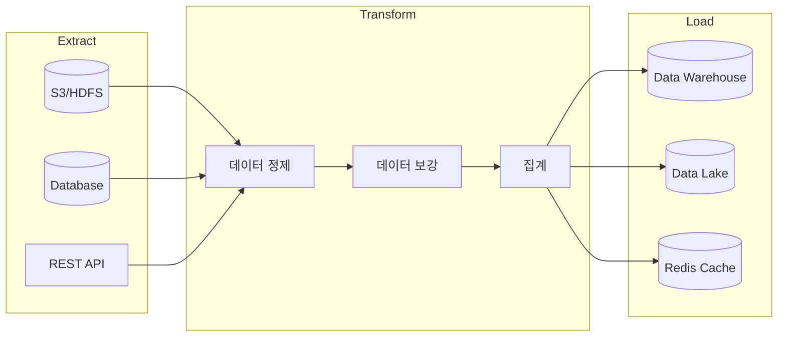

프로덕션 환경에서 사용 가능한 완전한 ETL(Extract-Transform-Load) 파이프라인 예제입니다.

#### 파이프라인 아키텍처



#### 프로젝트 구조

```
etl-pipeline/
├── src/main/java/com/example/etl/
│   ├── EtlApplication.java
│   ├── config/
│   │   └── SparkConfig.java
│   ├── job/
│   │   ├── AbstractEtlJob.java
│   │   ├── SalesEtlJob.java
│   │   └── CustomerEtlJob.java
│   ├── transformer/
│   │   ├── DataCleaner.java
│   │   └── DataEnricher.java
│   └── util/
│       ├── SchemaUtils.java
│       └── DateUtils.java
├── src/main/resources/
│   ├── application.yml
│   └── schemas/
│       └── sales-schema.json
└── build.gradle.kts
```

#### 기본 ETL 구조

**추상 ETL 작업 클래스**

```java
package com.example.etl.job;

import org.apache.spark.sql.Dataset;
import org.apache.spark.sql.Row;
import org.apache.spark.sql.SaveMode;
import org.apache.spark.sql.SparkSession;
import org.slf4j.Logger;
import org.slf4j.LoggerFactory;

import java.time.LocalDate;
import java.time.format.DateTimeFormatter;

/**
 * ETL 작업의 기본 구조를 정의하는 추상 클래스
 */
public abstract class AbstractEtlJob {
    protected final Logger logger = LoggerFactory.getLogger(getClass());
    protected final SparkSession spark;
    protected final LocalDate processDate;

    protected AbstractEtlJob(SparkSession spark, LocalDate processDate) {
        this.spark = spark;
        this.processDate = processDate;
    }

    /**
     * ETL 작업 실행 (템플릿 메서드 패턴)
     */
    public final EtlResult execute() {
        String jobName = getJobName();
        long startTime = System.currentTimeMillis();
        logger.info("ETL 작업 시작: {} (처리 일자: {})", jobName, processDate);

        try {
            // 1. Extract
            logger.info("[Extract] 데이터 추출 시작");
            Dataset<Row> rawData = extract();
            long extractCount = rawData.count();
            logger.info("[Extract] 완료: {} 레코드", extractCount);

            // 2. Transform
            logger.info("[Transform] 데이터 변환 시작");
            Dataset<Row> transformedData = transform(rawData);
            long transformCount = transformedData.count();
            logger.info("[Transform] 완료: {} 레코드", transformCount);

            // 3. Validate
            logger.info("[Validate] 데이터 검증 시작");
            ValidationResult validation = validate(transformedData);
            if (!validation.isValid()) {
                throw new EtlValidationException(validation.getErrors());
            }
            logger.info("[Validate] 완료: 검증 통과");

            // 4. Load
            logger.info("[Load] 데이터 적재 시작");
            load(transformedData);
            logger.info("[Load] 완료");

            long duration = System.currentTimeMillis() - startTime;
            logger.info("ETL 작업 완료: {} (소요 시간: {}ms)", jobName, duration);

            return EtlResult.success(extractCount, transformCount, duration);

        } catch (Exception e) {
            long duration = System.currentTimeMillis() - startTime;
            logger.error("ETL 작업 실패: {} - {}", jobName, e.getMessage(), e);
            return EtlResult.failure(e.getMessage(), duration);
        }
    }

    // 하위 클래스에서 구현
    protected abstract String getJobName();
    protected abstract Dataset<Row> extract();
    protected abstract Dataset<Row> transform(Dataset<Row> data);
    protected abstract ValidationResult validate(Dataset<Row> data);
    protected abstract void load(Dataset<Row> data);

    // 공통 유틸리티 메서드
    protected String getPartitionPath() {
        return processDate.format(DateTimeFormatter.ofPattern("year=yyyy/month=MM/day=dd"));
    }
}
```

**ETL 결과 클래스**

```java
package com.example.etl.job;

public record EtlResult(
    boolean success,
    long inputRecords,
    long outputRecords,
    long durationMs,
    String errorMessage
) {
    public static EtlResult success(long input, long output, long duration) {
        return new EtlResult(true, input, output, duration, null);
    }

    public static EtlResult failure(String error, long duration) {
        return new EtlResult(false, 0, 0, duration, error);
    }
}
```

#### 매출 데이터 ETL 예제

**전체 구현**

```java
package com.example.etl.job;

import org.apache.spark.sql.Dataset;
import org.apache.spark.sql.Row;
import org.apache.spark.sql.SaveMode;
import org.apache.spark.sql.SparkSession;
import org.apache.spark.sql.types.*;

import java.time.LocalDate;
import java.util.ArrayList;
import java.util.List;

import static org.apache.spark.sql.functions.*;

/**
 * 매출 데이터 ETL 파이프라인
 * - 원본: S3 JSON 파일
 * - 변환: 정제, 파생 컬럼 생성, 집계
 * - 적재: Parquet 파티션 테이블
 */
public class SalesEtlJob extends AbstractEtlJob {

    private final String inputPath;
    private final String outputPath;
    private final StructType inputSchema;

    public SalesEtlJob(SparkSession spark, LocalDate processDate,
                       String inputPath, String outputPath) {
        super(spark, processDate);
        this.inputPath = inputPath;
        this.outputPath = outputPath;
        this.inputSchema = createInputSchema();
    }

    @Override
    protected String getJobName() {
        return "SalesETL";
    }

    private StructType createInputSchema() {
        return new StructType()
            .add("order_id", DataTypes.StringType, false)
            .add("customer_id", DataTypes.StringType, false)
            .add("product_id", DataTypes.StringType, false)
            .add("quantity", DataTypes.IntegerType, false)
            .add("unit_price", DataTypes.DoubleType, false)
            .add("discount", DataTypes.DoubleType, true)
            .add("order_timestamp", DataTypes.TimestampType, false)
            .add("shipping_address", DataTypes.StringType, true)
            .add("payment_method", DataTypes.StringType, true);
    }

    @Override
    protected Dataset<Row> extract() {
        String datePath = processDate.format(
            java.time.format.DateTimeFormatter.ofPattern("yyyy/MM/dd")
        );

        return spark.read()
            .schema(inputSchema)
            .option("mode", "PERMISSIVE")  // 오류 레코드 허용
            .option("columnNameOfCorruptRecord", "_corrupt_record")
            .json(inputPath + "/" + datePath + "/*.json");
    }

    @Override
    protected Dataset<Row> transform(Dataset<Row> data) {
        return data
            // 1. 손상된 레코드 제거
            .filter(col("_corrupt_record").isNull())
            .drop("_corrupt_record")

            // 2. NULL 값 처리
            .withColumn("discount",
                when(col("discount").isNull(), lit(0.0))
                .otherwise(col("discount")))
            .withColumn("shipping_address",
                when(col("shipping_address").isNull(), lit("Unknown"))
                .otherwise(col("shipping_address")))

            // 3. 파생 컬럼 생성
            .withColumn("gross_amount",
                col("quantity").multiply(col("unit_price")))
            .withColumn("discount_amount",
                col("gross_amount").multiply(col("discount")))
            .withColumn("net_amount",
                col("gross_amount").minus(col("discount_amount")))

            // 4. 시간 파생 컬럼
            .withColumn("order_date",
                to_date(col("order_timestamp")))
            .withColumn("order_hour",
                hour(col("order_timestamp")))
            .withColumn("order_dayofweek",
                dayofweek(col("order_timestamp")))

            // 5. 지역 추출 (주소에서)
            .withColumn("region",
                when(col("shipping_address").contains("Seoul"), "수도권")
                .when(col("shipping_address").contains("Busan"), "영남권")
                .when(col("shipping_address").contains("Daegu"), "영남권")
                .when(col("shipping_address").contains("Daejeon"), "충청권")
                .otherwise("기타"))

            // 6. 처리 메타데이터 추가
            .withColumn("etl_timestamp", current_timestamp())
            .withColumn("etl_batch_id",
                lit(processDate.format(
                    java.time.format.DateTimeFormatter.BASIC_ISO_DATE
                )));
    }

    @Override
    protected ValidationResult validate(Dataset<Row> data) {
        List<String> errors = new ArrayList<>();

        // 1. 필수 컬럼 존재 확인
        String[] requiredColumns = {"order_id", "customer_id", "net_amount"};
        for (String col : requiredColumns) {
            if (!java.util.Arrays.asList(data.columns()).contains(col)) {
                errors.add("필수 컬럼 누락: " + col);
            }
        }

        // 2. 데이터 품질 검사
        long totalCount = data.count();
        if (totalCount == 0) {
            errors.add("처리할 데이터가 없습니다");
        }

        // 음수 금액 검사
        long negativeAmounts = data.filter(col("net_amount").lt(0)).count();
        if (negativeAmounts > 0) {
            double ratio = (double) negativeAmounts / totalCount * 100;
            if (ratio > 1.0) {  // 1% 초과 시 오류
                errors.add(String.format("음수 금액 레코드 비율 초과: %.2f%%", ratio));
            } else {
                logger.warn("음수 금액 레코드 발견: {} ({}%)", negativeAmounts, ratio);
            }
        }

        // 중복 주문 검사
        long uniqueOrders = data.select("order_id").distinct().count();
        if (uniqueOrders < totalCount) {
            long duplicates = totalCount - uniqueOrders;
            errors.add("중복 주문 발견: " + duplicates + "건");
        }

        // 3. 스키마 검증
        StructType actualSchema = data.schema();
        if (!actualSchema.fieldNames().length >= 10) {
            errors.add("예상 스키마와 불일치");
        }

        return new ValidationResult(errors.isEmpty(), errors);
    }

    @Override
    protected void load(Dataset<Row> data) {
        // 파티션별 저장 (연/월/일)
        data.write()
            .mode(SaveMode.Overwrite)
            .partitionBy("order_date")
            .option("compression", "snappy")
            .parquet(outputPath + "/sales_fact");

        // 일별 집계 테이블도 생성
        Dataset<Row> dailySummary = data
            .groupBy("order_date", "region")
            .agg(
                count("*").alias("order_count"),
                sum("net_amount").alias("total_revenue"),
                avg("net_amount").alias("avg_order_value"),
                countDistinct("customer_id").alias("unique_customers")
            );

        dailySummary.write()
            .mode(SaveMode.Overwrite)
            .parquet(outputPath + "/daily_summary/" + getPartitionPath());
    }
}
```

**검증 결과 클래스**

```java
package com.example.etl.job;

import java.util.List;

public record ValidationResult(
    boolean valid,
    List<String> errors
) {
    public boolean isValid() {
        return valid;
    }

    public List<String> getErrors() {
        return errors;
    }
}
```

#### 데이터 정제 유틸리티

**범용 데이터 클리너**

```java
package com.example.etl.transformer;

import org.apache.spark.sql.Dataset;
import org.apache.spark.sql.Row;
import org.apache.spark.sql.types.DataTypes;

import java.util.Arrays;
import java.util.List;

import static org.apache.spark.sql.functions.*;

/**
 * 재사용 가능한 데이터 정제 변환기
 */
public class DataCleaner {

    /**
     * 중복 제거 (지정된 키 기준)
     */
    public Dataset<Row> removeDuplicates(Dataset<Row> df, String... keyColumns) {
        return df.dropDuplicates(keyColumns);
    }

    /**
     * NULL 값 처리 (기본값으로 대체)
     */
    public Dataset<Row> fillNulls(Dataset<Row> df,
                                   java.util.Map<String, Object> defaults) {
        Dataset<Row> result = df;
        for (var entry : defaults.entrySet()) {
            String colName = entry.getKey();
            Object defaultValue = entry.getValue();

            if (Arrays.asList(df.columns()).contains(colName)) {
                result = result.withColumn(colName,
                    when(col(colName).isNull(), lit(defaultValue))
                    .otherwise(col(colName)));
            }
        }
        return result;
    }

    /**
     * 문자열 정규화 (공백 제거, 소문자 변환)
     */
    public Dataset<Row> normalizeStrings(Dataset<Row> df, String... columns) {
        Dataset<Row> result = df;
        for (String colName : columns) {
            result = result.withColumn(colName,
                lower(trim(col(colName))));
        }
        return result;
    }

    /**
     * 이상치 필터링 (IQR 방식)
     */
    public Dataset<Row> removeOutliers(Dataset<Row> df, String column,
                                        double lowerPercentile,
                                        double upperPercentile) {
        // 백분위수 계산
        double[] percentiles = df.stat().approxQuantile(
            column,
            new double[]{lowerPercentile, upperPercentile},
            0.01
        );

        double lower = percentiles[0];
        double upper = percentiles[1];

        return df.filter(
            col(column).geq(lower).and(col(column).leq(upper))
        );
    }

    /**
     * 날짜 형식 표준화
     */
    public Dataset<Row> standardizeDates(Dataset<Row> df,
                                          String column,
                                          String inputFormat) {
        return df.withColumn(column,
            to_date(col(column), inputFormat));
    }

    /**
     * 이메일 유효성 검사
     */
    public Dataset<Row> validateEmails(Dataset<Row> df, String column) {
        String emailPattern = "^[a-zA-Z0-9._%+-]+@[a-zA-Z0-9.-]+\\.[a-zA-Z]{2,}$";
        return df.withColumn(column + "_valid",
            col(column).rlike(emailPattern));
    }

    /**
     * 전화번호 정규화 (한국 형식)
     */
    public Dataset<Row> normalizePhoneNumbers(Dataset<Row> df, String column) {
        return df.withColumn(column,
            regexp_replace(col(column), "[^0-9]", ""))
            .withColumn(column,
                when(col(column).startsWith("82"),
                    concat(lit("0"), substring(col(column), 3, 100)))
                .otherwise(col(column)));
    }
}
```

#### 증분 ETL (Incremental)

**CDC 기반 증분 처리**

```java
package com.example.etl.job;

import org.apache.spark.sql.Dataset;
import org.apache.spark.sql.Row;
import org.apache.spark.sql.SaveMode;
import org.apache.spark.sql.SparkSession;

import java.time.LocalDateTime;
import java.time.format.DateTimeFormatter;

import static org.apache.spark.sql.functions.*;

/**
 * 증분 ETL 작업 (Delta 방식)
 */
public class IncrementalEtlJob {
    private final SparkSession spark;
    private final String watermarkPath;

    public IncrementalEtlJob(SparkSession spark, String watermarkPath) {
        this.spark = spark;
        this.watermarkPath = watermarkPath;
    }

    /**
     * 마지막 처리 시점 조회
     */
    public LocalDateTime getLastWatermark() {
        try {
            Dataset<Row> watermark = spark.read().json(watermarkPath);
            String lastTs = watermark.first().getString(0);
            return LocalDateTime.parse(lastTs, DateTimeFormatter.ISO_DATE_TIME);
        } catch (Exception e) {
            // 워터마크 파일이 없으면 기본값 반환
            return LocalDateTime.of(1970, 1, 1, 0, 0);
        }
    }

    /**
     * 워터마크 갱신
     */
    public void updateWatermark(LocalDateTime newWatermark) {
        spark.createDataFrame(
            java.util.List.of(new Watermark(
                newWatermark.format(DateTimeFormatter.ISO_DATE_TIME)
            )),
            Watermark.class
        ).write().mode(SaveMode.Overwrite).json(watermarkPath);
    }

    /**
     * 증분 데이터 추출
     */
    public Dataset<Row> extractIncremental(String sourcePath,
                                            LocalDateTime fromTs,
                                            LocalDateTime toTs) {
        return spark.read()
            .parquet(sourcePath)
            .filter(col("updated_at").gt(lit(fromTs.toString()))
                .and(col("updated_at").leq(lit(toTs.toString()))));
    }

    /**
     * Upsert (Insert or Update)
     */
    public void upsertToTarget(Dataset<Row> updates,
                                String targetPath,
                                String... keyColumns) {
        // 기존 데이터 읽기
        Dataset<Row> existing;
        try {
            existing = spark.read().parquet(targetPath);
        } catch (Exception e) {
            // 대상 테이블이 없으면 새로 생성
            updates.write()
                .mode(SaveMode.Overwrite)
                .parquet(targetPath);
            return;
        }

        // 중복 키 제거 (새 데이터 우선)
        Dataset<Row> merged = existing
            .join(updates.select(keyColumns), scala.collection.JavaConverters
                .asScalaBuffer(java.util.Arrays.asList(keyColumns)).toSeq(), "left_anti")
            .union(updates);

        // 결과 저장
        merged.write()
            .mode(SaveMode.Overwrite)
            .parquet(targetPath);
    }

    // DTO
    public static class Watermark implements java.io.Serializable {
        private String timestamp;

        public Watermark() {}

        public Watermark(String timestamp) {
            this.timestamp = timestamp;
        }

        public String getTimestamp() { return timestamp; }
        public void setTimestamp(String timestamp) { this.timestamp = timestamp; }
    }
}
```

#### 에러 처리 및 재시도

**견고한 ETL 러너**

```java
package com.example.etl;

import com.example.etl.job.AbstractEtlJob;
import com.example.etl.job.EtlResult;
import org.slf4j.Logger;
import org.slf4j.LoggerFactory;

import java.time.LocalDate;
import java.util.concurrent.TimeUnit;

/**
 * 재시도 로직이 포함된 ETL 실행기
 */
public class EtlRunner {
    private static final Logger logger = LoggerFactory.getLogger(EtlRunner.class);

    private final int maxRetries;
    private final long retryDelayMs;

    public EtlRunner(int maxRetries, long retryDelayMs) {
        this.maxRetries = maxRetries;
        this.retryDelayMs = retryDelayMs;
    }

    public EtlResult runWithRetry(AbstractEtlJob job) {
        int attempt = 0;
        EtlResult lastResult = null;

        while (attempt < maxRetries) {
            attempt++;
            logger.info("ETL 실행 시도 {}/{}", attempt, maxRetries);

            lastResult = job.execute();

            if (lastResult.success()) {
                logger.info("ETL 성공: 입력={}, 출력={}, 시간={}ms",
                    lastResult.inputRecords(),
                    lastResult.outputRecords(),
                    lastResult.durationMs());
                return lastResult;
            }

            if (attempt < maxRetries) {
                logger.warn("ETL 실패, {}ms 후 재시도: {}",
                    retryDelayMs, lastResult.errorMessage());
                try {
                    TimeUnit.MILLISECONDS.sleep(retryDelayMs);
                } catch (InterruptedException e) {
                    Thread.currentThread().interrupt();
                    break;
                }
            }
        }

        logger.error("ETL 최종 실패 ({}회 시도): {}",
            attempt, lastResult != null ? lastResult.errorMessage() : "Unknown");
        return lastResult;
    }

    /**
     * 날짜 범위에 대해 ETL 실행
     */
    public void runForDateRange(java.util.function.Function<LocalDate, AbstractEtlJob> jobFactory,
                                 LocalDate startDate,
                                 LocalDate endDate) {
        LocalDate current = startDate;

        while (!current.isAfter(endDate)) {
            logger.info("=== 처리 일자: {} ===", current);

            AbstractEtlJob job = jobFactory.apply(current);
            EtlResult result = runWithRetry(job);

            if (!result.success()) {
                logger.error("날짜 {} 처리 실패, 중단", current);
                throw new RuntimeException("ETL 실패: " + current);
            }

            current = current.plusDays(1);
        }

        logger.info("전체 날짜 범위 처리 완료: {} ~ {}", startDate, endDate);
    }
}
```

#### 스케줄링 (Spring)

```java
package com.example.etl;

import com.example.etl.job.SalesEtlJob;
import org.apache.spark.sql.SparkSession;
import org.springframework.scheduling.annotation.Scheduled;
import org.springframework.stereotype.Component;

import java.time.LocalDate;

@Component
public class EtlScheduler {

    private final SparkSession spark;
    private final EtlRunner runner;
    private final String inputPath;
    private final String outputPath;

    public EtlScheduler(SparkSession spark) {
        this.spark = spark;
        this.runner = new EtlRunner(3, 60000);  // 3회 재시도, 1분 대기
        this.inputPath = System.getenv("ETL_INPUT_PATH");
        this.outputPath = System.getenv("ETL_OUTPUT_PATH");
    }

    @Scheduled(cron = "0 30 1 * * *")  // 매일 새벽 1:30
    public void runDailyEtl() {
        LocalDate yesterday = LocalDate.now().minusDays(1);
        SalesEtlJob job = new SalesEtlJob(spark, yesterday, inputPath, outputPath);
        runner.runWithRetry(job);
    }
}
```

#### 관련 문서

- [기본 예제](../basic/) - DataFrame 기본 연산
- [모니터링](../monitoring/) - 파이프라인 모니터링
- [성능 튜닝](../../concepts/tuning/) - 대용량 처리 최적화
